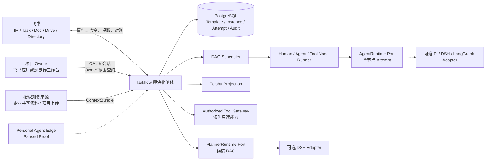

# ARCHITECTURE · larkflow

> 状态：Cloud-first Target + Gap · 既有架构简化版 · 2026-08-14

## 1. 架构原则

1. 每个节点的责任属于人，Human、Agent 和 Tool 是执行方式。
2. 中央数据库保存流程真相，飞书是交互入口和可恢复投影。
3. 产品 DAG 独立于 Agent 框架。
4. DAG 无环，重做通过 Attempt 和状态转换表达。
5. 生成、编辑和重启都先预览后确认。
6. 所有外部写入幂等，权限由服务端重算，关键变化可审计。
7. MVP 采用模块化单体，不预先引入 Kafka 或微服务。
8. 知识授权、工具授权和业务状态转换是三个独立边界。
9. Planner 与 Agent Runtime 可替换，只执行一个受限 Attempt，不持有业务真相或生产凭据。

## 2. 目标系统



### 模块边界

- Template Service：模板身份、不可变版本、生命周期和布尔锁。
- Instance Service：草稿、确认、快照、状态、编辑、重启和进度。
- Scheduler：依据依赖和状态解锁节点。
- Node Runner：运行 Agent 与 Tool 节点，接收 Human 节点提交。
- Knowledge Context Service：只从管理员发布的企业共享资料和当前项目上传件生成授权 `ContextBundle`，记录来源 ID、摘要指纹与数据分类，不把检索索引当成权限边界。
- PlannerRuntime Port：接收目标、授权上下文和只读工具清单，只返回 `DAGCandidate`、`ValidationReport`、`PlanningEvidence` 与 `Usage`。larkflow 确定性复验后才可创建草稿。
- AgentRuntime Port：接收一个 Node、一个 Attempt、最小上下文和短时能力，返回节点交付物、执行轨迹与用量，不直接修改 Instance。
- Authorized Tool Gateway：校验 tenant、Instance、Node、Attempt、actor、允许工具、知识范围、过期时间与数据外发政策。Attempt 内部首版工具只读，业务写入保持为显式 Tool 节点。
- Edge Control：历史 Proof，管理本人设备配对、撤销和窄 capability。当前暂停，不进入云端主线或默认部署。
- Console：把一个服务端认证主体映射到 tenant 与 person。Instance Owner 可以读取本人流程并执行服务端允许的确认、暂停、继续、取消、重启和未来区域图编辑；当前 Human 负责人只能读取有界任务上下文，普通任务可以提交或转交，决定任务可以接受或退回，但不能因此读取完整实例。管理员可额外读取当前 tenant 聚合，并通过耐久预览、显式确认和追加型审计撤销其他浏览器会话；当前会话只能注销。所有写入都调用既有领域服务并重新校验状态、责任人、Attempt 和版本，待处理项从同一 PostgreSQL 聚合即时派生，不形成第二套状态。
- Projection Service：创建和对账飞书任务、卡片、消息及文档。面向人的文本交付物默认物化为原生 Docx；父文件夹 token 只控制云空间位置，二进制附件才使用普通 Drive 文件。
- Audit Service：追加 actor、来源、状态、revision 和相关对象。
- Outbox Worker：在数据库事务提交后可靠执行飞书副作用。

## 3. 领域模型与权威

| Entity | 权威位置 | 说明 |
|---|---|---|
| Template | PostgreSQL | 跨版本稳定身份 |
| TemplateVersion | PostgreSQL | 不可变图定义、状态与 `locked` |
| Instance | PostgreSQL | 可选模板引用、完整图快照、Owner、状态和 revision |
| NodeInstance | PostgreSQL | 依赖、唯一人类 Owner、执行器和当前状态 |
| Attempt | PostgreSQL | 每次执行、提交、质量结果和交付物引用 |
| Projection | PostgreSQL + 飞书对象 | 记录外部对象和同步版本，可重建 |
| AuditEvent | Append-only 审计表 | 客户端不能改写 |
| Project attachment / Context manifest | PostgreSQL + AttachmentBlobStore | Phase 2A 包含草稿请求级 txt/md 元数据、逻辑撤销、保留配额、冻结清单、规划 ContextBundle 与 Instance 安全引用，已完成真实 PostgreSQL、Caddy、migration、开发部署和 Owner 作用域 HTTPS API 验收；Phase 2B 的显式 Agent 输入、Node/Attempt 绑定执行 bundle 与短时只读能力信封也已部署，并通过真实 PostgreSQL 合同和安装态 synthetic Runtime 探针；当前 filesystem adapter 只适合显式配置的单机开发环境，真实 Owner 浏览器附件交互仍待完成 |
| Runtime trace / Tool invocation | PostgreSQL 中的 Attempt 附件或审计 | Target：观察与对账记录，不反向成为业务状态 |
| EdgeDevice / Pairing / EdgeEvent | PostgreSQL | 设备身份、一次性配对、撤销与追加型审计，不保存原始 secret |
| NodeRun checkpoint | 节点执行运行时 | 只属于一个 Agent 节点的一次 Attempt |

MVP 不建立独立 Project 聚合。产品界面的“项目工作区”先由一个 `Instance`、完整图快照、项目 Owner、参与人和项目级上传引用承载。若真实试用中一个项目经常需要多个独立 DAG 共享材料，再重新评估 Project 聚合。首个部署按单企业实现，schema 保留 `tenant_id`，但不把完整多租户产品化作为首版交付条件。

## 4. 生命周期

### 模板

```text
draft -> enabled -> disabled -> deleted
```

修改已存在版本时创建新版本。`deleted` 为逻辑终态。只有 `enabled` 版本可以创建新实例。

### 实例

```text
draft -> running -> paused -> running
draft -> discarded
running -> done | failed | canceled
paused -> running | done | failed | canceled
```

### 节点

```text
pending -> ready -> running -> done
                     |
                     +-> waiting_human -> done
                     +-> failed
pending | ready | running | waiting_human -> canceled
```

具体转换由领域服务校验。飞书动作、Agent 回传或 Tool 结果都只是命令输入。

## 5. 核心流程

### 创建与启动

1. 用户选择启用模板，或通过自然语言引导、结构化高级入口提交无模板定义，并按需上传当前项目资料。
2. 服务端先解析 tenant、actor、企业共享资料范围、项目上传范围、数据分类与模型外发政策，形成有界 `ContextBundle`。
3. PlannerRuntime 使用只读工具生成候选图，larkflow 确定性校验 DAG、责任人、交付物、能力与验收字段。
4. 服务端保存 `draft`，用户查看节点、依赖、Owner、资料范围、执行方式和风险后确认或丢弃。
5. 确认事务冻结快照、创建节点和初始 Attempt，并写入 outbox。
6. 投影服务创建飞书责任入口，Scheduler 解锁根节点。

### 执行与质量

Human 节点等待 Owner 提交。Agent 与 Tool 节点由中央 Node Runner 运行。AgentRuntime 每次只处理当前 Node 的当前 Attempt；内部可使用只读检索、校验或分析工具，但不能修改 DAG、调用 Human Gate 或执行未声明的外部业务写。所有节点都保留唯一 Owner。自动执行失败、重试超限或需要人工判断时，节点进入可见的人工处理路径。

质量结果使用 `pass/fail + evidence + suggestion`。Agent 自动重试上限由服务配置，并且只由一个层次负责重试，避免 SDK 与业务层叠加。

### 编辑

草稿定义与运行中未来区域编辑已经共用 Target GraphEditPreview。服务端只接受当前 Owner 对未锁定的 `draft / running` Instance 发起 `add_node / update_node / remove_node`。草稿允许修改完整定义；运行中仍只允许修改没有任何执行痕迹的 `pending / ready` 当前 Attempt。服务端在内存副本上重新验证完整 DAG、Owner 与执行工作定义，随后把规范化操作、增删改集合、aggregate version、当前与目标 `graph_revision`、候选 Snapshot SHA-256 和 15 分钟有效期写入 GraphEditPreview。预览本身不修改 aggregate 或审计。

确认时重新授权创建预览的当前 Instance Owner，并重新执行相同操作。aggregate version、`graph_revision`、操作语义、节点集合或候选 Snapshot 哈希任一漂移都会拒绝。确认在同一 PostgreSQL 事务内保存 aggregate、消费预览、递增一次 revision，并追加审计。草稿分支只替换 Snapshot，不创建 NodeInstance、Attempt、outbox 或外部资源，后续草稿确认启动才独立物化运行时。运行中分支继续更新未开始 NodeInstance、创建或关闭 Attempt，并追加必要 outbox；模板和已执行历史不变。重复确认只回读已应用状态。

工作台画板使用 React Flow 12.11.2 渲染节点与依赖边，ELK.js 0.12.0 负责自动布局。节点拖动位置按 Instance 保存在浏览器 `localStorage`，刷新后合并到新的自动布局之上；恢复自动布局只清除个人位置，不写 PostgreSQL。增加、修改、删除节点，拖动节点端点增加依赖，以及选中连线断开依赖，都会被翻译成有界操作并请求 GraphEditPreview，确认仍由服务端消费预览。表单依赖选择继续保留。选中节点的“打回到此节点”直接复用 RestartPreview。当前编辑器不支持多人实时协同或任意自由白板。

### 重启

节点和完整实例重启已经按 Target 模型落地。RestartPreview 以显式 `node / instance` scope 区分两种语义：节点 scope 计算目标节点及所有可达下游，并保存目标节点键；实例 scope 使用拓扑排序后的全图，节点键为空。两者都把 tenant、Instance、actor、稳定影响集合、aggregate version、`graph_revision` 和 15 分钟有效期写入独立 RestartPreview，预览本身不修改 aggregate 或审计。确认时重新授权当前 Instance Owner，并在同一 PostgreSQL 事务内锁定和消费预览、比较 aggregate version、重算影响集合、取消活动旧 Attempt、清除 claim、创建新 Attempt、写审计与投影 outbox。节点 scope 把目标节点置为 `ready`，下游置为 `pending`；如果当前失败的决定节点以该目标作为 `reject_target`，服务端从它的耐久结果中提取具体退回意见，并只向目标的新 Attempt 输入快照注入 `rework_feedback`。Runner 激活目标节点时保留该字段，范围外上游、下游占位 Attempt 与冻结 Instance Snapshot 都不复制或改写它。实例 scope 把全部根节点置为 `ready`，其他节点置为 `pending`，不会隐式继承某次局部退回意见。旧 Attempt、结果和质量记录保持只读，重复确认只回读已应用结果。

### 对账

Projection 记录外部对象 ID、幂等键和已同步版本。缺失对象可重建，重复事件被忽略，冲突按服务端合法状态重新投影并记录告警。

## 6. Agent Runtime 边界

业务 DAG 不使用 Pi session、DeepSeek Harness workflow、LangGraph 图或任何运行时 checkpoint 作为产品模型。它们只可以实现一次 Planner 或 Agent Attempt 内部的检索、工具组合、并行 Subagent、生成和自检。内部 Subagent 不成为业务节点或 Owner，内部进度事件不替代 PostgreSQL 状态。

PTC 只允许在隔离的 Planner Attempt 中编排只读工具并返回候选图。worker thread 只能作为故障 containment，不能作为多租户安全边界；生产试验必须使用 OS 级隔离或服务端固定编排。普通工具副作用不会因 Cordis effect 生命周期或会话回滚而撤销，因此当前不向 Planner 或 Agent 内部开放写能力。

运行时切换与模型 fallback 只能发生在明确策略内。若需要更换 provider 或 runtime，必须结束当前 Attempt 并创建新 Attempt，不能在一次执行中静默改变审计身份。Pi session 与 DSH 日志只作为 trace 附件，PostgreSQL 中的 Attempt 仍是耐久历史。

LangGraph 的依赖生命周期也服从这一边界。当前默认安装仍包含 LangGraph，只是为了维持 legacy `larkflow` 入口、`engine/`、`service.py`、SQLite checkpointer 和对应测试；Target `workflow/` 不使用它保存业务状态。Refactor Phase 0 与 Phase 1 不删除现有依赖，但新增的 `planning/`、`agent_runtime/` 和 Target 测试不得导入 LangGraph。待 Target 成为正式默认入口、无 LangGraph 的基础 wheel 完成导入、启动和离线冒烟，且 legacy 测试能显式安装 `larkflow[legacy]` 后，才把 LangGraph 从默认依赖移入 legacy extra。

这不是为新架构预留一个必做的 LangGraph 版本。只有真实的单节点复杂 Attempt 证明需要内部图分支、checkpoint 或恢复，且普通 completion、有界 loop、Pi 或 DSH 基线无法满足时，才评估独立的 `LangGraphAgentRuntimeAdapter` 与 `larkflow[langgraph]`。没有需求证据就不实现该适配器；即使实现，它也只能保存当前 Attempt 的临时执行状态。

## 7. 当前 Target 内核 As-built

`larkflow/workflow/` 是目标架构代码，与 legacy `engine/`、`service.py` 和 LangGraph checkpointer 隔离：

- `planning/`：提供纯本地 `PlannerRequest / PlannerResult / PlannerRuntime` 合同、兼容现有草稿 Worker 的 `DraftGenerator` 门面，以及包住 `DraftDefinitionGenerator` 的 `BoundedPlannerRuntime`。Phase 2A 又增加不可变 `SourceRef / AttachmentRef / ContextChunk / ContextBundle`；bundle fingerprint 规范化覆盖 scope、purpose、来源哈希、分级、外发决策与 chunk 顺序。`PlannerRequest` 只接受与 tenant、actor、request scope 一致的类型化 bundle。Target 装配显式选择 `bounded`，默认仍是一次生成、最多一次修复和现有确定性复验；Runtime 只返回候选与最小 metadata，不写 PostgreSQL，也不启动流程。
- `agent_runtime/`：提供纯本地 `AgentRunRequest / AgentRunResult / AgentRuntime` 合同、包住 `LLMAgentExecutor` 的 `CompletionAgentRuntime`，以及连接 `WorkflowWorker` 的 `AgentRuntimeExecutor`。桥接只下发节点合同、冻结输入和稳定 `tenant:attempt` 幂等键；claim token、租约到期时间和 expected node version 留在 Worker 内，Runtime 不能提交业务状态。Phase 2B 增加不可变 `CapabilityEnvelope` 和 claim-free `AgentContextRequest`：只有节点显式声明 `instance_inputs.project_attachments` 时才解析附件，能力信封绑定 tenant、Instance、Node、Attempt、scope、过期时间和上下文 fingerprint，成功结果只附加安全运行证据。
- `model.py`：不可变 `InstanceSnapshot` 与 `NodeSpec`，以及 Template、TemplateVersion、模板审计、Instance、NodeInstance、NodeAttempt 和质量结果。
- `template_service.py`：模板文档校验、不可变版本、生命周期、角色与参数绑定，以及冻结 Instance Snapshot 的确定性物化。
- `graph.py`：v0.2 schema、必填工作字段、唯一节点、依赖存在、无环、拓扑、就绪和可达下游校验。
- `transitions.py`：实例、节点和 Attempt 的显式状态转换表。
- `scheduler.py`：确认草稿时创建节点与初始 Attempt，根节点进入 ready，依赖完成后解锁直接下游。
- `runner.py` 与 `decision.py`：普通 Human 节点等待唯一 Owner；`accept_reject` Human 节点只接受版本绑定的明确接受或退回。退回意见必填且最多 1000 字，服务端规范化后写入 Human Attempt 结果、质量证据和追加型审计；接受路径忽略客户端附带的额外意见。退回使当前 Human Attempt 与 Instance 失败并保留历史，后续修订复用节点重启；Runner 激活目标新 Attempt 时保留服务端注入的 `rework_feedback`。Agent 与 Tool 节点使用带 Worker 身份的短时 claim，结果必须匹配当前 Attempt、节点版本、token、Worker 和租期。过期 claim 由新 Worker 轮换 token 后接管同一 Attempt。
- `events.py`：不可变 AuditEvent、OutboxEvent 以及带租约的 outbox claim 契约。投影事件达到有界尝试上限后进入 `exhausted`，不再参与领取，但事件内容、累计次数、最后错误和终止时间继续保留。
- `repository.py`：Instance、Template、RestartPreview 与 GraphEditPreview 仓储 Port，以及仅供测试的 copy-on-read 内存实现；两类重启通过 `save_restart`，未来区域编辑通过 `save_graph_edit`，把 aggregate、预览消费、审计和 outbox 原子提交。
- `migrations/` 与 `migrate.py`：PostgreSQL 14 schema、package-data migration 和 advisory lock migration runner；`0010_restart_previews` 保存短期重启授权，`0011_restart_scope` 增加显式 scope，`0012_graph_edit_previews` 保存未来区域编辑预览，`0013_im_command_mentions` 保存最小化 mention 数组，`0014_role_binding_cards` 保存人员选择卡状态，`0015_recovery_cards` 为失败恢复卡片增加耐久更新 token，`0016_role_card_single_action` 在不删除历史回调的前提下为每张人员选择卡保留一个 canonical 动作并建立部分唯一索引，`0017_card_feedback_metrics` 为人员选择与恢复动作保存完整的首个服务端反馈状态、耗时和完成时间，`0018_worker_wakeups` 为四类耐久工作表安装事务提交后通知触发器，`0019_draft_generation_progress` 为自然语言草稿增加独立生成、阶段进度与租约状态，`0020_console_sessions` 保存员工工作台会话凭据摘要、服务端主体和有效期，`0021_console_session_governance` 增加安全会话 ID、耐久撤销预览和追加型撤销事件，`0022_outbox_exhaustion` 为投影 outbox 增加保留历史的终止状态和时间约束，`0023_console_draft_requests` 保存网页自然语言草稿请求与生成租约，`0024_console_project_attachments` 增加 collecting 状态、冻结清单和 tenant-first 附件元数据并禁止物理删除，`0025` 与 `0026` 保存企业资料目录、不可变正文授权证明，`0027_console_enterprise_knowledge_selection` 为 collecting 草稿增加默认空、Owner-only、单调版本化的 source 选择，以及生成边界冻结的精确企业 refs 和 selection fingerprint。
- `console_attachments.py`：定义正文与元数据分离的 `AttachmentBlobStore` Port、内存测试实现、显式根目录的单机 filesystem adapter、内存与 PostgreSQL 元数据仓储、Owner 授权服务和 fail-closed `PlanningContextService`。服务端固定 `internal` 分级并生成 object key；只有存储已配置且模型外发为 `allow` 时才公布附件规划能力，defer 会在持久化前拒绝其他部署。逻辑撤销不释放 request 或 tenant 保留配额；PostgreSQL 使用 tenant advisory transaction lock 串行计算保留量。读取正文前依次复验 tenant、Owner、请求状态、冻结清单、ready 状态、大小、SHA-256 与外发决策。确定性缺失或损坏进入 rejected，权限、I/O 与挂载故障进入既有 failed/backoff。正文、object key、上传人和存储路径不进入 Runtime metadata、浏览器 DTO、日志或 InstanceSnapshot。
- `agent_context.py`：把已提升到 Instance 的冻结附件 refs 解析为单个 Agent Attempt 的 `agent_execution` ContextBundle。服务在读取 blob 前复验 tenant、Instance、Node、Attempt、声明输入、原始规划 fingerprint、附件状态、origin request、分级、外发、大小、哈希、UTF-8 和字符预算；确定性失败为 `agent_context_rejected`，临时存储故障继续由 Worker 退避。正文只进入当前 Runtime 调用，不进入快照、审计或运行证据。
- `console_knowledge.py` 与 `knowledge_context.py`：普通成员只能读取当前 tenant 的 published 安全元数据；只有 Console collecting 草稿发起人可以保存默认空、Owner-only 的 source 选择。开始生成时 PostgreSQL 在单个事务中锁定草稿、附件和按 source 排序的企业版本，复验 published、proof 与 egress，冻结精确 refs 和 selection fingerprint 后才转为 pending；重试复用冻结选择，飞书向导和其他没有选择 UI 的入口不自动使用企业资料。Planning 与单个 Agent Attempt 只按冻结 ref 重新授权正文；读取、大小、SHA-256、UTF-8、预算和 TTL 校验后仍须通过仓储原子最终授权复验。撤销先于发行线性化点完成则 fail closed，发行先完成则撤销只阻断后续 bundle。项目附件保持冻结 manifest 顺序，企业资料按 source/version 排序后追加；Runtime 不获得 BlobStore、repository、object key、管理员身份或原始授权声明，旧 Attempt 的安全 manifest 与 fingerprint 不被改写。该显式选择切片已完成真实 PostgreSQL、0027 migration、开发部署和安装态 synthetic 探针，真实浏览器验收仍后置。
- Phase 2A 已提交并部署到开发环境：附件模块为 `35 passed`，当时完整离线套件为 `1120 passed, 26 skipped`。一次性真实 PostgreSQL 从空库应用 24 份 migration 并重入，`tests/test_workflow_postgres.py` 为 `26 passed`；补充合同覆盖并发 tenant 配额、逻辑撤销保留、Owner 隔离、manifest round-trip、promotion 幂等、删除保护和 migration 事务回滚。Caddy 2.11.4 的 validate/adapt 与公网 64 KB / 256 KB 请求体边界实测通过。开发库当前 ledger 为 `24 / 0024_console_project_attachments`，十个 Python 服务与 Caddy 均健康。主体提交为 `b2a13ff1eff796723774d42ca5d04556814a38c2`，合同收口提交为 `07de190db49839d8195cfa26967241fad7d975f6`。`0ff4272a10abe85d2afab36f65a2edd3e4d50a41` 完成附件 no-web 规划、Agent 完成性、搜索预检、结果规范化和公开错误说明。`48325c361361d4b634dbfbbb0a58d2178444919e` 把 no-web 来源节点收紧为被复核 Agent 的直接依赖，对有效日期、正数和否定证据做服务端 fail-closed 复验，并统一了超长 Agent 结果的 `agent_result_incomplete` 失败语义。`9a70f033d800292972a8d627fd4dddc7e45d83b2` 把日期、人数和总预算绑定到明确业务字段，防止资料更新时间、酒店房型人数或单项预算覆盖未确认的出行参数。最新的 `23437d15499df9182beeb823e0a1d7780fc69f5f` 又要求日期标签经过明确赋值边界，并只接受单日期或明确双日期范围，复合字段名与说明文字不能借用合法标签前缀。字段绑定反例均在模型调用前被拒绝，合法新疆 8 日合成实例证明 Agent 的 `input_snapshot.dependencies` 实际携带完整 Human 来源交付物，并完成真实 Task、Human 决定和 Docx 投影闭环。真实浏览器附件交互仍待手工验收，因此不是生产就绪。
- Phase 2B 内容提交 `6e6e3895ac9bb355f40c017e4b5ffe395f4ddca4` 和真实 PostgreSQL fixture 修正 `3a93fd2af9cfecdc00cada822ab8705232018205` 已部署到同一开发环境。完整离线合并证据为 `1192 passed, 27 skipped`；一次性 PostgreSQL 从空库应用 24 份 migration 并重入，仓储合同为 `27 passed`。安装态 synthetic Runtime 探针证明正文只进入当前 Node/Attempt 的 ContextBundle，持久证据不含正文、object key 或 claim。豆包 `SearchProvider` 真实公开查询回读 10 条带 URL 来源；原生 Docx 创建、同 document_id 覆盖和 revision 5 的标题、列表、表格也已由 bot 回读。以上都只关闭开发技术门槛，不替代真实 Owner 浏览器交互、来源权威性或生产容量验收。
- `postgres.py` 与 `serde.py`：模板版本、模板审计、JSONB 快照序列化、规范化运行态表、乐观并发仓储、追加型审计与 `FOR UPDATE SKIP LOCKED` outbox。
- `console.py`、`console_auth.py`、`console_http.py`、`console_cli.py`、`console_actions.py`、`console_tasks.py`、`console_admin.py`、`console_admin_sessions.py` 与 `console_rate_limit.py`：Owner 范围读模型、参与者任务面、受控流程操作、受控 DAG 画板、管理员聚合、会话治理、双鉴权和 loopback-only 服务入口。`feishu` 模式把 OAuth 验证后的 tenant 与 person 保存为 PostgreSQL 中的不透明会话摘要，不向浏览器暴露用户 token，也不复用 `lark-cli` 用户登录。Owner 读取继续限定 tenant 与 Instance Owner；参与者任务查询独立限定 tenant、当前节点 Owner、Human executor 和 `waiting_human` 状态，不能扩大为完整实例读取。普通 Human Task 可以在页面提交或转交；`accept_reject` 决定节点可以在页面接受或携带有界意见退回，也保留版本绑定的飞书决定卡，两条入口调用同一 `WorkflowService.submit_human_decision`。任务转交由服务端应用目录重新验证目标成员，只修改运行时 NodeInstance Owner，冻结 Snapshot 不变，并通过审计、outbox 和 Task Projection 同步。中央事务提交后接口只声明 `projection.status=queued`，页面立即显示负责人已更换且飞书仍在同步，不把异步副作用入队描述为飞书已更新。已提交的 Phase 2A 只有在服务端安全能力标志为 true 时才显示 txt/md 入口，并在落库前拒绝不可完成的 defer；Owner 可以上传、列出和逻辑撤销，确认资料后才原子冻结 manifest 并进入 pending，无附件请求继续直接 pending。附件上传在应用与已提交 Caddy 模板中使用独立 262144 字节 body budget，浏览器不能提交 tenant、uploader、object key、Instance 或数据分级。图编辑接口只接受严格 JSON 的有界操作，当前用户占位符由服务端替换为认证主体；确认接口只接受预览 ID 路径，不接受客户端 revision 或影响集合。流程操作、任务操作与管理员写入都要求专用动作头；`feishu` 模式还要求精确同源 `Origin`。跨边界资源统一返回 404，状态与版本冲突返回 409。浏览器只用 `textContent` 渲染，所有可操作按钮在请求发出前立即显示处理中；高风险操作先展示服务端预览。管理员写面仍只包含其他会话撤销，不扩展到 allowlist、队列或配置。开发入口的令牌桶和可信代理来源只用于可用性公平性，不参与身份授权，也不承担生产级多副本限流。
- Status addendum · 2026-08-19：`console_admin_knowledge.py` 已复用同一服务器管理员 allowlist 增加企业资料列表、带正文的不可变发布、版本审计和幂等撤销。浏览器必须提交与正文匹配的 SHA-256、固定全员授权声明和策略版本；tenant、管理员身份、授权证明、时间、object key 与分级由服务端产生。管理员写面仍不允许浏览器修改 allowlist、队列、存储位置或服务器配置。正文、ContextBundle 和显式成员选择已完成真实 PostgreSQL 和开发部署；真实浏览器显式选择仍待人工验收。
- `deliverables.py`：定义有界节点输出语法和统一结果校验。新合同用 `required=true` 激活严格模式，Human 结果拒绝未声明字段，自动执行结果允许保留执行器审计元数据，但三类执行器都必须提供全部必填交付物。服务层在 NodeRunner 完成身份、Attempt、版本与 claim 预检后才校验结果，随后使用规范化结果执行原有状态迁移，因此内容错误不能遮蔽授权或陈旧版本错误，也不能留下半提交状态。
- `console_actions.py` 的 Console 翻译层负责页面友好编辑语义。新增节点 key 由服务端生成；`insert_before` 只用于把一个新增操作展开为新增节点和目标节点更新，依赖与 `work.inputs` 同步重写。领域 `editing.py` 仍只接收标准 `add_node / update_node / remove_node`，并继续拥有完整 DAG、冻结线、版本和候选哈希的最终裁决权。
- Owner 流程详情把同一服务端读模型投影为五步首次成功主线。当前动作区只调用既有草稿确认、流程控制、Human Task、决定和转交 API；操作完成后重新读取当前详情，不在浏览器复制状态机。Agent 或 Tool 的实质结果进入主页面，接受类决定结果作为补充；画板、Attempt 与审计仍完整保留在高级视图。该结构只改变信息层级和入口，不改变领域授权、PostgreSQL 真相或飞书异步投影边界。
- `service.py`、`restart.py` 与 `editing.py`：提供只读草稿预览、节点及完整实例重启影响计算、未来区域编辑计划、短期预览与原子确认，并在仓储事务内协调草稿确认、调度、执行结果、授权、审计、outbox 与实例终态。节点重启若遗漏影响集合之外的失败节点会被拒绝；目标恰好匹配当前失败决定的 `reject_target` 时，只向该目标的新 Attempt 注入 `{source_node_key, source_attempt_no, feedback}`，不污染其他受影响节点；完整实例重启覆盖整个冻结图但不自动继承局部返工意见；未来区域编辑只跨越未开始区域，并用候选 Snapshot 哈希检测语义漂移。
- Human Task 转交复用同一 `WorkflowService` 和仓储乐观并发。命令绑定当前 Attempt 与节点版本，服务端锁定聚合后再次校验当前负责人，只更新 `NodeInstance.owner_person_id`，不改写 `InstanceSnapshot`；同一事务追加 `node.human_task_transferred` 审计和投影 outbox。Projection 对已有 Task 执行负责人移除与添加，失败沿用 outbox 重试，不把飞书状态反写成领域授权事实。
- `recovery.py`：为失败的自动节点实现显式 `retry / human_takeover` 领域命令。两条路径都只允许当前节点 Owner，并比较 Instance version、Node version 和 Attempt 编号；旧卡片失效，原失败 Attempt 保持只读。重试复用受控节点重启语义，人工接管创建新 `waiting_human` Attempt 并进入现有 Task 投影与入站链路。
- `runtime.py`：单步 `WorkflowWorker` 与 `AutomatedExecutor` Port。每个 tick 最多认领一个自动节点，先提交 claim，再调用外部 executor；外部异常写回失败，进程级崩溃留下的认领由租约恢复。
- `daemon.py`、`wakeup.py` 与 `config.py`：Target 常驻循环、PostgreSQL 通知唤醒、可中断的有界空闲退避、瞬时 tick 故障隔离、Worker 身份和 Target env 配置。每个服务在首次扫描前用独立连接执行静态 `LISTEN larkflow_work_available`；触发器只发送空 payload，业务状态仍从队列表读取。监听建立或等待失败时，仅等待当前退避区间的剩余时间后继续扫描，不把通知可用性提升为可靠性前提。
- `interactive_daemon.py`：把 IM 命令验证与回复、人员分工卡创建、回调验证、阶段进度和回复六条凭据侧车道从 Projection 拆出。每个进程按固定顺序访问六条车道，但每条车道一次只领取一项；开发部署固定运行两个独立进程，共享受限 bot profile，不在线程间共享 lark-cli 或数据库状态。阶段进度按 revision 更新原卡片，最终回复只在同 revision 进度结算后执行，避免旧进度覆盖终态。单条车道故障和日志故障不会阻塞其他车道，任何车道领取到工作后立即继续扫描。
- `projection.py`、`projection_daemon.py` 与 `completion_poll.py`：只认领投影事件的 Outbox Worker、Feishu Task / IM / Doc Projection Port、稳定幂等键、Projection 记录和独立常驻循环。普通 `waiting_human` 节点投影 Task；`accept_reject` 节点改投影版本绑定 Card 2.0，避免 Task 完成状态暗示接受。声明必填交付物的 Task 会明确提示必须在工作台提交，并在配置公开 HTTPS origin 后附加只含 Instance 与 Node 定位的深链。常驻循环在消费 Outbox 前，按 Instance ID 分页扫描 PostgreSQL 权威状态，为当前普通 Human 节点补建缺失 Projection，只在飞书 Task v2 明确返回 `1470404` 时重建外部 Task，并用带 repair generation 的稳定幂等键原子换绑。权限、限流、网络或五百错误不得触发换绑；终态节点不补发历史 Task，但会收口已有 Projection 的完成状态。重启产生的旧 Attempt 同步事件按历史 Attempt 状态关闭旧 Human Task，新 Attempt 使用不同稳定幂等键创建新 Task 或决定卡；未来区域编辑删除未开始节点后，陈旧的节点创建事件按 no-op 收口。循环还会周期读取当前普通 Human Task，观察到完成后以稳定信号 ID 写入耐久 Inbox。Human 责任入口会带入节点明确声明的 Instance 输入和直接依赖中已提交的结果，Agent 正文优先展示并设置长度上限；其他结构化值放入 JSON 代码块，避免 Card Markdown 把 URL 后的 JSON 引号编码为链接末尾的 `%22`。自动节点完成后向 Owner 发送结果消息；Instance 完成后创建汇总文档并发送带链接的最终通知。首次完成沿用历史幂等键，重启后按当前终端 Attempt 分代，确保同一实例再次完成时创建新文档与最终通知，并保留旧轮次 Projection。单实例修复入口只补齐当前完成轮次缺失的投影，并保持幂等。
- Console 和飞书卡片是同一 Human 决定的两个入口。领域提交接受或退回后，Projection Worker 根据当前 Attempt 结果原位更新已存在的决定卡，并保存 `settled / decision / node_status`；卡片回调链路仍提供快速处理中反馈，但不再独占终态卡片写入。旧 Attempt 因退回、取消或重启进入终态时也必须移除可操作控件。
- Projection outbox 外部调用失败沿用指数退避，默认第 24 次仍失败时原子写入 `exhausted`，清空租约并停止再次领取；不按错误文案猜测永久性，也不删除 outbox 历史。`ProjectionWorkerReport` 与常驻循环日志独立汇总 `failed` 和 `exhausted`，管理员队列聚合继续把终止记录作为需关注信号。
- `inbound.py` 与 `inbound_daemon.py`：接受普通 Human Task 状态轮询或飞书事件产生的 PostgreSQL Inbox 信号，以及凭据侧校验与领域侧提交两阶段 Worker。两阶段分别 claim，失败后指数退避，过期 claim 可被其他 Worker 恢复。无论信号来源如何，凭据侧都重新读取 Task，默认最多验证 24 次；耗尽后写入带终止时间、阶段、结果和最后错误的 `exhausted` 终态，结构化日志暴露耗尽计数，且该信号不再被认领。决定节点的 legacy Task 完成信号明确拒绝，不能绕过决定卡；普通 Human 节点只要有必填输出，也拒绝把 Task 完成映射成占位交付物，中央节点继续保持 `waiting_human`。
- `feishu.py`：基于 lark-cli 的 Task、文本消息、Card 2.0 和 Docx adapter。Task 创建使用原生 Task API、稳定 client token、`mode=1`、唯一 Owner assignee 和稳定绑定字段；入站校验只读 Task 详情。卡片首次快速反馈使用延时更新 token，后续多阶段状态使用原消息 ID 的消息更新接口，并要求更新前后都设置 `update_multi=true`。消息与文档 adapter 只消费服务端生成的目标和正文，不信任客户端身份字段。
- `im_commands.py`：把 `im.message.receive_v1` 的原始 V2 信封和 lark-cli 拍平事件归一为耐久命令信号，按 message / event 去重，并保存 mention key 与 open_id。凭据侧先验证发送者以及 `start` 或结构化 `draft` 引用的全部角色人员均为当前企业活跃成员；领域侧只接受 `/larkflow help`、`/larkflow start`、`/larkflow draft`、`/larkflow confirm`、`/larkflow status`、`/larkflow list`、`/larkflow pause`、`/larkflow resume`、`/larkflow cancel`、`/larkflow cancel-confirm`、`/larkflow restart`、`/larkflow restart-all`、`/larkflow restart-confirm`、`/larkflow edit` 与 `/larkflow edit-confirm`，并通过耐久回复队列发送结果。`start` 与两种 `draft` 都创建草稿但不自动确认。裸 `draft` 转成自然语言引导请求，带 JSON 的 `draft` 保留结构化高级入口。发送者成为 Instance Owner；`role=@成员` 只能引用同一条消息的认证 mention key，文本中的 open_id 和显示名称无效。`status` 与 `list` 只返回有界 Owner 读模型；pause 与 resume 直接执行 Owner 范围的可逆状态转换，cancel 先返回版本绑定影响预览，cancel-confirm 才进入终态；restart 与 edit 命令只返回服务端预览，对应 confirm 命令才消费并执行。不存在、无权限和不可操作使用合并错误，避免实例与预览枚举。
- `directory.py`：可选企业目录 Port 与 lark-cli bot adapter。草稿写入前去重校验 Instance Owner 和全部节点 Owner 的 open_id、激活状态与离职、冻结标志；缺字段、ID 不匹配或非活跃状态均 fail closed。
- `role_bindings.py`：把需要跨人员分工但未显式 mention 的 `start` 转成人员选择卡，也承载裸 `draft` 的自然语言引导卡。两者复用候选人快照、回调验证、目录再验证、领域创建、卡片回写和文本回复的耐久链路。操作人、候选集合、角色集合、表单字段和实例 ID 都由服务端重算；普通人员分工 Worker 排除自然语言草稿动作，后者由独立生成进程认领。回调落库后首次处理中状态使用回调 token；`generating / repairing` 进度和最终图预览改按动作中耐久保存的原消息 ID 更新，避免延时 token 使用次数耗尽。同一 message 只有一个 canonical 动作，重复回调不创建第二个草稿，也不重复调用模型；迁移前重复行保留为非 canonical 历史。
- `draft_generation.py` 与 `draft_validation.py`：前者把中央 LLM 输出视为不可信候选，提示词限制图规模、执行器、依赖方向和逻辑 Owner，严格 JSON parser 拒绝重复键、非有限数和包装文本；首个候选未通过确定性校验时，把错误和无效候选作为不可信修复数据交回同一中央 Agent，最多重生成一次。后者集中保存生成专用的交付物、依赖消费、Human 输入根、最终 Human Gate、领域形状和完整无模板 Snapshot 规则。`PlanningService` 会覆盖任何 Runtime 候选返回的 `schema_version` 与用户输入，并在 Runtime 返回后再次调用同一 validator；Adapter 内部校验不能替代这一稳定边界。第二个 bounded 候选或其他 Adapter 的最终候选不合法时都直接拒绝，不降低标准。Planner 不接受 provider 密钥、数据库连接、飞书凭据、claim token 或 Personal Edge capability。
- `draft_generation_daemon.py`：在不加载 lark-cli profile 的独立进程中只认领 `draft_wizard` canonical 动作。生成租约下限按两次完整 LLM 路由预算加安全余量计算，避免合法修复调用在租约中途被另一 Worker 接管；阶段进度使用独立短租约和 revision fencing，模型调用与飞书卡片更新不共享进程或凭据。
- `im_commands.py` 中的 `RecoveryActionInboxBridge` 与 `HumanDecisionActionInboxBridge`：把飞书恢复卡片和人类决定卡回调转换为耐久命令。接受按钮位于表单外，退回通过表单提交必填的 `rejection_feedback`；桥接层归一化 lark-cli 字符串化 `action_value`、可缺失 `action_name` 和秒、毫秒、微秒时间戳，并严格拒绝空白或超过 1000 字的退回意见。若 `action_name` 存在则必须与服务端动作交叉一致。操作人只从飞书顶层认证字段取值，卡片 payload 中的身份不参与授权；动作耐久插入后立即尝试把原卡片替换为无按钮“处理中”，最终再更新原卡片并发送耐久文本回执。决定命令还绑定 Instance、Node、Attempt 版本并重验当前 Owner。`event_time.py` 为卡片回调提供共享时间归一化，避免边界解析分叉。
- `card_feedback.py`：统一生成蓝色处理中与橙色拒绝卡。Target 长连接入口使用最长 3 秒的 lark-cli 直接更新；动作先延后 10 秒防止后台 Worker 抢先写入最终状态，直接更新结束后立即释放，崩溃时由延后时间兜底。单调时钟从有效回调被接受开始覆盖动作插入和直接更新，释放动作时原子保存 `updated / failed`、非负毫秒数和完成时间；结构化日志只记录动作类型、结果和耗时，不记录人员、消息或卡片标识，日志报告失败也不能破坏回调。该顺序保证最终状态不会被迟到的处理中状态覆盖，也不让视觉回写失败撤销已持久化动作。
- `cli.py`：独立 `larkflow-target` 运维入口，提供模板全生命周期、从模板创建草稿、预览、确认、状态、Human 提交，以及 Runtime、Projection、Interactive、Draft Generation、入站校验和领域入站的单步 / 常驻服务；`generate-drafts-once / generate-drafts` 运行无凭据草稿生成车道，并串行消费飞书引导请求与网页耐久草稿请求，避免同一模型路由并发失控。`reconcile-instance-completion` 可显式修复一个已完成实例缺失的完成文档或最终通知。独立 `larkflow-console` 装配 Owner 读仓储、受控操作适配、耐久草稿请求服务与 HTTP 页面；操作适配复用 `WorkflowService`，不复用 CLI 文本解析，也不建立浏览器专属领域命令。
- `console_drafts.py`：工作台自然语言请求的耐久 Port、内存与 PostgreSQL 仓储、会话主体映射、目录校验、租约 Worker 和安全 DTO。草稿 Worker 依赖本地 `DraftGenerator` 合同，Target 装配通过 `PlanningService` 调用 bounded 基线，并传入服务端 tenant、当前 requester 与耐久 console request ID。候选先在 bounded 内部经过生成校验，再由 `PlanningService` 通过同一 `GeneratedDraftValidator` 最终复验，之后才冻结到请求记录。含 Agent 的候选必须以 `accept_reject` Human 决策节点结束，且退回目标必须是它的直接上游 Agent。旅游规划由 evidence policy 分流：允许联网且资料不足时要求独立景点与交通 `web.search` 交付物；明确 no-web 且附件证据完整时允许 Human 来源交付、Agent 综合、Human 决定，附件不足则明确返回缺失证据。搜索节点只有在 provider/model 路线显式声明带引用能力时才能进入候选；能力不可用会在模型生成前阻断，并由公开 DTO 返回固定可操作说明。纯 Human 候选不被强制改成决定卡。实例创建使用稳定 ID，成功后只进入草稿，不自动运行。
- `agent_runtime/` 与 `executors.py`：completion adapter 仍一次只执行一个节点的一个 Attempt。支持 metadata 的 provider 回复会保存结束原因、用量和模型标识；普通正文必须通过严格完成 envelope、全部验收 ID 和正文短锚点校验，截断或结构缺失以 `agent_result_incomplete` 失败且不保存结果。Human Gate 继续保留，但不再承担唯一完整性检查。运行时可能返回的不可变嵌套 Mapping 在交付物 validator 前统一转换为 JSON 值，claim、expected node version 和陈旧结果拒绝仍留在 Worker 与领域服务。
- `feishu_richtext.py`：完成 Docx 的普通 Markdown 使用 fail-closed 子集投影。标题、列表、管道表格和粗体转为飞书原生块，所有原始 XML 先转义；未支持结构保持普通段落，模型不能借此注入任意 Docx XML。
- `search/` 与 `executors.py`：保留只接受 `work.agent.kind=llm.generate` 的 completion 基线，以及按 `work.tool.kind` 路由的显式 `web.search`、`content.check / source_claims.check / source_decision.check / source_evidence.check`。薄 Python 豆包 adapter 继续只调用固定搜索端点，不接收数据库、飞书凭据、claim 或 DAG 修改权；Responses citation 路线继续兼容。成功搜索结果保存 provider、查询、标题、摘要、规范 URL、发布时间、用量与安全错误，并新增 URL 结构、health、freshness、authority 与 support 分层状态。默认 `DisabledSafeOutboundFetcher` 不含网络客户端，生产 health 明确为 unknown；未来只有满足 SSRF、DNS 与重定向边界的独立 adapter 才能启用。`source_evidence.check` 只消费当前 Attempt 的直接依赖，要求 claim URL 属于对应 `web.search` 结果且 supporting excerpt 是 provider snippet 的有界原文片段；通过只证明片段支持，不证明页面、摘要或事实正确。额度、429、超时、协议、无 URL 和全部不可达使用稳定分类。Runtime 在 claim 前按 adapter 能力筛选具体节点，未接受的 kind 保持 ready。该来源质量切片已完成开发部署和安装态 synthetic 探针，生产 URL 健康 adapter 继续保持 unavailable，不把 DSH、PTC 或 LangGraph 引入业务真相边界。
- `edge_contract.py` 保存员工端与中央端共享的 `personal.readonly` 协议常量，以及 `edge-data-v0.1` 和当前允许的 `synthetic / public` 分类；`edge.py`、`edge_postgres.py` 与 migration `0007_edge_devices` 保存一次性配对、设备哈希凭据、撤销、追加型 Edge 审计和能力过滤。Edge 复用当前 Attempt 的 Worker、token、版本与租期校验，不创建第二套任务真相。共享常量不能反向依赖中央领域模块。
- `edge_http.py` 与 `edge_gateway_cli.py`：提供私有 `/edge/v1` JSON 边界和运维入口。Gateway 默认且强制只监听 loopback；远程设备必须经独立 HTTPS 反向代理，仓库不把该接口描述为公网 API。
- `edge_client.py`、`edge_agent.py` 与 `edge_cli.py`：用户设备提供 `pair`、`credential-migrate`、离线 `doctor`、单次 `run-once` 和用户主动保持的前台 `serve`。`doctor --workspace` 不连接中央节点或模型，只用独立临时 `CODEX_HOME` 执行所选工作区可读和外部哨兵不可读两项真实 sandbox 探针。执行器使用 `larkflow_edge_readonly` permission Profile，根路径默认拒绝、最小系统路径只读、临时目录拒绝、所选工作区只读，并排除工作区内 Agent 配置、环境文件、证书和常见私钥名；网页搜索、浏览器、Computer Use、应用、图片生成和命令网络均禁用。`run-once` 与 `serve` 在加载凭据和领取工作前要求本次前台会话显式确认模型外发，并声明 `edge-data-v0.1` 允许的 `synthetic` 或 `public`；执行结果保存策略摘要。常驻循环固定显式单工作区，使用有界长轮询、退避、应用心跳和结构化日志；同一凭据只能由一个本机 Worker 使用。子进程继续清除 Edge、Target 与飞书凭据环境变量，并在超时、服务停止或租约续期失败时按进程组终止。
- `deploy/larkflow-edge-manager.py` 与 `deploy/build-larkflow-edge-bundle.py`：macOS 当前用户的独立安装控制面和发布方离线构建器。builder 从 clean commit 的完整 `larkflow` wheel 中按白名单提取四个员工端模块，重新封装为只依赖 `httpx` 的 `larkflow-personal-edge` wheel；最小 package initializer 不加载中央 `workflow/__init__.py`。随后为一个明确的 Mac 架构与 Python 次版本下载 binary-only wheelhouse，生成精确哈希 `requirements.lock`、SPDX 2.3 SBOM、source wheel 与 Edge artifact 构建证明，并把全部证据纳入 schema v2 manifest。manager 先验证独立 manifest SHA-256、精确文件集、目标、wheel metadata、lock、SBOM 与构建证明，再使用 `--require-hashes --no-index` 断网安装；它在最终 `releases/<version>-<sha12>/venv` 路径创建虚拟环境，完成 `pip check` 与已安装 CLI 启动校验后才原子切换 `current`，并保留一个 `previous` 回滚点。精确前缀确认的卸载只删除受管 release、链接和稳定命令，拒绝根目录、用户主目录、符号链接布局和无关同名命令；manager 不修改系统 Python、Keychain、设备元数据或 launchd，也不连接中央节点。

内容提交 `1a80b4035d0a5ad5c634af7be957f4b7d1ee37d7`、`2ed644e640f3c3834f82c464e05fe0b4c3a241cc` 与 `b7e589ba4af0398573ec995254dd61e9b1a4508c` 已部署到 `alicloud-sh`。Runtime、Projection、两个 Interactive、凭据侧入站、领域侧入站、Draft Generation Worker 和 Edge 共八个 Target 服务，加上 legacy 消费者共九个 Python 服务，均回读 `active / running / NRestarts=0`。七条 PostgreSQL 通知连接分属凭据侧四条和领域侧三条。独立生成拓扑已通过真实双副本竞争；自然语言草稿新实例证明首次 token 反馈、按消息 ID 的生成进度和最终图预览可以在同一卡片顺序收口。两个来源约束型实例又分别证明直接接受，以及明确退回后只重启 Agent、Tool 与最终 Human、创建 Attempt 2、保留旧结果并最终恢复完成。两张决定卡、两轮自动结果、完成文档、通知与追加型审计均保留独立外部绑定。该证据只适用于开发测试组织中的公开材料接受与返工路径，不能解释为事实真伪、模型质量规模化、业务价值、生产容量或生产上线。

内容提交 `d879a280d49e584d2d7e5927a498e7947544bb63` 已部署到 `alicloud-sh`，把上述明确决定契约提升为工作台自然语言 Agent 候选的服务端结构不变量。真实实例 `console_draft_80707de5ea8149809d15433510e67128` 证明一次有界修复后的三节点候选只能以 Human `accept_reject` 结束；首轮退回后，RestartPreview 只影响直接上游 Agent 与决定节点，退回意见只进入 Agent Attempt 2，旧 Agent 与 Human 结果均保留。第二轮明确接受后，Instance、三个当前 Node 与 Attempt 均为完成态，两轮 Agent 消息、两张决定卡、完成文档和最终通知具有独立 Projection。该证据不把合成内容或开发部署外推为业务正确或生产发布。

内容提交 `0dc5359e990635c7b6aa16ec0bcd798eb8df39d0` 与原生表单绑定修复 `f6125331aa541e824675e25f9cd2d756cd4c6b56` 已部署，完整离线套件为 `910 passed, 18 skipped`。它们不增加 migration，复用 Attempt `input_snapshot / result / quality_result` 与 Audit payload 的既有 JSONB。真实实例 `im_5717aa5b9480d146239907d5` 已从 PostgreSQL 回读意见持久化、质量证据、追加审计、三节点重启、只注入 Agent Attempt 2 的 `rework_feedback`、上游与下游隔离和 Tool 从失败转为通过；新的 Human Attempt 2 决定卡也已从飞书服务端读回。该证据证明开发环境中的窄返工上下文契约，不证明模型内容质量规模化或生产可用性。

内容提交 `ee2fa9439594d765cd08f2caa0f7ecb20d30d78b` 已部署 Owner 只读中央控制台。完整离线套件为 `922 passed, 18 skipped`，未新增 migration。开发服务以 `lf_target_dev` 运行，读取权限收紧的 env，通过 Unix socket peer authentication 访问长期 PostgreSQL，只监听 `127.0.0.1:8780`。真实 API 验证了 Owner 列表、运行中详情和跨 Owner 404；SSH 隧道浏览器验证了 30 条流程、运行中 DAG、Attempt 1/2、审计时间线、草稿 0/3、无浏览器错误和显式锁定。控制台加入统一重启脚本后，九个 Target 服务与一个 legacy 消费者均回读 `active / NRestarts=0`。当前静态 Bearer token 只适合开发试用，不构成公网或生产鉴权。

内容提交 `623b9b6228caa52b4680eb30ad2fee723e8921b6` 进一步修正首版图形把节点数组误画成线性链的问题。前端现按真实 `deps` 分层，以 SVG 绘制依赖方向、显示直接依赖，并在选择节点时突出关联边。完整离线套件仍为 `922 passed, 18 skipped`；候选 wheel、服务器安装资源与本地源码的 `app.js` SHA-256 一致。本次 migration runner 返回 `versions=[]`，只重启 Console，十个 Python 服务均保持 `active / NRestarts=0`；8780 仍只监听 loopback，未认证 API 返回 401，认证详情返回 200，部署窗口 warning 为 0。真实 Chrome 标签页刷新后回读 4 条 SVG 依赖边和 4 条依赖标签，分叉、汇合、关联高亮与横向溢出均完成目视确认；用户独立使用价值仍需另行验证。

内容提交 `b153c5311771eaa5b98d964fe6ffd448b62cf49d` 在该真实依赖图上增加显式视口控制。空白区域拖动平移，按钮和快捷键提供 50% 到 160% 缩放、100% 重置与适配；缩放以视口锚点保持上下文。节点点击只更新当前选中态、关联边和 Attempt 面板，不重建 DAG 画布。真实浏览器发现同一指针手势仍可能把节点点击误判为拖动后，内容提交 `c3e23fcbf3bf9e66eeb9cf97bf8bbbc1bb2eefc3` 禁止从 `.graph-node` 启动平移，从而让空白拖动与节点单击拥有互不竞争的命中区。Console 继续只读，不承担文字回复或领域命令输入。

内容提交 `efc1dff935d21918517d73c0d10fd15336516d9a` 在只读详情 DTO 增加 `insights`，由服务端同时读取当前聚合与有界审计后提炼。返工节点只来自当前 `NodeInstance.current_attempt_no > 1`，最近重启只接受两个领域事件类型，并把审计 payload 中的影响键重新交叉限定到冻结 Snapshot 节点；前端不获得原始 payload、人员 ID 或其他内部字段。页面把该 DTO 渲染为最终状态、返工节点和关键重启三张摘要卡，并显式声明写操作边界。该摘要是观察面派生数据，不是第二套流程状态，也不增加 migration。

领域状态、审计与 outbox 在同一事务提交。事务提交后，Human 节点与所有节点状态变化通过 outbox 请求投影同步；Agent 和 Tool 激活直接返回 NodeActivation，由 Runtime Worker 在提交后交给 executor，避免数据库事务跨越外部调用。自动执行是 at-least-once，executor 必须使用 tenant-scoped Attempt 幂等键消除重复副作用。Agent 装配还会检查所有显式故障切换线路的超时总和，加上安全余量后必须小于 claim 租期，避免正常慢调用在结果提交前失去租约。Edge Proof 不发明独立 Capability Lease，它把可撤销设备身份与一个明确 kind 映射到同一 Node claim，并用心跳延长当前租期；设备失联或本机执行器异常后，租约到期才允许接管。

下段保留累计验证实录。其中“十八份 migration、六个服务、四条监听连接”属于较早开发快照，不代表当前拓扑；当前 As-built 以本节上方的二十一份 migration、十个 Python 服务和七条监听连接为准。

PostgreSQL adapter 已在一次性 PostgreSQL 14 数据库上验证 migration 重入、完整聚合往返、模板并发启用、不可变版本触发器、审计追加保护、outbox、Inbox、双 Worker 竞争、过期认领恢复、验证耗尽终态，以及投影分页对账、缺失补建、受控换绑和重入。通知验收还证明未提交事务不唤醒、提交后唤醒一次，监听关闭后普通轮询仍可领取耐久工作。Owner 实例列表还验证了 tenant 与 Owner 隔离、稳定倒序、进度汇总和索引存在性。节点重启、完整实例重启和未来区域编辑分别验证同一预览的两个真实连接恰好一路执行、一路幂等回放，聚合版本只增加一次、历史 Attempt 保留且审计只有一条。Edge migration 与 store 也已验证配对竞争、领取、续租、完成、撤销、原始 secret 不落库和 Edge 审计不可改写；测试库和上传件随后删除。长期开发库已应用十八份 migration。第十六份迁移在真实库发现一组五条历史同卡回调后无损执行，保留最早一条 canonical 动作与四条非 canonical 历史，canonical 重复组为零；第十七份迁移在两类动作表增加首个服务端反馈指标及完整性约束；第十八份迁移为四类耐久工作表增加空通知触发器。`alicloud-sh` 已建立长期 Target 开发库、每日备份，以及 Runtime、Projection、入站校验、领域入站和 Edge Gateway 五个 Target 常驻服务；加上 legacy 事件消费者，共六个 Python 服务。前四个 Target Worker 各自持有一条 PostgreSQL 监听连接，队列表和轮询继续保证可靠性。飞书 IM 命令、mention 与卡片人员分工、发送者和候选人目录校验、草稿创建与确认、Human-Agent-Tool-Human、自动节点消息、完成 Docx、最终通知、Owner 专属状态查询、最近实例列表、两类重启、未来区域编辑和自动节点失败恢复已在测试组织完成真实闭环。失败恢复验收中，两个不同恢复卡分别创建 Attempt 2 和 3；人工接管创建 Attempt 4 与 Human Task，Task 完成后 Instance 进入 `done`，前三次失败 Attempt、错误、审计与投影全部保留，Attempt 4 的完成文档和最终消息均已投影。编辑正向实例完成于 `version 8 / graph_revision 2`，更新后的 Human Task、Docx 与最终消息均已绑定；负向实例真实拒绝冻结线、成环依赖和陈旧预览，完成于 `version 7 / graph_revision 1`，没有图编辑审计。完整实例重启验收覆盖三节点全图预览、确认、从全部根节点重新调度、重复确认 no-op 和再次完成；三个当前 Attempt 为 2、2、3，旧 Attempt、Task、结果和完成投影均保留，新旧完成文档与最终消息具有不同外部 ID。Task 完成事件在本轮仍未被 bot 长连接收到，Projection 对当前 Human Task 的周期读回仍是可靠路径。轮询和可选事件都只写 Inbox，不直接改 Target 领域状态。凭据侧以 `lf-dev` 重新读取飞书资源并写验证结果，领域侧以 `lf_target_dev` 重新校验业务授权，后者不能读取 lark-cli profile。开发应用发布所需通讯录数据范围后，中央应用从根部门读取到五名活跃成员，并能解析选定测试成员。该成员持有的合成实例生成真实 Human Task 投影后，当前登录用户发送的 `/larkflow edit` 被耐久处理为拒绝并成功回复；实例保持 `graph_revision 1`，没有创建预览或图编辑审计。群聊 mention 和单聊 Card 2.0 两条跨人员正向入口均已创建冻结草稿；后者的原卡片已回写为已确认状态。提交 `a506e7d` 已将批次 Worker 的验证、领域处理与回复完成时间改为逐项结算；一次性真实 PostgreSQL 验证同批两条记录分别保存不同完成时刻。修正版五次人员选择卡都只创建一个 canonical 动作和一个草稿，首反馈、凭据验证、领域处理与最终回复的 P50 / P95 分别为 0.991 / 1.274 秒、4.757 / 12.358 秒、4.941 / 12.582 秒和 12.670 / 19.298 秒。前四次为 7.548 秒内的突发点击，第五次约 19 分钟后隔离点击并于 4.044 秒完成全链路；突发最终回复范围为 8.368 到 19.569 秒，说明串行外部调用存在队头阻塞。提交 `a506e7d` 之前公布的首反馈数据仍有效，但下游精确耗时使用了批次开始时间，现已废止。飞书服务端读回五张原卡片均为终态且没有操作控件；这些耗时不包含客户端渲染。更多业务 Tool、可写图形化控制面和生产装配仍未实现；同机本地备份不构成生产级高可用或灾难恢复。投影对账已部署到长期开发服务，并用专用实例完成真实 Task 删除后的换绑、重入及新 Task 完成入站验收。Gateway 以 `lf_target_dev` 常驻且只监听 `127.0.0.1:8765`。临时本机 Edge 通过 SSH 隧道完成两条合成 Codex 跨机实例，第二条产生 10 次真实续租审计；设备撤销后旧凭据领取被拒绝。开发服务器另以 Caddy 将专用 DNS-only 子域名反向代理到 loopback Gateway，受信任证书、SAN、安全响应头和源站 401 均已验证；但公网客户端后续 TLS 握手在到达 ECS 前被阿里云中国内地 ICP 接入备案系统重置，因此公网配对、领取、续租和回传尚未验证。阻断确认后 Caddy 已停止并禁用开机启动，配置、证书和回滚备份保留，Gateway 与其他 Target 服务不受影响。

## 8. Intended vs implemented

| Area | Target | 当前仓库 | 差距 |
|---|---|---|---|
| 业务真相 | PostgreSQL 领域模型 | Template 与 Instance aggregate、PostgreSQL adapter、独立 CLI、Runtime、Agent、首个 Tool、Task 入站和窄 IM 命令已落码；legacy 仍用 checkpointer | 需要更多飞书命令、更多业务 Tool 与生产装配 |
| 持久化 | Instance、Node、Attempt、Audit、Outbox、Inbox | PostgreSQL 14 schema、事务仓储、追加型 Audit、带租约 Outbox 和事件去重 Inbox 已实现并真库验证；长期开发库与本地每日备份已建立 | 需要异机备份、PITR、升级、容量告警和生产装配 |
| 草稿与模板可选 | 草稿预览、确认、模板或无模板实例 | 新内核支持直接 Snapshot 草稿，以及模板参数和角色绑定生成的冻结草稿；Owner 可在受控画板预览、修改并独立确认。飞书 IM 已提供模板 `start`、自然语言引导 `draft` 和结构化高级 `draft`，三条路径均已完成开发真栈闭环。自然语言验收还覆盖即时处理中、非法首候选的有界修复、唯一草稿、独立确认、Agent 与 Human 执行、耐久 Task 入站、最终无控件卡片、完成 Docx 和最终通知；公开软件需求材料已完成来源约束型接受和退回重启恢复路径 | 需要更完整的模板管理入口、草稿拖拽连线的可见复验和受控内部试用的产品价值证据 |
| 模板 | 简单生命周期、不可变版本、布尔锁 | Template Service、PostgreSQL 仓储、追加型审计、CLI 与 v0.2 示例已实现并真库验证 | 需要 importer 和模板管理界面 |
| 责任 | 每节点唯一 Owner，执行器分离 | 新内核已强制 Owner 与 `human/agent/tool` 分离；IM mention 和 Card 2.0 人员选择均在凭据侧验证活跃成员，再由领域侧冻结角色绑定，已完成开发真栈正向验收；草稿 Owner 全量目录校验已落码但默认关闭 | 需要异常成员状态回归、管理入口和生产装配 |
| 编辑与重启 | 预览确认、revision、下游 Attempt | 草稿定义、运行中未来区域编辑及节点、完整实例重启都已实现耐久预览、Owner 重授权、版本与 revision 校验、历史保护和原子审计；受控 DAG 画板已接入节点增删改、依赖连接与断开和节点返工，编辑拒绝矩阵覆盖冻结线、非法 DAG、陈旧预览与跨人员非 Owner | 需要图形化 diff、跨轮次浏览、多人协同和生产装配 |
| 飞书集成 | PostgreSQL outbox / Inbox、幂等、服务端授权、对账 | Human Task 创建 / 完成、可靠轮询、可选事件、服务端详情回读、两阶段授权、启动对账、受控 Task 重建、十五个窄命令、模板与无模板草稿、人员选择卡、失败恢复卡、自动节点消息、暂停继续取消、两类重启、未来区域编辑、跨人员分工、完成 Docx 与最终通知已落码并完成相应开发真栈验收；凭据侧交互已拆为两个单项领取副本 | 需要更多业务命令、更高强度限流回归和生产拓扑 |
| 工作台与管理员控制面 | Owner 浏览流程、DAG、跨轮次 Attempt、审计与派生待处理提示，发起受控自然语言流程，并执行本人实例的受控流程操作；普通 Human Task 参与者读取有界任务上下文并提交或转交；管理员查看当前企业聚合并治理其他浏览器会话 | 飞书 OAuth、PostgreSQL 耐久会话、耐久草稿请求、独立中央生成 Worker、Owner 流程操作、参与者任务 API、运行时责任转交、受控 DAG 画板、服务端 allowlist 管理员聚合、会话撤销、Caddy 安全边界与有界令牌桶均已开发部署。真实 PostgreSQL 已验证草稿领取竞争、草稿连接与断开依赖、独立启动和转交竞争；真实登录浏览器已完成普通 Human 提交、跨成员转交和运行中画板增改返工。受控输入已完成真实登录模型生成 | 仍需草稿画板拖拽连线的真实登录可见复验、生产容量和分布式限流；还缺任意自由图形、多人实时协同、批量撤销、设备命名、分页筛选、完整协作者实例视图和跨轮次对比 |
| 运行时 | 独立 Scheduler + Node Runner | 新内核已实现 Scheduler、Node Runner、持久化 runnable scan、`llm.generate`、`content.check`、Runtime / Projection / Interactive / Inbound Worker、能力过滤、优雅停机、过期 claim 恢复，以及失败自动节点的 Owner 重试与人工接管 | 需要更多业务 Tool、自动重试策略配置、恢复运营视图和生产装配 |
| PlannerRuntime | 运行时中立的候选图生成端口、只读工具和确定性复验 | 已有本地合同、`PlanningService`、`GeneratedDraftValidator` 和 bounded adapter；默认保持一次生成、最多一次修复，所有 Adapter 最终候选都由 larkflow 强制复验，真实入口携带服务端 tenant、actor 与耐久 request ID。企业资料切片会把重新授权的企业正文与项目附件合并为同一 planning ContextBundle，并已完成开发部署与 synthetic 技术探针 | 缺少类型化只读工具、完整规划证据、持久 metadata、A/B harness，以及真实管理员浏览器验收 |
| AgentRuntime | 单节点、单 Attempt 的可替换执行端口 | 已有本地合同、completion adapter 和 Worker bridge；默认仍只接受声明式 `llm.generate`，一次执行一次 completion，支持 metadata 的回复必须通过结束原因、完成 envelope、验收 ID 与正文短锚点校验，claim 与版本不下发。Phase 2B 的 Node/Attempt 绑定只读附件 capability envelope 与安全运行证据已部署，并通过真实 PostgreSQL 与 synthetic Runtime 探针 | 缺少只读 Tool Gateway、统一 trace、持久 policy 快照、候选适配器和真实 Owner 浏览器交互 |
| Knowledge Context | 企业共享资料加项目上传，服务端授权后形成 `ContextBundle` | Phase 2A 项目附件规划、Phase 2B Agent Attempt 二次授权及企业资料正文切片均已部署。企业资料已有 tenant-first 不可变目录、逻辑撤销、追加审计、独立正文 Blob、管理员全员授权证明、规划与 Agent ContextBundle 合并；正文不进入数据库、DTO、快照、审计或运行证据。真实 PostgreSQL、0026、Caddy 和 synthetic Runtime 探针已通过 | 还缺真实管理员浏览器交互、真实内部资料受控验收、生产对象存储、语义检索、持久运行策略和多机部署 |
| Personal Agent Edge | 暂停的历史 Proof | Proof v0 已实现配对、撤销、私有 HTTP、只读领取、受控分发和真机合成验收 | 不继续产品化；恢复必须有云端不可替代的需求证据并重做安全评估 |

[SPEC.md](SPEC.md) 和 [DEPLOYMENT.md](DEPLOYMENT.md) 继续描述 As-built 原型，不作为目标产品已实现证据。

## 9. 安全与运维不变量

- 凭证、token、真实人员 ID 和生产数据不进入模板、日志或仓库。
- 控制台身份只由服务端认证结果映射，不从查询参数、卡片 payload 或浏览器提交的 person 字段取值。非 Owner 与不存在资源使用相同 404；开发静态 token 不得暴露到公网。
- 每个命令按当前 actor、tenant、责任关系、状态和 expected revision 重新授权。
- 知识访问、工具执行和业务状态转换分别授权。检索服务不得先取回跨权限正文再依赖提示词过滤。
- PlannerRuntime 与 AgentRuntime 不获得 PostgreSQL 写权限、飞书应用凭据、租户级对象存储密钥或生产密钥，只接收当前 Attempt 的短时能力信封。
- 数据分类和模型外发政策分别于执行位置建模。云端运行不自动等于允许把内容发送给外部模型供应商。
- 人员、模板或实例失效必须有可审计的逻辑终态，不通过物理删除抹除历史。
- 状态事务与飞书副作用通过 outbox 或等价机制解耦。
- 测试继续使用 Mock Lark I/O、Stub LLM 和临时或内存数据库，不访问真实飞书。
- Human Gate 永远不能由 Planner、Agent Runtime、内部 Subagent 或 Edge 代答。
