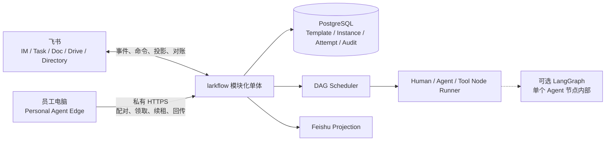

# ARCHITECTURE · larkflow

> 状态：Target + Gap · 既有架构简化版 · 2026-08-04

## 1. 架构原则

1. 每个节点的责任属于人，Human、Agent 和 Tool 是执行方式。
2. 中央数据库保存流程真相，飞书是交互入口和可恢复投影。
3. 产品 DAG 独立于 Agent 框架。
4. DAG 无环，重做通过 Attempt 和状态转换表达。
5. 生成、编辑和重启都先预览后确认。
6. 所有外部写入幂等，权限由服务端重算，关键变化可审计。
7. MVP 采用模块化单体，不预先引入 Kafka 或微服务。

## 2. 目标系统



### 模块边界

- Template Service：模板身份、不可变版本、生命周期和布尔锁。
- Instance Service：草稿、确认、快照、状态、编辑、重启和进度。
- Scheduler：依据依赖和状态解锁节点。
- Node Runner：运行 Agent 与 Tool 节点，接收 Human 节点提交。
- Edge Control：管理本人设备配对、撤销和窄 capability，把合法设备映射到现有 Node Runner 租约，不另建业务状态机。
- Projection Service：创建和对账飞书任务、卡片、消息及文档。
- Audit Service：追加 actor、来源、状态、revision 和相关对象。
- Outbox Worker：在数据库事务提交后可靠执行飞书副作用。

## 3. 领域模型与权威

| Entity | 权威位置 | 说明 |
|---|---|---|
| Template | PostgreSQL | 跨版本稳定身份 |
| TemplateVersion | PostgreSQL | 不可变图定义、状态与 `locked` |
| Instance | PostgreSQL | 可选模板引用、完整图快照、Owner、状态和 revision |
| NodeInstance | PostgreSQL | 依赖、唯一人类 Owner、执行器和当前状态 |
| Attempt | PostgreSQL | 每次执行、提交、质量结果和交付物引用 |
| Projection | PostgreSQL + 飞书对象 | 记录外部对象和同步版本，可重建 |
| AuditEvent | Append-only 审计表 | 客户端不能改写 |
| EdgeDevice / Pairing / EdgeEvent | PostgreSQL | 设备身份、一次性配对、撤销与追加型审计，不保存原始 secret |
| NodeRun checkpoint | 节点执行运行时 | 只属于一个 Agent 节点的一次 Attempt |

MVP 不建立独立 Project 聚合。`Instance` 只保存目标、项目 Owner、参与人和材料引用等最小元数据。首个部署按单企业实现，schema 保留 `tenant_id`，但不把完整多租户产品化作为首版交付条件。

## 4. 生命周期

### 模板

```text
draft -> enabled -> disabled -> deleted
```

修改已存在版本时创建新版本。`deleted` 为逻辑终态。只有 `enabled` 版本可以创建新实例。

### 实例

```text
draft -> running -> paused -> running
draft -> discarded
running -> done | failed | canceled
paused -> canceled
```

### 节点

```text
pending -> ready -> running -> done
                     |
                     +-> waiting_human -> done
                     +-> failed
pending | ready | running | waiting_human -> canceled
```

具体转换由领域服务校验。飞书动作、Agent 回传或 Tool 结果都只是命令输入。

## 5. 核心流程

### 创建与启动

1. 用户选择启用模板，或提交结构化无模板定义。
2. 服务端校验 DAG、责任人和验收字段，创建 `draft`。
3. 用户查看预览并确认或丢弃。
4. 确认事务冻结快照、创建节点和初始 Attempt，并写入 outbox。
5. 投影服务创建飞书责任入口，Scheduler 解锁根节点。

### 执行与质量

Human 节点等待 Owner 提交。Agent 与 Tool 节点由中央 Node Runner 运行。所有节点都保留唯一 Owner。自动执行失败、重试超限或需要人工判断时，节点进入可见的人工处理路径。

质量结果使用 `pass/fail + evidence + suggestion`。Agent 自动重试上限由服务配置，并且只由一个层次负责重试，避免 SDK 与业务层叠加。

### 编辑

运行中未来区域编辑已经按 Target 模型落地。服务端只接受当前 Owner 对 `running` 且未锁定 Instance 发起的 `add_node / update_node / remove_node`，并只允许修改没有任何执行痕迹的 `pending / ready` 当前 Attempt。服务端在内存副本上重新验证完整 DAG、Owner 与执行工作定义，随后把规范化操作、增删改集合、aggregate version、当前与目标 `graph_revision`、候选 Snapshot SHA-256 和 15 分钟有效期写入 GraphEditPreview。预览本身不修改 aggregate 或审计。

确认时重新授权创建预览的当前 Instance Owner，并重新执行相同操作。aggregate version、`graph_revision`、操作语义、节点集合或候选 Snapshot 哈希任一漂移都会拒绝。确认在同一 PostgreSQL 事务内保存 aggregate、消费预览、递增一次 revision、追加一条审计及必要 outbox。新增节点创建 Attempt 1，更新节点只刷新未开始 Attempt，删除节点只移除未开始 Node 与 Attempt；模板和已执行历史不变。重复确认只回读已应用状态。

### 重启

节点和完整实例重启已经按 Target 模型落地。RestartPreview 以显式 `node / instance` scope 区分两种语义：节点 scope 计算目标节点及所有可达下游，并保存目标节点键；实例 scope 使用拓扑排序后的全图，节点键为空。两者都把 tenant、Instance、actor、稳定影响集合、aggregate version、`graph_revision` 和 15 分钟有效期写入独立 RestartPreview，预览本身不修改 aggregate 或审计。确认时重新授权当前 Instance Owner，并在同一 PostgreSQL 事务内锁定和消费预览、比较 aggregate version、重算影响集合、取消活动旧 Attempt、清除 claim、创建新 Attempt、写审计与投影 outbox。节点 scope 把目标节点置为 `ready`，下游置为 `pending`；实例 scope 把全部根节点置为 `ready`，其他节点置为 `pending`。旧 Attempt、结果和质量记录保持只读，重复确认只回读已应用结果。

### 对账

Projection 记录外部对象 ID、幂等键和已同步版本。缺失对象可重建，重复事件被忽略，冲突按服务端合法状态重新投影并记录告警。

## 6. LangGraph 边界

业务 DAG 不使用 LangGraph 图或 checkpointer 作为产品模型。LangGraph 可以实现一个复杂 Agent 节点内部的检索、生成和自检，checkpoint 只服务该次 NodeRun 的恢复。简单 Agent 或 Tool 节点无需 LangGraph。

## 7. 当前 Target 内核 As-built

`larkflow/workflow/` 是目标架构代码，与 legacy `engine/`、`service.py` 和 LangGraph checkpointer 隔离：

- `model.py`：不可变 `InstanceSnapshot` 与 `NodeSpec`，以及 Template、TemplateVersion、模板审计、Instance、NodeInstance、NodeAttempt 和质量结果。
- `template_service.py`：模板文档校验、不可变版本、生命周期、角色与参数绑定，以及冻结 Instance Snapshot 的确定性物化。
- `graph.py`：v0.2 schema、必填工作字段、唯一节点、依赖存在、无环、拓扑、就绪和可达下游校验。
- `transitions.py`：实例、节点和 Attempt 的显式状态转换表。
- `scheduler.py`：确认草稿时创建节点与初始 Attempt，根节点进入 ready，依赖完成后解锁直接下游。
- `runner.py`：Human 节点等待唯一 Owner；Agent 与 Tool 节点使用带 Worker 身份的短时 claim，结果必须匹配当前 Attempt、节点版本、token、Worker 和租期。过期 claim 由新 Worker 轮换 token 后接管同一 Attempt。
- `events.py`：不可变 AuditEvent、OutboxEvent 以及带租约的 outbox claim 契约。
- `repository.py`：Instance、Template、RestartPreview 与 GraphEditPreview 仓储 Port，以及仅供测试的 copy-on-read 内存实现；两类重启通过 `save_restart`，未来区域编辑通过 `save_graph_edit`，把 aggregate、预览消费、审计和 outbox 原子提交。
- `migrations/` 与 `migrate.py`：PostgreSQL 14 schema、package-data migration 和 advisory lock migration runner；`0010_restart_previews` 保存短期重启授权，`0011_restart_scope` 增加显式 scope，`0012_graph_edit_previews` 保存未来区域编辑预览，`0013_im_command_mentions` 保存最小化 mention 数组，`0014_role_binding_cards` 保存人员选择卡状态，`0015_recovery_cards` 为失败恢复卡片增加耐久更新 token，`0016_role_card_single_action` 在不删除历史回调的前提下为每张人员选择卡保留一个 canonical 动作并建立部分唯一索引。
- `postgres.py` 与 `serde.py`：模板版本、模板审计、JSONB 快照序列化、规范化运行态表、乐观并发仓储、追加型审计与 `FOR UPDATE SKIP LOCKED` outbox。
- `service.py`、`restart.py` 与 `editing.py`：提供只读草稿预览、节点及完整实例重启影响计算、未来区域编辑计划、短期预览与原子确认，并在仓储事务内协调草稿确认、调度、执行结果、授权、审计、outbox 与实例终态。节点重启若遗漏影响集合之外的失败节点会被拒绝；完整实例重启覆盖整个冻结图；未来区域编辑只跨越未开始区域，并用候选 Snapshot 哈希检测语义漂移。
- `recovery.py`：为失败的自动节点实现显式 `retry / human_takeover` 领域命令。两条路径都只允许当前节点 Owner，并比较 Instance version、Node version 和 Attempt 编号；旧卡片失效，原失败 Attempt 保持只读。重试复用受控节点重启语义，人工接管创建新 `waiting_human` Attempt 并进入现有 Task 投影与入站链路。
- `runtime.py`：单步 `WorkflowWorker` 与 `AutomatedExecutor` Port。每个 tick 最多认领一个自动节点，先提交 claim，再调用外部 executor；外部异常写回失败，进程级崩溃留下的认领由租约恢复。
- `daemon.py` 与 `config.py`：常驻轮询、可中断的有界空闲退避、瞬时 tick 故障隔离、Worker 身份和 Target env 配置。开发部署的 Runtime 与 Projection 空闲退避上限均为 1 秒；这只是交互延迟取舍，不改变耐久队列语义。
- `projection.py`、`projection_daemon.py` 与 `completion_poll.py`：只认领投影事件的 Outbox Worker、Feishu Task / IM / Doc Projection Port、稳定幂等键、Projection 记录和独立常驻循环。常驻循环在消费 Outbox 前，按 Instance ID 分页扫描 PostgreSQL 权威状态，为当前 `waiting_human` 节点补建缺失 Projection，只在飞书 Task v2 明确返回 `1470404` 时重建外部 Task，并用带 repair generation 的稳定幂等键原子换绑。权限、限流、网络或五百错误不得触发换绑；终态节点不补发历史 Task，但会收口已有 Projection 的完成状态。重启产生的旧 Attempt 同步事件按历史 Attempt 状态关闭旧 Human Task，新 Attempt 使用不同稳定幂等键创建新 Task；未来区域编辑删除未开始节点后，陈旧的节点创建事件按 no-op 收口。循环还会周期读取当前 Human Task，观察到完成后以稳定信号 ID 写入耐久 Inbox。Human Task 描述会带入节点明确声明的 Instance 输入和直接依赖中已提交的结果，Agent 正文优先展示并设置长度上限。自动节点完成后向 Owner 发送结果消息；Instance 完成后创建汇总文档并发送带链接的最终通知。首次完成沿用历史幂等键，重启后按当前终端 Attempt 分代，确保同一实例再次完成时创建新文档与最终通知，并保留旧轮次 Projection。单实例修复入口只补齐当前完成轮次缺失的投影，并保持幂等。
- `inbound.py` 与 `inbound_daemon.py`：接受 Task 状态轮询或飞书事件产生的 PostgreSQL Inbox 信号，以及凭据侧校验与领域侧提交两阶段 Worker。两阶段分别 claim，失败后指数退避，过期 claim 可被其他 Worker 恢复。无论信号来源如何，凭据侧都重新读取 Task，默认最多验证 24 次；耗尽后写入带终止时间、阶段、结果和最后错误的 `exhausted` 终态，结构化日志暴露耗尽计数，且该信号不再被认领。
- `feishu.py`：基于 lark-cli 的 Task、文本消息和 Docx adapter。Task 创建使用原生 Task API、稳定 client token、`mode=1`、唯一 Owner assignee 和稳定绑定字段；入站校验只读 Task 详情。消息与文档 adapter 只消费服务端生成的目标和正文，不信任客户端身份字段。
- `im_commands.py`：把 `im.message.receive_v1` 的原始 V2 信封和 lark-cli 拍平事件归一为耐久命令信号，按 message / event 去重，并保存 mention key 与 open_id。凭据侧先验证发送者以及 `start` 引用的全部角色人员均为当前企业活跃成员；领域侧只接受 `/larkflow help`、`/larkflow start`、`/larkflow confirm`、`/larkflow status`、`/larkflow list`、`/larkflow restart`、`/larkflow restart-all`、`/larkflow restart-confirm`、`/larkflow edit` 与 `/larkflow edit-confirm`，并通过耐久回复队列发送结果。`start` 创建草稿但不自动确认，发送者成为 Instance Owner，未显式绑定的角色归发送者；`role=@成员` 只能引用同一条消息的认证 mention key，文本中的 open_id 和显示名称无效。`status` 与 `list` 只返回有界 Owner 读模型；restart 与 edit 命令只返回服务端预览，对应 confirm 命令才消费并执行。不存在、无权限和不可操作使用合并错误，避免实例与预览枚举。
- `directory.py`：可选企业目录 Port 与 lark-cli bot adapter。草稿写入前去重校验 Instance Owner 和全部节点 Owner 的 open_id、激活状态与离职、冻结标志；缺字段、ID 不匹配或非活跃状态均 fail closed。
- `role_bindings.py`：把需要跨人员分工但未显式 mention 的 `start` 转成 Card 2.0 人员选择表单。候选人快照、卡片发送、回调事件、目录再验证、领域创建、卡片回写和文本回复均耐久保存并独立认领；操作人、候选集合、角色集合和实例 ID 都由服务端重算。回调动作耐久插入后立即尝试把原卡片替换为无按钮“处理中”，成功后同一原卡片冻结为已确认状态。同一 message 只有一个 canonical 动作，重复回调不创建第二个草稿；迁移前的重复行保留为非 canonical 历史。
- `im_commands.py` 中的 `RecoveryActionInboxBridge`：把飞书恢复卡片回调转换为耐久命令。桥接层归一化 lark-cli 字符串化 `action_value`、可缺失 `action_name` 和秒、毫秒、微秒时间戳；若 `action_name` 存在则必须与服务端动作交叉一致。操作人只从飞书顶层认证字段取值，卡片 payload 中的身份不参与授权；动作耐久插入后立即尝试把原卡片替换为无按钮“处理中”，最终再更新原卡片并发送耐久文本回执。`event_time.py` 为恢复与人员分工回调提供共享时间归一化，避免边界解析分叉。
- `card_feedback.py`：统一生成蓝色处理中与橙色拒绝卡。Target 长连接入口使用最长 3 秒的 lark-cli 直接更新；动作先延后 10 秒防止后台 Worker 抢先写入最终状态，直接更新结束后立即释放，崩溃时由延后时间兜底。该顺序保证最终状态不会被迟到的处理中状态覆盖，也不让视觉回写失败撤销已持久化动作。
- `cli.py`：独立 `larkflow-target` 运维入口，提供模板全生命周期、从模板创建草稿、预览、确认、状态、Human 提交，以及 Runtime、Projection、入站校验和领域入站的单步 / 常驻服务；`reconcile-instance-completion` 可显式修复一个已完成实例缺失的完成文档或最终通知。
- `executors.py`：包含只接受 `work.agent.kind=llm.generate` 的 `LLMAgentExecutor`、按 `work.tool.kind` 路由内部 adapter 的 `ToolExecutorRouter`、确定性的 `content.check`，以及只用于开发验证的 `development.echo`。`content.check` 从直接依赖提取正文，执行长度与必需词检查，并返回 `pass / fail + evidence + suggestion`；Runtime 在 claim 前按 adapter 能力筛选具体节点，未接受的 kind 保持 ready，不会先认领后失败。
- `edge.py`、`edge_postgres.py` 与 migration `0007_edge_devices`：一次性配对、设备哈希凭据、撤销、追加型 Edge 审计和 `personal.readonly` 能力过滤。Edge 复用当前 Attempt 的 Worker、token、版本与租期校验，不创建第二套任务真相。
- `edge_http.py` 与 `edge_gateway_cli.py`：提供私有 `/edge/v1` JSON 边界和运维入口。Gateway 默认且强制只监听 loopback；远程设备必须经独立 HTTPS 反向代理，仓库不把该接口描述为公网 API。
- `edge_client.py` 与 `edge_cli.py`：用户设备只提供手工 `pair` 与 `run-once`。Codex adapter 固定显式工作区，使用只读、临时会话和忽略用户配置模式，清除 Edge、Target 与飞书凭据环境变量，并按进程组终止超时子进程。

领域状态、审计与 outbox 在同一事务提交。事务提交后，Human 节点与所有节点状态变化通过 outbox 请求投影同步；Agent 和 Tool 激活直接返回 NodeActivation，由 Runtime Worker 在提交后交给 executor，避免数据库事务跨越外部调用。自动执行是 at-least-once，executor 必须使用 tenant-scoped Attempt 幂等键消除重复副作用。Agent 装配还会检查所有显式故障切换线路的超时总和，加上安全余量后必须小于 claim 租期，避免正常慢调用在结果提交前失去租约。Edge Proof 不发明独立 Capability Lease，它把可撤销设备身份与一个明确 kind 映射到同一 Node claim，并用心跳延长当前租期；设备失联或本机执行器异常后，租约到期才允许接管。

PostgreSQL adapter 已在一次性 PostgreSQL 14 数据库上验证 migration 重入、完整聚合往返、模板并发启用、不可变版本触发器、审计追加保护、outbox、Inbox、双 Worker 竞争、过期认领恢复、验证耗尽终态，以及投影分页对账、缺失补建、受控换绑和重入。Owner 实例列表还验证了 tenant 与 Owner 隔离、稳定倒序、进度汇总和索引存在性。节点重启、完整实例重启和未来区域编辑分别验证同一预览的两个真实连接恰好一路执行、一路幂等回放，聚合版本只增加一次、历史 Attempt 保留且审计只有一条。Edge migration 与 store 也已验证配对竞争、领取、续租、完成、撤销、原始 secret 不落库和 Edge 审计不可改写；测试库和上传件随后删除。长期开发库已应用十六份 migration。第十六份迁移在真实库发现一组五条历史同卡回调后无损执行，保留最早一条 canonical 动作与四条非 canonical 历史，canonical 重复组为零。`alicloud-sh` 已建立长期 Target 开发库、每日备份，以及 Runtime、Projection、入站校验、领域入站和 Edge Gateway 五个 Target 常驻服务；加上 legacy 事件消费者，共六个 Python 服务。飞书 IM 命令、mention 与卡片人员分工、发送者和候选人目录校验、草稿创建与确认、Human-Agent-Tool-Human、自动节点消息、完成 Docx、最终通知、Owner 专属状态查询、最近实例列表、两类重启、未来区域编辑和自动节点失败恢复已在测试组织完成真实闭环。失败恢复验收中，两个不同恢复卡分别创建 Attempt 2 和 3；人工接管创建 Attempt 4 与 Human Task，Task 完成后 Instance 进入 `done`，前三次失败 Attempt、错误、审计与投影全部保留，Attempt 4 的完成文档和最终消息均已投影。编辑正向实例完成于 `version 8 / graph_revision 2`，更新后的 Human Task、Docx 与最终消息均已绑定；负向实例真实拒绝冻结线、成环依赖和陈旧预览，完成于 `version 7 / graph_revision 1`，没有图编辑审计。完整实例重启验收覆盖三节点全图预览、确认、从全部根节点重新调度、重复确认 no-op 和再次完成；三个当前 Attempt 为 2、2、3，旧 Attempt、Task、结果和完成投影均保留，新旧完成文档与最终消息具有不同外部 ID。Task 完成事件在本轮仍未被 bot 长连接收到，Projection 对当前 Human Task 的周期读回仍是可靠路径。轮询和可选事件都只写 Inbox，不直接改 Target 领域状态。凭据侧以 `lf-dev` 重新读取飞书资源并写验证结果，领域侧以 `lf_target_dev` 重新校验业务授权，后者不能读取 lark-cli profile。开发应用发布所需通讯录数据范围后，中央应用从根部门读取到五名活跃成员，并能解析选定测试成员。该成员持有的合成实例生成真实 Human Task 投影后，当前登录用户发送的 `/larkflow edit` 被耐久处理为拒绝并成功回复；实例保持 `graph_revision 1`，没有创建预览或图编辑审计。群聊 mention 和单聊 Card 2.0 两条跨人员正向入口均已创建冻结草稿；后者的原卡片已回写为绿色已确认状态。本轮即时反馈验收中的新人员选择卡也只创建一个 canonical 动作和一个草稿，领域处理在入站后 3.393 秒完成，最终回复在 5.793 秒完成；飞书服务端读回原卡片为绿色已确认且没有提交按钮。更多业务 Tool、图形化控制面和生产装配仍未实现；同机本地备份不构成生产级高可用或灾难恢复。投影对账已部署到长期开发服务，并用专用实例完成真实 Task 删除后的换绑、重入及新 Task 完成入站验收。Gateway 以 `lf_target_dev` 常驻且只监听 `127.0.0.1:8765`。临时本机 Edge 通过 SSH 隧道完成两条合成 Codex 跨机实例，第二条产生 10 次真实续租审计；设备撤销后旧凭据领取被拒绝。开发服务器另以 Caddy 将专用 DNS-only 子域名反向代理到 loopback Gateway，受信任证书、SAN、安全响应头和源站 401 均已验证；但公网客户端后续 TLS 握手在到达 ECS 前被阿里云中国内地 ICP 接入备案系统重置，因此公网配对、领取、续租和回传尚未验证。阻断确认后 Caddy 已停止并禁用开机启动，配置、证书和回滚备份保留，Gateway 与其他 Target 服务不受影响。

## 8. Intended vs implemented

| Area | Target | 当前仓库 | 差距 |
|---|---|---|---|
| 业务真相 | PostgreSQL 领域模型 | Template 与 Instance aggregate、PostgreSQL adapter、独立 CLI、Runtime、Agent、首个 Tool、Task 入站和窄 IM 命令已落码；legacy 仍用 checkpointer | 需要更多飞书命令、更多业务 Tool 与生产装配 |
| 持久化 | Instance、Node、Attempt、Audit、Outbox、Inbox | PostgreSQL 14 schema、事务仓储、追加型 Audit、带租约 Outbox 和事件去重 Inbox 已实现并真库验证；长期开发库与本地每日备份已建立 | 需要异机备份、PITR、升级、容量告警和生产装配 |
| 草稿与模板可选 | 草稿预览、确认、模板或无模板实例 | 新内核支持直接 Snapshot 草稿，以及模板参数和角色绑定生成的冻结草稿；Owner 可只读预览并独立确认；飞书 IM 已提供模板草稿创建与确认入口 | 需要无模板用户入口和更完整的模板管理入口 |
| 模板 | 简单生命周期、不可变版本、布尔锁 | Template Service、PostgreSQL 仓储、追加型审计、CLI 与 v0.2 示例已实现并真库验证 | 需要 importer 和模板管理界面 |
| 责任 | 每节点唯一 Owner，执行器分离 | 新内核已强制 Owner 与 `human/agent/tool` 分离；IM mention 和 Card 2.0 人员选择均在凭据侧验证活跃成员，再由领域侧冻结角色绑定，已完成开发真栈正向验收；草稿 Owner 全量目录校验已落码但默认关闭 | 需要异常成员状态回归、管理入口和生产装配 |
| 编辑与重启 | 预览确认、revision、下游 Attempt | 未来区域编辑及节点、完整实例重启都已实现耐久预览、Owner 重授权、版本与 revision 校验、历史保护和原子审计，并完成真库竞争与 Owner 飞书闭环；编辑拒绝矩阵覆盖冻结线、非法 DAG、陈旧预览与跨人员非 Owner | 需要图形化 diff、跨轮次浏览和生产装配 |
| 飞书集成 | PostgreSQL outbox / Inbox、幂等、服务端授权、对账 | Human Task 创建 / 完成、可靠轮询、可选事件、服务端详情回读、两阶段授权、启动对账、受控 Task 重建、十个窄命令、人员选择卡、失败恢复卡、自动节点消息、两类重启、未来区域编辑、跨人员分工、完成 Docx 与最终通知已落码并完成开发真栈验收 | 需要更多业务命令、长期轮询唤醒优化和生产拓扑 |
| 运行时 | 独立 Scheduler + Node Runner | 新内核已实现 Scheduler、Node Runner、持久化 runnable scan、`llm.generate`、`content.check`、Runtime / Projection / Inbound Worker、能力过滤、优雅停机、过期 claim 恢复，以及失败自动节点的 Owner 重试与人工接管 | 需要更多业务 Tool、自动重试策略配置、恢复运营视图和生产装配 |
| Personal Agent Edge | 默认关闭、本人设备、窄 capability、中央真相 | Proof v0 已实现配对、撤销、私有 HTTP、手工 run-once、只读 Codex adapter、续租与迟到结果拒绝；离线、真实 PostgreSQL、loopback 常驻部署、SSH 隧道跨机 Codex、Caddy 与源站证书已验证 | 需要完成 ICP 接入备案或迁移合规地域，再做公网设备 E2E；凭据系统存储与安全评审仍缺，产品化仍为 Later |

[SPEC.md](SPEC.md) 和 [DEPLOYMENT.md](DEPLOYMENT.md) 继续描述 As-built 原型，不作为目标产品已实现证据。

## 9. 安全与运维不变量

- 凭证、token、真实人员 ID 和生产数据不进入模板、日志或仓库。
- 每个命令按当前 actor、tenant、责任关系、状态和 expected revision 重新授权。
- 人员、模板或实例失效必须有可审计的逻辑终态，不通过物理删除抹除历史。
- 状态事务与飞书副作用通过 outbox 或等价机制解耦。
- 测试继续使用 Mock Lark I/O、Stub LLM 和临时或内存数据库，不访问真实飞书。
- Edge 子进程不得获得设备凭据、Target DSN 或飞书应用凭据；Human gate 永远不能由 Edge 代答。
