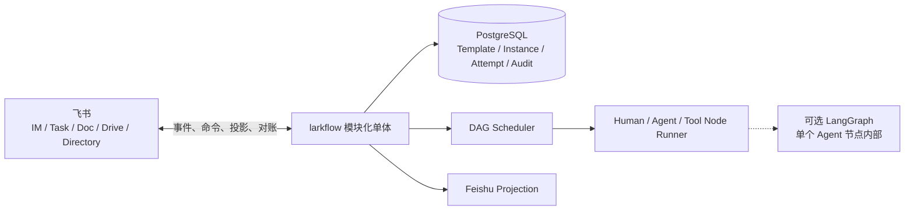

# ARCHITECTURE · larkflow

> 状态：Target + Gap · 既有架构简化版 · 2026-08-01

## 1. 架构原则

1. 每个节点的责任属于人，Human、Agent 和 Tool 是执行方式。
2. 中央数据库保存流程真相，飞书是交互入口和可恢复投影。
3. 产品 DAG 独立于 Agent 框架。
4. DAG 无环，重做通过 Attempt 和状态转换表达。
5. 生成、编辑和重启都先预览后确认。
6. 所有外部写入幂等，权限由服务端重算，关键变化可审计。
7. MVP 采用模块化单体，不预先引入 Kafka 或微服务。

## 2. 目标系统



### 模块边界

- Template Service：模板身份、不可变版本、生命周期和布尔锁。
- Instance Service：草稿、确认、快照、状态、编辑、重启和进度。
- Scheduler：依据依赖和状态解锁节点。
- Node Runner：运行 Agent 与 Tool 节点，接收 Human 节点提交。
- Projection Service：创建和对账飞书任务、卡片、消息及文档。
- Audit Service：追加 actor、来源、状态、revision 和相关对象。
- Outbox Worker：在数据库事务提交后可靠执行飞书副作用。

## 3. 领域模型与权威

| Entity | 权威位置 | 说明 |
|---|---|---|
| Template | PostgreSQL | 跨版本稳定身份 |
| TemplateVersion | PostgreSQL | 不可变图定义、状态与 `locked` |
| Instance | PostgreSQL | 可选模板引用、完整图快照、Owner、状态和 revision |
| NodeInstance | PostgreSQL | 依赖、唯一人类 Owner、执行器和当前状态 |
| Attempt | PostgreSQL | 每次执行、提交、质量结果和交付物引用 |
| Projection | PostgreSQL + 飞书对象 | 记录外部对象和同步版本，可重建 |
| AuditEvent | Append-only 审计表 | 客户端不能改写 |
| NodeRun checkpoint | 节点执行运行时 | 只属于一个 Agent 节点的一次 Attempt |

MVP 不建立独立 Project 聚合。`Instance` 只保存目标、项目 Owner、参与人和材料引用等最小元数据。首个部署按单企业实现，schema 保留 `tenant_id`，但不把完整多租户产品化作为首版交付条件。

## 4. 生命周期

### 模板

```text
draft -> enabled -> disabled -> deleted
```

修改已存在版本时创建新版本。`deleted` 为逻辑终态。只有 `enabled` 版本可以创建新实例。

### 实例

```text
draft -> running -> paused -> running
draft -> discarded
running -> done | failed | canceled
paused -> canceled
```

### 节点

```text
pending -> ready -> running -> done
                     |
                     +-> waiting_human -> done
                     +-> failed
pending | ready | running | waiting_human -> canceled
```

具体转换由领域服务校验。飞书动作、Agent 回传或 Tool 结果都只是命令输入。

## 5. 核心流程

### 创建与启动

1. 用户选择启用模板，或提交结构化无模板定义。
2. 服务端校验 DAG、责任人和验收字段，创建 `draft`。
3. 用户查看预览并确认或丢弃。
4. 确认事务冻结快照、创建节点和初始 Attempt，并写入 outbox。
5. 投影服务创建飞书责任入口，Scheduler 解锁根节点。

### 执行与质量

Human 节点等待 Owner 提交。Agent 与 Tool 节点由中央 Node Runner 运行。所有节点都保留唯一 Owner。自动执行失败、重试超限或需要人工判断时，节点进入可见的人工处理路径。

质量结果使用 `pass/fail + evidence + suggestion`。Agent 自动重试上限由服务配置，并且只由一个层次负责重试，避免 SDK 与业务层叠加。

### 编辑

服务端基于当前 `graph_revision` 计算只涉及未开始区域的变更预览。确认请求只有在 revision 未变化时才能提交。提交后 Instance revision 递增，模板版本不变。

### 重启

服务端计算目标节点及所有可达下游。确认后结束当前活动 Attempt，为受影响节点创建新 Attempt，并按拓扑重新进入 `pending` 或 `ready`。旧 Attempt 与交付物保持只读。

### 对账

Projection 记录外部对象 ID、幂等键和已同步版本。缺失对象可重建，重复事件被忽略，冲突按服务端合法状态重新投影并记录告警。

## 6. LangGraph 边界

业务 DAG 不使用 LangGraph 图或 checkpointer 作为产品模型。LangGraph 可以实现一个复杂 Agent 节点内部的检索、生成和自检，checkpoint 只服务该次 NodeRun 的恢复。简单 Agent 或 Tool 节点无需 LangGraph。

## 7. 当前 Target 内核 As-built

`larkflow/workflow/` 是目标架构代码，与 legacy `engine/`、`service.py` 和 LangGraph checkpointer 隔离：

- `model.py`：不可变 `InstanceSnapshot` 与 `NodeSpec`，以及 Instance、NodeInstance、NodeAttempt 和质量结果。
- `graph.py`：v0.2 schema、必填工作字段、唯一节点、依赖存在、无环、拓扑、就绪和可达下游校验。
- `transitions.py`：实例、节点和 Attempt 的显式状态转换表。
- `scheduler.py`：确认草稿时创建节点与初始 Attempt，根节点进入 ready，依赖完成后解锁直接下游。
- `runner.py`：Human 节点等待唯一 Owner；Agent 与 Tool 节点使用带 Worker 身份的短时 claim，结果必须匹配当前 Attempt、节点版本、token、Worker 和租期。过期 claim 由新 Worker 轮换 token 后接管同一 Attempt。
- `events.py`：不可变 AuditEvent、OutboxEvent 以及带租约的 outbox claim 契约。
- `repository.py`：仓储 Port 与仅供测试的 copy-on-read 内存实现，按 tenant 隔离、扫描 ready 或过期认领实例，并使用实例版本拒绝丢失更新。
- `migrations/` 与 `migrate.py`：PostgreSQL 14 schema、package-data migration 和 advisory lock migration runner。
- `postgres.py` 与 `serde.py`：JSONB 快照序列化、规范化运行态表、乐观并发仓储、追加型审计与 `FOR UPDATE SKIP LOCKED` outbox。
- `service.py`：在一次仓储事务内协调草稿确认、调度、执行结果、授权、审计、outbox 与实例终态。
- `runtime.py`：单步 `WorkflowWorker` 与 `AutomatedExecutor` Port。每个 tick 最多认领一个自动节点，先提交 claim，再调用外部 executor；外部异常写回失败，进程级崩溃留下的认领由租约恢复。
- `daemon.py` 与 `config.py`：常驻轮询、可中断的有界空闲退避、瞬时 tick 故障隔离、Worker 身份和 Target env 配置。
- `projection.py` 与 `projection_daemon.py`：只认领投影事件的 Outbox Worker、Feishu Task Projection Port、稳定幂等键、Projection 记录和独立常驻循环。Human Task 描述会带入节点明确声明的 Instance 输入和直接依赖中已提交的结果，Agent 正文优先展示并设置长度上限。
- `inbound.py` 与 `inbound_daemon.py`：以飞书 `event_id` 去重的 PostgreSQL Inbox，以及凭据侧校验与领域侧提交两阶段 Worker。两阶段分别 claim，失败后有界重试，过期 claim 可被其他 Worker 恢复。
- `feishu.py`：基于 lark-cli 的 Task adapter。创建使用原生 Task API、稳定 client token、`mode=1`、唯一 Owner assignee 和稳定绑定字段；入站校验只读 Task 详情。
- `cli.py`：独立 `larkflow-target` 运维入口，提供 migration、草稿创建、确认、状态、Human 提交，以及 Runtime、Projection、入站校验和领域入站的单步 / 常驻服务。
- `executors.py`：包含只接受 `work.agent.kind=llm.generate` 的 `LLMAgentExecutor`，以及只用于开发验证的 `development.echo` Tool adapter。Agent 使用提交时冻结的实例输入与依赖结果，返回正文、逻辑模型角色和稳定请求标识；Runtime 在 claim 前按 adapter 能力筛选具体节点，未接受的 kind 保持 ready，不会先认领后失败。

领域状态、审计与 outbox 在同一事务提交。事务提交后，Human 节点与所有节点状态变化通过 outbox 请求投影同步；Agent 和 Tool 激活直接返回 NodeActivation，由 Runtime Worker 在提交后交给 executor，避免数据库事务跨越外部调用。自动执行是 at-least-once，executor 必须使用 tenant-scoped Attempt 幂等键消除重复副作用。Agent 装配还会检查所有显式故障切换线路的超时总和，加上安全余量后必须小于 claim 租期，避免正常慢调用在结果提交前失去租约。当前 claim 只解决中央 Worker 的并发认领，不是已 Deferred 的设备能力租约。

PostgreSQL adapter 已在一次性 PostgreSQL 14 数据库上验证 migration 重入、完整聚合往返、审计追加保护、outbox、Inbox、双 Worker 竞争与过期认领恢复。`alicloud-sh` 已建立长期 Target 开发库、每日备份，以及 Runtime、Projection、入站校验和领域入站四个 Target 常驻服务。legacy 仍是事件长连接的唯一消费者，只把原始 Task 完成信号持久化，不写 Target 领域状态。凭据侧以 `lf-dev` 读飞书 Task 并写验证结果，领域侧以 `lf_target_dev` 校验 Projection 绑定、当前 Attempt、唯一 Owner、任务来源与完成人后提交 Human 节点，后者不能读取 lark-cli profile。包含 Agent adapter 的 wheel 已安装到云端 Target 独立虚拟环境，但 Agent 开关保持关闭，尚未获得独立 LLM 凭证，也未完成真实 Human-Agent-Human 闭环。通用飞书命令、业务 Tool、IM 或 Doc 投影仍未接入；同机本地备份不构成生产级高可用或灾难恢复。

## 8. Intended vs implemented

| Area | Target | 当前仓库 | 差距 |
|---|---|---|---|
| 业务真相 | PostgreSQL 领域模型 | 新 workflow aggregate、PostgreSQL adapter、独立 CLI、Runtime、Agent、Projection 与 Task 入站已落码；legacy 仍用 checkpointer | 需要模板、通用飞书命令、业务 Tool 与生产装配 |
| 持久化 | Instance、Node、Attempt、Audit、Outbox、Inbox | PostgreSQL 14 schema、事务仓储、追加型 Audit、带租约 Outbox 和事件去重 Inbox 已实现并真库验证；长期开发库与本地每日备份已建立 | 需要异机备份、PITR、升级、容量告警和生产装配 |
| 草稿与模板可选 | 草稿确认、无模板实例 | 新内核支持直接 InstanceSnapshot 草稿与 Owner 确认；模板编译未实现 | 需要模板服务与 importer |
| 模板 | 简单生命周期、不可变版本、布尔锁 | 只消费 `id/name/nodes` | 未实现 |
| 责任 | 每节点唯一 Owner，执行器分离 | 新内核已强制 Owner 与 `human/agent/tool` 分离；企业人员有效性尚无 adapter | 需要目录校验与角色解析 |
| 编辑与重启 | 预览确认、revision、下游 Attempt | 已有活图和选择性重算机制 | 需按新模型提炼 |
| 飞书集成 | PostgreSQL outbox / Inbox、幂等、服务端授权、对账 | Human Task 创建 / 完成、Task 完成事件去重、服务端详情回读、两阶段授权和独立常驻 Worker 已实现 | 需要通用命令入站、启动全量对账、IM / Doc 投影与缺失对象重建 |
| 运行时 | 独立 Scheduler + Node Runner | 新内核已实现 Scheduler、Node Runner、持久化 runnable scan、`llm.generate` Agent adapter、Runtime / Projection / Inbound Worker、能力过滤、优雅停机与过期 claim 恢复 | 需要 Agent 云端真链路、业务 Tool executor 和有限重试 |

[SPEC.md](SPEC.md) 和 [DEPLOYMENT.md](DEPLOYMENT.md) 继续描述 As-built 原型，不作为目标产品已实现证据。

## 9. 安全与运维不变量

- 凭证、token、真实人员 ID 和生产数据不进入模板、日志或仓库。
- 每个命令按当前 actor、tenant、责任关系、状态和 expected revision 重新授权。
- 人员、模板或实例失效必须有可审计的逻辑终态，不通过物理删除抹除历史。
- 状态事务与飞书副作用通过 outbox 或等价机制解耦。
- 测试继续使用 Mock Lark I/O、Stub LLM 和临时或内存数据库，不访问真实飞书。
