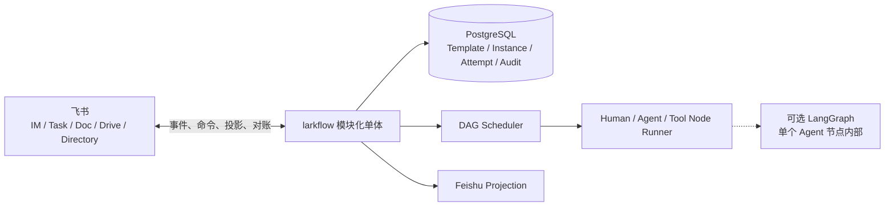

# ARCHITECTURE · larkflow

> 状态：Target + Gap · 既有架构简化版 · 2026-08-01

## 1. 架构原则

1. 每个节点的责任属于人，Human、Agent 和 Tool 是执行方式。
2. 中央数据库保存流程真相，飞书是交互入口和可恢复投影。
3. 产品 DAG 独立于 Agent 框架。
4. DAG 无环，重做通过 Attempt 和状态转换表达。
5. 生成、编辑和重启都先预览后确认。
6. 所有外部写入幂等，权限由服务端重算，关键变化可审计。
7. MVP 采用模块化单体，不预先引入 Kafka 或微服务。

## 2. 目标系统



### 模块边界

- Template Service：模板身份、不可变版本、生命周期和布尔锁。
- Instance Service：草稿、确认、快照、状态、编辑、重启和进度。
- Scheduler：依据依赖和状态解锁节点。
- Node Runner：运行 Agent 与 Tool 节点，接收 Human 节点提交。
- Projection Service：创建和对账飞书任务、卡片、消息及文档。
- Audit Service：追加 actor、来源、状态、revision 和相关对象。
- Outbox Worker：在数据库事务提交后可靠执行飞书副作用。

## 3. 领域模型与权威

| Entity | 权威位置 | 说明 |
|---|---|---|
| Template | PostgreSQL | 跨版本稳定身份 |
| TemplateVersion | PostgreSQL | 不可变图定义、状态与 `locked` |
| Instance | PostgreSQL | 可选模板引用、完整图快照、Owner、状态和 revision |
| NodeInstance | PostgreSQL | 依赖、唯一人类 Owner、执行器和当前状态 |
| Attempt | PostgreSQL | 每次执行、提交、质量结果和交付物引用 |
| Projection | PostgreSQL + 飞书对象 | 记录外部对象和同步版本，可重建 |
| AuditEvent | Append-only 审计表 | 客户端不能改写 |
| NodeRun checkpoint | 节点执行运行时 | 只属于一个 Agent 节点的一次 Attempt |

MVP 不建立独立 Project 聚合。`Instance` 只保存目标、项目 Owner、参与人和材料引用等最小元数据。首个部署按单企业实现，schema 保留 `tenant_id`，但不把完整多租户产品化作为首版交付条件。

## 4. 生命周期

### 模板

```text
draft -> enabled -> disabled -> deleted
```

修改已存在版本时创建新版本。`deleted` 为逻辑终态。只有 `enabled` 版本可以创建新实例。

### 实例

```text
draft -> running -> paused -> running
draft -> discarded
running -> done | failed | canceled
paused -> canceled
```

### 节点

```text
pending -> ready -> running -> done
                     |
                     +-> waiting_human -> done
                     +-> failed
pending | ready | running | waiting_human -> canceled
```

具体转换由领域服务校验。飞书动作、Agent 回传或 Tool 结果都只是命令输入。

## 5. 核心流程

### 创建与启动

1. 用户选择启用模板，或提交结构化无模板定义。
2. 服务端校验 DAG、责任人和验收字段，创建 `draft`。
3. 用户查看预览并确认或丢弃。
4. 确认事务冻结快照、创建节点和初始 Attempt，并写入 outbox。
5. 投影服务创建飞书责任入口，Scheduler 解锁根节点。

### 执行与质量

Human 节点等待 Owner 提交。Agent 与 Tool 节点由中央 Node Runner 运行。所有节点都保留唯一 Owner。自动执行失败、重试超限或需要人工判断时，节点进入可见的人工处理路径。

质量结果使用 `pass/fail + evidence + suggestion`。Agent 自动重试上限由服务配置，并且只由一个层次负责重试，避免 SDK 与业务层叠加。

### 编辑

服务端基于当前 `graph_revision` 计算只涉及未开始区域的变更预览。确认请求只有在 revision 未变化时才能提交。提交后 Instance revision 递增，模板版本不变。

### 重启

服务端计算目标节点及所有可达下游。确认后结束当前活动 Attempt，为受影响节点创建新 Attempt，并按拓扑重新进入 `pending` 或 `ready`。旧 Attempt 与交付物保持只读。

### 对账

Projection 记录外部对象 ID、幂等键和已同步版本。缺失对象可重建，重复事件被忽略，冲突按服务端合法状态重新投影并记录告警。

## 6. LangGraph 边界

业务 DAG 不使用 LangGraph 图或 checkpointer 作为产品模型。LangGraph 可以实现一个复杂 Agent 节点内部的检索、生成和自检，checkpoint 只服务该次 NodeRun 的恢复。简单 Agent 或 Tool 节点无需 LangGraph。

## 7. Intended vs implemented

| Area | Target | 当前仓库 | 差距 |
|---|---|---|---|
| 业务真相 | PostgreSQL 领域模型 | LangGraph checkpointer | 需要替换 |
| 持久化 | Instance、Node、Attempt、Audit、Outbox | SQLite + LangGraph state | 需要重建 |
| 草稿与模板可选 | 草稿确认、无模板实例 | 从 legacy YAML 直接启动 | 未实现 |
| 模板 | 简单生命周期、不可变版本、布尔锁 | 只消费 `id/name/nodes` | 未实现 |
| 责任 | 每节点唯一 Owner，执行器分离 | 静态角色映射，部分节点自动执行 | 部分经验可迁移 |
| 编辑与重启 | 预览确认、revision、下游 Attempt | 已有活图和选择性重算机制 | 需按新模型提炼 |
| 飞书投影 | PostgreSQL outbox、幂等、对账 | 已有 CLI adapter、关联表和 reconcile | 可迁移经验 |
| 运行时 | 独立 Scheduler + Node Runner | LangGraph 解释整个业务流 | 需要拆边界 |

[SPEC.md](SPEC.md) 和 [DEPLOYMENT.md](DEPLOYMENT.md) 继续描述 As-built 原型，不作为目标产品已实现证据。

## 8. 安全与运维不变量

- 凭证、token、真实人员 ID 和生产数据不进入模板、日志或仓库。
- 每个命令按当前 actor、tenant、责任关系、状态和 expected revision 重新授权。
- 人员、模板或实例失效必须有可审计的逻辑终态，不通过物理删除抹除历史。
- 状态事务与飞书副作用通过 outbox 或等价机制解耦。
- 测试继续使用 Mock Lark I/O、Stub LLM 和临时或内存数据库，不访问真实飞书。
