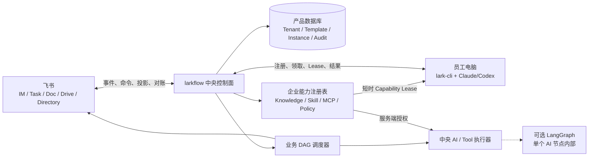

# ARCHITECTURE · larkflow

> 状态：Target Architecture + As-built Gap · 2026-07-30

## 1. Architecture principles

1. 业务责任属于人；Agent、LLM 和工具是执行手段。
2. 中央控制面保存企业流程真相；飞书和本地设备都是可恢复投影或执行端。
3. 产品 DAG 是稳定业务契约，必须与任何 Agent 框架解耦。
4. 模板 DAG 无环；返工通过 Attempt 和状态转换表达。
5. 父子 DAG 只通过 Work Contract 交换信息，并强制三级上限。
6. 所有外部写入幂等，所有权限在服务端重算，所有关键转换可审计。

## 2. Target system



### Central control plane

- Tenant / Organization：租户、部门、人员映射和治理角色。
- Template Registry：四级模板、版本、Fork、权限、锁和发布流程。
- Workflow Service：实例、节点、父子关系、Attempt、验收、阻塞和改派。
- Scheduler：按依赖和状态解锁工作包，不依赖在线的个人设备。
- Projection Service：飞书待办、消息、卡片、文档和状态对账。
- Capability Registry：企业知识、Skill、MCP、Secret 引用和策略。
- Edge Gateway：设备注册、在线状态、任务领取、Lease 和结果回传。
- Audit / Operations：不可抵赖的 actor、来源、状态变更和运维告警。

### Feishu as system of engagement

飞书通讯录提供人员身份与组织输入；Task/IM 是工作入口；Docs/Drive 保存协作内容。中央数据库记录这些对象的 token、投影版本和幂等键。飞书对象可以被重建或对账，不能反向覆盖业务权限与状态。

### Local Agent edge

每位员工可在自己的电脑安装 lark-cli，并把 Claude/Codex 注册为个人执行环境。设备不拥有企业待办，也不持续持有广泛凭证。只有责任人主动选择 Agent 执行时，中央控制面签发短时、可撤销、限定资源与工具的 Capability Lease。

边缘提交至少包含 `instance/node/attempt`、责任人、设备、Agent 类型、Lease、产出引用和执行摘要。服务端验证当前责任、Attempt 和 Lease 后才接收；人类 Gate 必须由本人确认。

## 3. Domain model and authority

| Entity | Target authority | Notes |
|---|---|---|
| Tenant / Person / Role binding | Product DB；人员基础资料来自飞书同步 | 绑定变化必须审计 |
| Template / Version / Lock | Product DB | 发布版本不可变 |
| Instance / Node / Attempt | Product DB | 跨人业务状态唯一真相 |
| Parent-child relation | Product DB | 只通过 Work Contract 连接 |
| Assignment | Product DB | 必须解析到唯一人员 |
| Feishu task/card/doc projection | 飞书对象 + Product DB projection record | 可对账，不决定权限 |
| Agent node-run checkpoint | 对应执行运行时 | 仅属于一个节点的一次执行 |
| Knowledge / Skill / MCP policy | Capability Registry | Secret 只保存引用 |
| Audit event | Append-only audit store | 不允许客户端改写 |

PostgreSQL 是目标业务数据库；MVP 可从单租户开始，但 schema 必须从第一天带 `tenant_id`。SQLite 仅保留在本地测试、边缘缓存或 legacy 原型中，不作为目标 SaaS 真相源。

## 4. DAG and state semantics

模板与实例拓扑始终是 DAG。节点状态建议为：

```text
pending -> ready -> assigned -> in_progress -> submitted -> accepted
                         \-> blocked
submitted -> rejected -> new Attempt
```

`rejected` 不将图连回祖先节点。系统创建新的 Attempt，并按服务端规则将必要节点重新置为可执行。历史 Attempt、交付物和责任人保持不变。

实例最多三级。创建子 DAG 时：

1. 父节点责任人保持不变。
2. 子实例获得独立 Owner、权限、模板快照和内部审计。
3. 父层只读取 Contract Summary；无权默认修改子层节点。
4. 子实例交付后形成父节点提交；父层拒绝则创建父工作包新 Attempt。
5. L3 的 `expansion.policy` 强制为 `forbidden`。

## 5. Template and capability boundary

DAG Template 只声明业务目标、依赖、Role Slot、输入输出、验收、资源需求和治理规则。它可以引用逻辑资源，例如 `kb:historical_contracts`、`skill:legal_drafting@2`、`mcp:archive.search`，但不得嵌入个人 token、设备、prompt 链或 LangGraph state。

实例化负责把 Role Slot 解析成人，把逻辑资源解析为企业允许的版本。执行前再根据 actor、节点、Attempt 和用途签发最小 Capability Lease。

## 6. LangGraph decision

业务 DAG 不以 LangGraph 图或 checkpointer 为产品模型。原因是跨人流程需要模板治理、多租户查询、父子权限、长期审计和离线边缘执行，这些都不应绑定某个 Agent 框架。

LangGraph 可以作为一个复杂 AI 节点内部的运行时，例如“检索 → 起草 → 自检”。它的 checkpoint 只回答该 Node Run 如何恢复；节点最终仍通过标准提交协议向 Workflow Service 返回结果。简单 LLM 或工具节点无需使用 LangGraph。

## 7. Core flows

### Start and assign

1. 发起人选择已发布模板并填写参数。
2. 服务端解析所有必需 Role Slot、权限和资源引用。
3. 事务性创建实例快照和初始 Attempt。
4. Scheduler 解锁节点；Projection Service 给真实责任人创建飞书待办。
5. 责任人在飞书中选择执行方式。

### Personal Agent execution

1. 责任人从待办选择“交给我的 Agent”。
2. 在线设备领取工作包；无在线设备则保持待办并提示替代方式。
3. 服务端签发短时 Lease，边缘执行并上传结果。
4. 责任人确认提交；后续 Gate 验收或打回。

### Reconciliation

中央控制面按 projection record 检查飞书对象。缺失对象可重建，重复事件按幂等键忽略，飞书状态与产品状态冲突时记录告警并以服务端合法状态重新投影。

## 8. Intended vs implemented

| Area | Target intent | Current repository evidence | Gap |
|---|---|---|---|
| Business truth | Product DB / PostgreSQL | `service.py` 以 LangGraph checkpointer 为权威 | Replace, not relabel |
| Persistence | 多租户关系模型 + audit | `app.py` 构造 SQLite `SqliteSaver` | 未实现 |
| Template | v0.1 metadata、版本、权限、Role Slot | `model/template.py` 只返回 `nodes`，校验 legacy 字段 | 未实现 |
| Assignment | 唯一人员 + 组织解析 | `config.py` 从静态 env 把角色映射到 `open_id` | 仅原型 |
| Three levels | L1/L2/L3 parent-child instances | 无 child instance / level 实体 | 未实现 |
| Local Agent | 每人设备注册、领取、Lease、回传 | `build_real_service` 只构造中央 lark-cli/LLM | 未实现 |
| Capability plane | Knowledge/Skill/MCP registry + policy | 无对应领域模型 | 未实现 |
| Feishu projection | 幂等、事件、对账 | 已有 lark-cli adapters、卡片/任务/文档和 reconcile 经验 | 可迁移 |
| AI runtime | 节点级可插拔 LangGraph | LangGraph 解释整个业务流 | 需拆边界 |

因此 [SPEC.md](SPEC.md) 和 [DEPLOYMENT.md](DEPLOYMENT.md) 是 as-built 原型说明，不得作为目标产品验收依据。

## 9. Security and operational invariants

- Secret 不进入模板、业务状态、日志或 Agent 结果；只保存 Secret 引用。
- 每个 API 和事件以服务端身份、租户、责任关系和版本重新授权。
- Lease 短时、单节点、单 Attempt、限定知识与工具，可随时撤销。
- 跨租户查询和缓存键必须包含 `tenant_id`。
- 人员离职、设备丢失、模板废弃和 MCP 撤权都有明确失效路径。
- 状态转换与外部副作用使用幂等键，并以 outbox/inbox 或等价机制保证可恢复。
