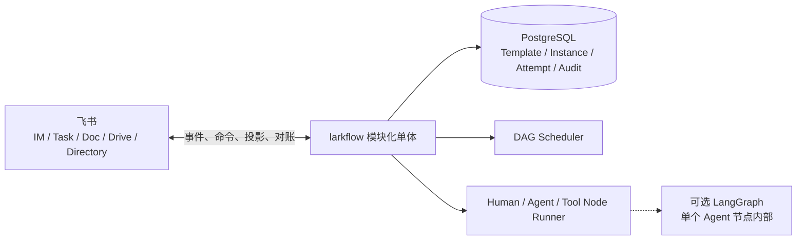

# larkflow · 飞流

> 飞书原生的企业协作 DAG 系统。它把多人流程拆成有依赖、有唯一责任人、可验收和可追溯的节点。

## 当前状态

larkflow 正在把既有产品设计收敛为可实现、可核验的最小范围。

- **目标产品**：单企业、单层 DAG 的最小闭环，支持模板可选、草稿确认、Human / Agent / Tool 节点、受控编辑、重启、审计和飞书投影。
- **当前代码**：LangGraph + SQLite + lark-cli 的 legacy 机制原型，已验证部分飞书投影、打回、幂等和恢复机制。
- **证据边界**：本轮完成的是既有设计简化与一致性核验，不是访谈、市场或商业验证。
- **重要边界**：当前原型不是 PostgreSQL 目标架构，不能把 checkpointer、SQLite 或全局 LangGraph state 继续扩展为新产品领域模型。

产品与架构真相源从 [AIREADME/INDEX.md](AIREADME/INDEX.md) 开始。判断“目标是什么”和“现在做到了什么”时，必须区分 Target 与 As-built。

## 简化后的产品闭环

1. 用户从启用模板或结构化无模板定义创建实例草稿。
2. 系统展示节点、依赖、唯一人类 Owner、执行器和验收条件。
3. 用户明确确认启动或丢弃，草稿不会自动执行。
4. 中央 Scheduler 按依赖调度 Human、Agent 和 Tool 节点，并把责任入口投影到飞书。
5. 项目 Owner 可以预览并确认只影响未来节点的编辑。
6. 节点重启会重置该节点及全部可达下游，历史通过 Attempt 保留。
7. PostgreSQL 保存业务状态、revision、投影记录和审计，飞书对象可以对账和重建。

既有设计的取舍记录见 [research/design-simplification.md](research/design-simplification.md)。

## 产品不变量

1. 每个节点必须有唯一人类 Owner，Agent 和 Tool 只是执行器。
2. 实例先是草稿，经人确认后才能运行。
3. 模板可选，模板版本不可变，实例保存完整快照。
4. 运行中编辑只影响未开始区域，并经过预览、确认和 revision 校验。
5. DAG 保持无环，重做与重启创建新的 Attempt。
6. 中央数据库是业务真相源，飞书是交互入口和可恢复投影。
7. 权限、责任、状态和图修改合法性由服务端计算。
8. LangGraph 只可用于单个复杂 Agent 节点内部。

## MVP 明确不包含

- 独立 Project、IM、搜索、知识库和应用市场全套平台。
- 模板子 DAG、临时子 DAG和三级下钻。
- 个人 Agent Edge、设备注册和 Capability Lease。
- Knowledge、Skill、MCP 注册表和 RAG 模板匹配。
- 字段级锁、复杂 ACL、五维评分、Kafka、微服务和完整图形化编辑器。

这些能力只有在真实使用证据证明必要时才重新评估。

## 目标架构



详细模型和迁移差距见 [AIREADME/ARCHITECTURE.md](AIREADME/ARCHITECTURE.md)。目标契约见 [AIREADME/DAG_TEMPLATE_SPEC.md](AIREADME/DAG_TEMPLATE_SPEC.md)。

## 仓库结构

```text
AIREADME/                         产品、架构、契约、路线和决策真相源
research/design-simplification.md 既有设计简化与取舍记录
research/phase-0/                Deferred 的访谈、对照实验协议与迁移清单
larkflow/
  engine/                        legacy LangGraph 编排、门禁、返工和活图机制
  model/                         legacy YAML 节点和模板校验
  io/                            lark-cli、飞书投影、事件和关联表适配
  llm/                           Stub 与 OpenAI 兼容多角色路由
  templates/                     legacy 合同、缺陷和招聘 YAML 模板
  service.py                     legacy interrupt/resume、投影、权限与对账驱动层
  serve.py                       legacy 常驻服务和启动对账
  store.py                       legacy SQLite、WAL 和跨进程锁
tests/                           离线 pytest 套件
deploy/                          legacy 单机 ECS 部署资产
```

迁移资产的逐模块处理方式见 [research/phase-0/migration-inventory.md](research/phase-0/migration-inventory.md)。

## 当前阶段

当前 Phase 0 的门是设计一致性，不是外部访谈：

- MVP 能力必须有明确的产品理由和可判定验收。
- CORE、PRD、架构、模板契约、路线图、README 和包描述必须一致。
- Target 与 As-built 必须分开。
- 首个场景、真实频率、增量收益和付费意愿继续标记为未知。

原有访谈和飞书基线协议保留在 [research/phase-0/README.md](research/phase-0/README.md)，当前状态为 Deferred，不阻塞本轮简化设计，也不能被描述为已完成。

## 运行 legacy 原型

下面的命令用于回归当前机制原型，不代表目标产品已经实现。测试使用 Mock Lark I/O、Stub LLM 和临时或内存 SQLite，不访问真实飞书。

```bash
python -m venv .venv
. .venv/bin/activate
pip install -e ".[dev]"

pytest -q
python -m larkflow.demo --auto
python -m larkflow.demo --template hiring
```

真实飞书部署会创建任务、卡片和文档，只能在明确配置的开发环境中运行。现有单机部署是 legacy 原型实录，操作前先读 [AIREADME/DEPLOYMENT.md](AIREADME/DEPLOYMENT.md)。

## 文档路由

- 产品定位与红线：[CORE](AIREADME/CORE.md)
- 简化依据与目标：[PRODUCT_STRATEGY](AIREADME/PRODUCT_STRATEGY.md)
- MVP 功能契约：[PRD](AIREADME/PRD.md)
- 目标架构与实现差距：[ARCHITECTURE](AIREADME/ARCHITECTURE.md)
- DAG 目标契约：[DAG_TEMPLATE_SPEC](AIREADME/DAG_TEMPLATE_SPEC.md)
- 当前 legacy 接口：[SPEC](AIREADME/SPEC.md)
- 推进顺序：[ROADMAP](AIREADME/ROADMAP.md)
- 决策历史：[DECISIONS](AIREADME/DECISIONS.md)

## 安全

- 不提交凭证、token、真实人员 ID 或生产数据库。
- 飞书对象和执行器回传都必须经过服务端授权、版本与幂等校验。
- 测试不得构造 `build_real_service`，不得访问网络或真实飞书资源。
