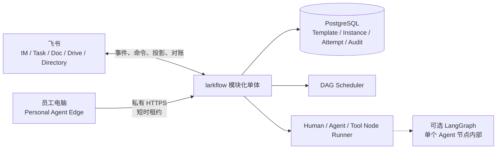

# larkflow · 飞流

> 飞书原生的企业协作 DAG 系统。它把多人流程拆成有依赖、有唯一责任人、可验收和可追溯的节点。

## 当前状态

内容提交 `432fea77c210e7a2cfa5344054eb30d01706bf87` 已把受控流程输入直接接入员工工作台。员工填写目标、可选背景和可选协作者后，请求先写入 PostgreSQL 耐久队列，再由不持有飞书凭据的中央草稿 Worker 生成并确定性校验候选 DAG；浏览器不会模拟机器人消息，也不会直接创建运行中流程。生成结果始终先保存为草稿，只有本人再次点击“确认并启动”才进入既有运行时。请求 ID 保证重复提交幂等，生成租约支持崩溃接管，已保存候选在接管时保持冻结，失败最多尝试五次后进入保留历史的终态。完整离线套件为 `1015 passed, 23 skipped`。wheel SHA-256 为 `6b320b22804c02eaa2840d9a101bcf1b4ffe75287509816486727588ccdc0198`，已部署到 `/srv/larkflow/target/releases/20260809_0357_console_drafts_432fea7/`；长期库应用第二十三份 migration。真实 PostgreSQL 双 Worker 竞争只有一路领取，测试记录已清理。十个 Python 服务与 Caddy 均为 `active / NRestarts=0`，公网工作台返回 200，未登录草稿 API 返回 401，安全响应头、安装资源哈希和部署窗口零 warning 均已读回。真实登录网页生成仍需在文档提交后完成最终验收，因此本条不提前宣称真实模型草稿已创建。

内容提交 `3fd42df8740825482eb3bbebd5cf69715f37df5b` 修正普通 Human Task 转交后的状态表达。中央事务成功后，按钮立即显示“中央已转交，飞书同步中”，接口显式返回 `projection.status=queued`；页面不再把 outbox 已入队描述成飞书 Task 已完成更新，异步失败继续进入管理员异常队列。完整离线套件为 `1005 passed, 22 skipped`。真实浏览器已完成一次普通 Human 节点提交和一次跨成员转交；所需飞书 Task 权限开通后，既有转交事件在第 8 次尝试成功发布。飞书服务端回读原 Task 仍为 `todo / mode=1 / 单一负责人`，飞书负责人、中央 NodeInstance Owner 与 Projection Owner 一致，`sync_version=2`。wheel SHA-256 为 `79ac572f4feb160db835d8a26b25d77b84e57916542367c347f0df0b65426ee1`，已部署到 `/srv/larkflow/target/releases/20260809_0259_transfer_sync_3fd42df/`；升级前备份、二十二份 migration、十个 Python 服务、Caddy、公网与 loopback 200、未登录 401、安全响应头和零 warning 均已读回。

内容提交 `ed118e7b3a9eeb5b5daed52e3d7b0296896f12f1` 为 Projection outbox 增加有界重试终态。投影默认最多尝试 24 次，达到上限后原子进入 `exhausted`，停止再次领取，同时保留事件 payload、累计尝试次数、最后错误和终止时间；临时失败仍沿用原有指数退避。migration `0022_outbox_exhaustion` 只扩展状态约束并增加终止时间，不删除历史。完整离线套件为 `1005 passed, 22 skipped`；一次性真实 PostgreSQL 双连接竞争只有一路取得租约，终止后未来领取为 0。wheel SHA-256 为 `a9f68581294ac65e71b2eae5f97940618289194eedd77c5943c40f539e4f6245`，已部署到 `/srv/larkflow/target/releases/20260809_0201_outbox_exhaustion_ed118e7/`。长期库应用第二十二份 migration 后，两条由历史合成身份留下的永久无效投影在保留前 1171 次失败的基础上完成最后一次尝试，稳定进入 `exhausted / 1172`；十个 Python 服务与 Caddy 均为 `active / NRestarts=0`，公网工作台与未登录 401 边界正常。

内容提交 `3d438bb476ad9b9f98cd4c2873802a2894718fe4` 已把普通 Human Task 接入员工工作台。当前负责人可以在任务详情中填写结果并直接提交，也可以把运行时责任转交给同一租户内、中央应用可见且仍活跃的成员；参与者只能读取分配给自己的有界任务上下文，不能借此打开其他 Owner 的完整流程。转交只修改 `NodeInstance.owner_person_id`，冻结 `InstanceSnapshot` 中的原始设计责任保持不变；旧负责人立即失去提交权限，变更写入追加型审计与 outbox，并由 Projection 更新既有飞书 Task 的负责人。需要明确接受或退回的决定节点继续使用飞书决定卡。完整离线套件为 `1003 passed, 22 skipped`；真实 PostgreSQL 双连接竞争只有一路转交成功，快照责任保持不变且运行时责任、审计与 outbox 恰好更新一次。wheel SHA-256 为 `8373a9f18377abf7068b53e362158714168078327934d44ab9d3b3330f75e736`，已部署到 `/srv/larkflow/target/releases/20260809_0120_human_tasks_3d438bb/`。公网静态资源哈希、登录态任务与成员目录 API、临时会话撤销、二十一份 migration、全部服务 `active / NRestarts=0`、安全响应头和零 warning 均已读回。后续真实浏览器提交和跨成员飞书 Task 转交已由内容提交 `3fd42df8740825482eb3bbebd5cf69715f37df5b` 的验收关闭。

内容提交 `da94891f5e6d01ecee6082a98bab6148abba12ee` 已把 Owner 工作台从“复制飞书命令”升级为中央节点受控操作。草稿确认、暂停和继续直接复用既有领域服务；取消先展示 aggregate version 绑定的完整影响预览，节点与完整实例重启复用耐久 RestartPreview，确认后才执行。所有操作继续由服务端校验当前飞书会话、tenant、Instance Owner、状态和版本，跨 Owner 与不存在实例统一返回 404；Human 正文与最终决定仍在飞书责任入口完成。按钮会在请求发出前立即显示“正在执行”或“正在生成预览”，高风险操作在同页明确二次确认。完整离线套件为 `995 passed, 21 skipped`；wheel SHA-256 为 `fca2eee16d3af57dcfb4bb78409a0b6f9e23b7d3d29aa7d7435cc1f26dd3063a`，已部署到 `/srv/larkflow/target/releases/20260808_235309_console_actions_da94891/`。公网与 loopback 页面、未认证 401、安全响应头、静态资源哈希、二十一份 migration、全部服务 `active / NRestarts=0` 和零 warning 均已读回。真实登录 Owner 已在公网工作台直接确认并启动 `internal_trial_20260808_155244`；三个节点均在 Attempt 1 完成，实例终态为 `done / version 7`，两个飞书 Task、Agent 结果消息、完成文档与最终通知均已外部绑定。该证据关闭首个真实登录 Owner 写操作门槛，不代表暂停、继续、取消和重启已逐项完成页面验收。

larkflow 已开始按收敛后的产品设计重建中央工作流，目前完成模板生命周期、草稿预览、领域内核、PostgreSQL 事务持久化、Runtime Worker、首个 LLM Agent executor、首个确定性 Tool executor、Task Projection Worker、飞书 Task 完成状态的耐久入站链路，以及带预览确认的节点重启、完整实例重启和运行中未来区域编辑。开发环境中的真实 Human-Agent-Tool-Human 四节点闭环、Human-Agent-Human 节点重启闭环、完整实例重启闭环和运行中未来区域编辑闭环已经完成。未来区域编辑的真实飞书验收覆盖未开始节点改名、幂等重复确认、冻结线拒绝、成环图拒绝和状态漂移后的陈旧预览拒绝；正向实例最终完成于 `graph_revision 2`，三类负向命令均未污染图或审计。开发应用发布所需通讯录数据范围后，跨人员非 Owner 真组织验收也已通过：中央应用可解析测试成员，当前登录用户对该成员持有实例发送的真实编辑命令被拒绝，图修订、预览和审计均未被污染。跨人员正向分工现已同时通过群聊 mention 和单聊 Card 2.0 人员选择两条真实链路，后者会冻结候选人与角色绑定、幂等创建一个草稿，并把原卡片更新为不可重复提交的已确认状态。所有可操作卡片现在遵循统一视觉反馈契约：回调先耐久落库，再尽快把原卡片替换为无按钮的“处理中”，最终收口为无按钮的成功或拒绝状态。六条 Target Worker 连接现通过 PostgreSQL `LISTEN/NOTIFY` 在耐久队列事务提交后立即唤醒，通知不携带业务状态，连接或等待失败时仍由原有有界轮询保证可靠性。修正逐项完成时间后，五次真实人员选择卡验收的首个服务端反馈 P50 / P95 为 0.991 / 1.274 秒，最终回复 P50 / P95 为 12.670 / 19.298 秒；前四次是 7.548 秒内的突发点击，第五次在约 19 分钟后单独点击并于 4.044 秒完成全链路。突发样本暴露了外部调用串行处理造成的队头阻塞。内容提交 `5312f6c` 已把五条凭据侧交互车道移出 Projection，以两个独立进程并行消费，每个进程在每条车道一次只领取一项。该拓扑已部署并完成新一轮三次真实飞书突发验收：三条动作均为唯一 canonical 记录并进入 `processed / draft_created / sent`，两个副本都实际承担校验和回复工作，最终回复 P50 / P95 降至 4.793 / 5.498 秒。三张原卡片均从飞书服务端读回为已冻结的确认终态。该小样本只证明开发环境突发链路改善，隔离样本与更高强度限流回归仍待完成。此前公布的首反馈数据仍有效，但提交 `a506e7d` 之前的身份校验、领域处理和最终回复精确耗时使用了批次开始时间，现已明确废止。既有失败恢复卡首反馈为 0.990 秒。Personal Agent Edge Proof v0 的内容提交 `fd6933a` 已部署到开发服务器，并通过临时 SSH 隧道在员工 Mac 上完成前台 `serve` 真机验收：空闲心跳、连续领取、真实 Codex、租约续期、单设备锁、SIGTERM 安全停止和设备撤销均已读回；专用开发子域名、Caddy 和受信任证书已经完成源站验证，但公网设备链路受阿里云中国内地 ICP 接入备案阻断，Caddy 已停止并禁用开机启动。

内容提交 `5113a59` 新增 `/larkflow draft <JSON定义>`，让结构化无模板定义进入与模板相同的草稿确认、Owner 授权和中央运行时。无模板定义使用严格 JSON，限制为 100 个节点，并拒绝调用方提供模型服务配置或 `personal.readonly` Edge capability。真实实例 `im_a9a43d1d4db354b31b798bb1` 已完成 Human-Agent-Tool-Human 4/4，PostgreSQL 回读为 `template_version_id IS NULL / status=done`。

内容提交 `244fb0c` 为裸 `/larkflow draft` 增加 Card 2.0 自然语言引导，`6ff0af2` 修正 Card 2.0 表单提交动作，`282ea51` 为未通过确定性校验的中央 Agent 候选增加一次有界重生成。用户填写目标、可选背景并选择一名协作者后，中央 Agent 只生成最多八个 Human / Agent 节点的候选图；服务端重新绑定原始输入、限制 Owner 角色并校验完整 Snapshot，随后只创建草稿。三个内容提交已推送，最终候选 wheel 已同时安装到 Target Runtime 与 legacy 飞书事件桥接虚拟环境。真实点击在 1056 ms 内把原卡片更新为无按钮“处理中”，中央 Agent 的首个非法依赖候选被拒绝，第二个候选通过校验并创建实例 `im_69af9ebdf241017341e5fee4`。PostgreSQL 回读该实例为 `draft / template_version_id IS NULL / 3 nodes / 0 NodeInstance / 0 Attempt`，唯一 canonical 动作为 `processed / draft_created / sent`；飞书服务端回读原卡片为无操作控件的“流程草稿已生成”。流程仍需独立 `/larkflow confirm` 才能启动，本轮没有确认该草稿。

内容提交 `1a80b4035d0a5ad5c634af7be957f4b7d1ee37d7` 已把可能连续调用两次模型的自然语言草稿生成移出凭据侧 Interactive 主循环，改由不持有飞书 profile 的独立 Draft Generation Worker 认领。凭据侧先把原卡片更新为“正在生成”，首次候选被确定性校验拒绝时再更新为“正在修复”，最终回复等待同 revision 的进度更新结算，避免旧进度覆盖终态。migration `0019_draft_generation_progress` 保存独立生成与进度租约；生成租约覆盖两次完整模型路由预算和安全余量。该拓扑已部署，第九个服务、migration 19、真实 PostgreSQL 双副本竞争和七条监听连接均已回读。内容提交 `2ed644e640f3c3834f82c464e05fe0b4c3a241cc` 又修正飞书延时更新 token 第三次使用导致终态卡片失败的问题：回调首次反馈继续使用 token，生成进度和最终结果改按原消息 ID 更新。完整离线套件为 `886 passed, 18 skipped`，两项隔离破坏测试均被捕获；旧卡片已修复，新实例 `im_74e775110afbd80aa598d3ae` 真实进入 `processed / draft_created / reply sent`，飞书服务端回读同一卡片为无按钮、无输入框的最终图预览。该实例随后由真实用户确认启动，Agent Attempt 1 经 86.0 秒模型调用完成，飞书 Human Task 的完成状态通过周期读回进入耐久 Inbox；实例最终为 `done / template_version_id IS NULL / 2 nodes done`。完成 Docx 和最终通知均已从飞书服务端读回，九个 Python 服务保持 `active / running / NRestarts=0`。这证明自然语言草稿到中央执行的开发环境技术闭环；本次输入不含真实业务数据，Agent 结果明确报告数据不足，因此不证明模型内容质量、业务价值或生产可用性。

内容提交 `b7e589ba4af0398573ec995254dd61e9b1a4508c` 新增来源约束型材料复核模板。输入用稳定 `F` 事实与 `Q` 开放问题登记来源；Agent 输出把来源事实、推断和开放问题显式分型并携带引用；确定性 `source_claims.check` 只校验结构、引用覆盖和来源 URL 一致性，不声称验证事实真伪。最终 Human 节点不使用飞书 Task 完成状态暗示接受，而是投影版本绑定的 Card 2.0，由唯一 Owner 明确选择接受或退回；退回保留旧 Attempt、结果和审计，并可通过既有节点重启从目标节点重新执行。完整离线套件为 `898 passed, 18 skipped`，wheel 已确认包含新模板。该提交现已部署到开发服务器，长期 PostgreSQL 回读仍为十九份 migration，九个 Python 服务均为 `active / running / NRestarts=0`。公开材料实例 `source_grounded_20260805_234517` 已完成首次接受路径；第二个实例 `source_grounded_reject_20260806_001940` 又完成真实退回、三节点重启、Attempt 2 重新执行和最终接受恢复。后者从 `failed / version 9` 恢复为 `done / version 16`，首个来源确认节点未重做，两轮 Agent 与 Tool 结果、退回与接受决定、两张独立决定卡和唯一重启审计均保留。这只证明开发测试组织中的窄材料复核与返工闭环，不证明事实真伪、内容质量规模化、市场价值、生产容量或生产上线。

真实内部样本 `im_fb85651d34e24c9789304715` 进一步证明上述材料复核契约不适合直接生成优先级决定：旧 `source_claims.v1` 按设计保留 Q 为开放问题，Agent 因而没有回答 Q1、Q2、Q3，Owner 已明确退回，完整意见、旧自动结果和审计均已保存。内容提交 `db7651228e26055eb1229ae9f451e3e87c31df38` 因此新增独立 `source_grounded_decision` 模板、`source_decision.v1` Agent 结果和确定性 `source_decision.check`。新契约只允许一项优先级，要求逐一回答所有 Q，给出 3 到 5 条完成标准、不做事项及重新评估条件，并把全部内容明确标记为来源支持的建议推断。旧材料复核模板保持兼容。决定卡中的结构化输入改用 JSON 代码块，避免 URL 后的 JSON 引号被飞书自动链接解析成 `%22`。该提交已部署并启用新模板；真实实例 `source_decision_20260808_0405` 在四个 Attempt 1 上完成，Agent 回答 Q1、Q2、Q3 并生成 4 条完成标准、4 个带重新评估条件的后置项和 3 项风险，Tool 覆盖 6/6 个 F 与 3/3 个 Q、零违规且 `verdict=pass`。Owner 明确接受后实例进入 `done / version 9`，完成文档与最终通知均有外部绑定；飞书服务端回读终态卡为已接受、无按钮且无 `%22`。这只证明开发环境中的决策契约和交互闭环，不证明建议在业务上正确、内容质量规模化、市场价值、生产容量或生产上线。

内容提交 `0dc5359e990635c7b6aa16ec0bcd798eb8df39d0` 修复受控内部试用暴露的返工上下文缺口，内容提交 `f6125331aa541e824675e25f9cd2d756cd4c6b56` 又修正真实 Card 2.0 原生表单提交不携带 `action_value` 时的服务端绑定。决定卡继续允许一键接受，但退回必须填写不超过 1000 字的具体意见；服务端重新校验、裁剪空白，并把意见写入 Human Attempt 结果、质量证据和追加型审计。Instance Owner 确认 `reject_target` 节点重启后，意见只进入该目标节点的新 Attempt 输入快照，节点真正激活时仍会保留并交给 Agent；影响集合之外的上游节点、旧 Attempt 和冻结 Instance Snapshot 均不改写。接受路径忽略客户端额外提交的意见。完整离线套件为 `910 passed, 18 skipped`，实现复用既有 JSONB 字段，不增加 migration。开发服务器已部署 `f6125331aa541e824675e25f9cd2d756cd4c6b56`；真实实例 `im_5717aa5b9480d146239907d5` 已把具体退回意见写入 Human Attempt、质量证据和审计，卡片回调进入 `processed / human_decision_rejected / sent / updated`，首个服务端反馈为 1155 ms。节点重启只影响 Agent、Tool 与最终 Human，来源确认保持 Attempt 1；退回意见只进入 Agent Attempt 2，Agent 补出问题与验收条件后，确定性 Tool 从首轮失败变为 `pass`，新的 Attempt 2 决定卡已从飞书服务端读回。实例当前停在最终人工复核，不把本次开发验收外推为内容质量规模化、市场价值、生产容量或生产上线。

首批三项真实项目小样本现已覆盖直接退回、带具体意见返工和直接接受。第三项 `pilot_console_value_20260806_164925` 使用固定版本路线图作为来源，Human-Agent-Tool-Human 四节点均在 Attempt 1 完成，Tool 覆盖 5/5 条来源事实与 3/3 个开放问题，Owner 接受首次结果；从确认到接受用时 12 分 41 秒，完成文档、通知和其他外部投影均保持唯一。该小样本说明流程能记录结果可用性、返工与人工干预，不证明稳定模型质量、市场价值或生产容量。本轮状态仍由开发操作者通过 PostgreSQL 与聊天追踪，没有证明用户独立使用中央控制台能降低追踪成本，下一门槛见 [`AIREADME/ROADMAP.md`](AIREADME/ROADMAP.md)。

第一次 Owner 独立 Console 试用已成功定位 `source_grounded_reject_20260806_001940`，同时暴露两个真实体验边界：Console 是只读观察面，文字回复仍在当前 Agent 对话；首版流程图只有浏览器滚动条，没有可发现的拖动、缩放或适配操作。内容提交 `b153c5311771eaa5b98d964fe6ffd448b62cf49d` 增加空白区域拖动平移、50% 到 160% 缩放、适配、重置、键盘操作和视口保持，内容提交 `c3e23fcbf3bf9e66eeb9cf97bf8bbbc1bb2eefc3` 又消除平移手势与节点点击竞争。最终真实 Chrome 验收在同一返工实例上完成拖动后鼠标选中 Tool 节点、右侧 Attempt 切换、100% 到 90% 缩小和 57% 适配；该能力已部署，但仍需 Owner 再次独立使用后才能判断是否降低状态追踪成本。

内容提交 `efc1dff935d21918517d73c0d10fd15336516d9a` 在实例详情顶部增加只读摘要，直接展示最终状态与节点进度、所有多轮执行节点及当前 Attempt、最近一次受控重启的时间、操作者、起点和影响范围。摘要由服务端根据当前聚合与有界审计提炼，不向浏览器暴露原始审计 payload；页面同时明确回复与写操作仍在 Agent 对话或飞书入口完成。真实 Chrome 已在 `source_grounded_reject_20260806_001940` 回读 `done / 4/4 / version 16`、三个 Attempt 2 节点和 00:53:27 的三节点重启，也在无返工实例上回读正确空状态。该能力减少了理解返工历史所需的人工解释，但独立使用价值仍需后续观察。

Owner 待处理中心 v0 已完成并部署到开发服务器。列表接口从同一 PostgreSQL 聚合和有界 Owner 实例集合即时派生失败恢复、本人 Human 待办、暂停继续和草稿确认四类提示，不保存第二套状态，也不返回人员 ID、原始错误或审计 payload。页面可以打开只读详情，或复制现有 `/larkflow confirm / resume / restart / restart-all` 命令；真正执行仍回到飞书入口重新授权，并继续使用既有预览确认和版本栅栏。复制与打开按钮会在点击后立即显示处理中，再明确显示成功或失败。内容提交 `b6eda8caaa06d338de8c5aa0283c3d787a8affe7` 的 wheel 已安装到 `/srv/larkflow/target/releases/20260807_010810_attention_b6eda8c/`，SHA-256 为 `14cdbcfc5f343dc16d4985f62752ef7ab302cb6f20e8e1410eae7f7420befa3c`。真实认证 API 回读最近 30 个本人流程和 22 条待处理项，PostgreSQL 直接查询验证十九份 migration、两条失败节点记录和一条本人 Human 等待记录；响应不含配置的人员 ID。十个相关 Python 服务保持 `active / running / NRestarts=0`，5432、8765 与 8780 继续只监听 loopback。与部署静态资源同源的浏览器功能验收使用非敏感测试身份完成，“查看流程”点击后明确显示“已打开”，页面无横向溢出或浏览器错误。由于没有把真实开发 token 注入自动化浏览器，本轮不把最后一项描述为真实数据浏览器验收；下一产品证据仍是 Owner 不依赖开发者解释的独立使用。

内容提交 `a6f5babb07623590e9be2a2b8c523857cce56ff7` 已把飞书工作台会话从 Console 进程内存迁入权威 PostgreSQL。浏览器仍只持有随机不透明 HttpOnly 凭据，数据库只保存 SHA-256 摘要、tenant、person 和有效期；会话注销、过期清理、全局数量上限与并发签发均由服务端执行。完整离线套件等价结果为 `955 passed, 19 skipped`，一次性真实 PostgreSQL 验证覆盖认证器重建后仍可登录、原始凭据不落库、注销立即失效和过期清理。内容 wheel SHA-256 为 `a3b680c0a76545ab25a6c62ad500c9a2db0e24b2aac890eb4a1b708bc5fea729`，已安装到 `/srv/larkflow/target/releases/20260807_195154_console_sessions_a6f5bab/`；升级前备份成功，长期库已应用 `0020_console_sessions`。真实成员重新授权后，PostgreSQL 回读一条有效摘要会话；Console 重启后该记录仍有效，公网与 loopback 均返回 200，用户直接刷新仍保持登录。Console 与 Caddy 均为 `active / NRestarts=0`，验收窗口无 warning。该证据关闭开发环境单进程重启丢失登录态的缺口，但不代表正式域名、管理员后台、生产限流、跨区域容灾或生产发布已经完成。

内容提交 `e15f47942fcc01bc85ecbbfa822acd00558c06f0` 在同一飞书身份与耐久会话上增加最小管理员只读概览。管理员资格只由服务端 `tenant + person` allowlist 计算，浏览器不能自行声明；普通成员访问管理员接口会得到与不存在路由相同的 404。页面只展示当前企业的流程状态聚合、有效与临近过期会话数量、migration 一致性，以及 Outbox、Inbox、IM 命令、IM 回复、人员分工动作、人员分工回复和人员分工进度七条耐久队列的汇总，不返回人员 ID、原始错误、payload 或 claim。完整离线套件为 `960 passed, 20 skipped`。候选 wheel SHA-256 为 `fbdd2e325d57fb595362c4aac8c32b10ae734843014c4bbef2da71480bbe418b`，已安装到 `/srv/larkflow/target/releases/20260807_204031_admin_e15f479/`；升级前备份成功，本次只重启 Console。真实 HTTP 验收回读管理员 200、普通成员 404、七条队列、55 个流程与二十份已对齐 migration，短期验收会话随后全部撤销，原有真实登录会话仍为一条。十个 Python 服务与 Caddy 均保持 `active / NRestarts=0`，公网工作台返回 200，验收窗口无 warning。真实登录浏览器随后完成管理员概览目视；在该提交时，会话撤销、allowlist 管理、写操作和生产发布能力仍未实现。

内容提交 `8ba0ab9d93554b7958a650492e0282ad40db0d2e` 增加管理员会话治理 v0。管理员可以查看当前企业的有效 Console 会话，只看到 `you / member` 关系、创建与过期时间及安全不透明 ID；当前浏览器会话必须通过注销结束，不能从管理面撤销。撤销其他会话必须先创建五分钟有效的耐久预览，再显式确认；确认会在同一 PostgreSQL 事务中删除目标会话并追加不可变审计，重复确认保持幂等。飞书会话的写请求还要求精确同源 `Origin` 与专用动作头，普通成员仍得到 404。完整离线套件为 `965 passed, 21 skipped`；一次性真实 PostgreSQL 双连接竞争得到一路执行、一路幂等回放，审计只有一条且不可删除。候选 wheel SHA-256 为 `b2cff677a419f7151f6ceb6dc8986fcd061999406cbd8212ac2cdde7504fecc8`，已安装到 `/srv/larkflow/target/releases/20260807_212230_session_gov_8ba0ab9/`，长期库应用 `0021_console_session_governance`。真实 HTTP 验收覆盖列表 200、当前会话拒绝 409、预览 201、确认 200、重复确认幂等、被撤销会话 401 和普通成员 404；原有真实登录会话仍保留。十个 Python 服务与 Caddy 均保持 `active / NRestarts=0`，部署窗口无 warning。用户随后在真实登录浏览器中完成新会话治理面板视觉验收；allowlist 自助管理、批量撤销、设备命名、队列处置、流程写操作和生产发布仍未实现。

内容提交 `66b2c12d3ea27a61e5a1cdc21332ed03adb516ac` 完成公网 Console 边界加固 v0。Caddy 覆盖客户端提交的来源头，loopback Console 只把该头用于限流公平性，不用于身份或授权；应用使用不保存原始 IP 的有界令牌桶，默认每个来源每分钟允许 300 次读取、30 次认证访问、30 次管理员写入，并设置每分钟 3000 次全局预算。Caddy 同时限制请求体、请求头大小与读写空闲时间，关闭 0-RTT，并补齐浏览器隔离和能力禁用响应头。完整离线套件为 `972 passed, 21 skipped`，wheel SHA-256 为 `3ff1d97317bf4c72e4040622e747bc16d7ca98709ecf2525371f894b9fa1b9df`，已部署到 `/srv/larkflow/target/releases/20260808_004500_console_public_66b2c12/`。真实公网并发验收让 31 个请求分别携带不同伪造来源值，仍得到共享预算下的 30 次 200 和 1 次 429，429 携带 `Retry-After`；公网与 loopback 页面均为 200，未认证管理员接口为 401，真实登录会话仍保留一条。十个 Python 服务与 Caddy 均为 `active / NRestarts=0`，部署窗口 warning 为 0。该证据只关闭当前开发入口的基础滥用防护与响应头缺口，不代表生产容量、分布式限流、正式域名、跨区域容灾或生产发布已经完成。

内容提交 `c1340ca21f13ed3f543df8f1411b94e46d9e6b7e`、`abc4f5e7ad8c3617cef641efc01523055e9b695e` 与 `00b3c8f920e6b856d11d9d4a91678959de3da6a5` 增加服务器侧管理员 allowlist 运维工具。操作者只能用当前租户内仍有效的 Console 会话创建十分钟预览，确认时会重新校验会话、tenant、env SHA-256 和现有 allowlist，并拒绝移除最后一名管理员。实际变更会原子保存 env、保留原权限和备份、重启 Console、回读页面、鉴权与未认证管理员响应；健康失败会自动恢复原 env，已应用操作还可显式回滚。公开输出和追加型运维审计不含人员 ID。完整离线套件为 `982 passed, 21 skipped`。开发服务器已安装与仓库 SHA-256 一致的工具；真实会话重复添加被确认为无变化操作，env 和重启计数保持不变，唯一管理员移除被拒绝，公网与 loopback 页面均为 200。本轮没有给其他成员提权，因此真实服务器上的实际变更与回滚路径仍待出现明确授权对象时验证。

Personal Agent Edge 的 macOS 客户端现已接入登录 Keychain：设备密钥只写入系统钥匙串，`0600` 元数据文件只保存服务器地址和设备 ID。除隔离合成项外，这台员工 Mac 已通过临时 SSH 隧道，以真实流程 Owner 身份完成默认 Keychain 槽位的一次性配对；随后 `run-once` 返回 `no_work`，服务器回读设备为 active、配对审计存在且认证后的 `last_seen_at` 已推进。隧道已关闭，设备凭据和非敏感元数据继续保留，重新建立受控隧道后可再次使用。该证据关闭真实设备 Keychain 配对缺口，但不等于员工安装分发、安全评审、可持续公网链路或生产上线。

- **目标产品**：单企业、单层 DAG 的最小闭环，支持模板可选、草稿确认、Human / Agent / Tool 节点、受控编辑、重启、审计和飞书投影。
- **新内核**：`larkflow/workflow/` 已实现模板生命周期和不可变版本、角色绑定和冻结 Instance Snapshot、草稿预览与确认、DAG 校验、节点状态迁移、依赖解锁、Human / Agent / Tool Node Runner、Attempt、claim、过期认领恢复、节点与完整实例重启预览及原子确认、未来区域编辑预览及原子确认、Runtime / Projection / Interactive / Inbound / Draft Generation Worker、PostgreSQL 通知唤醒与轮询兜底、乐观并发、PostgreSQL 仓储、追加型审计、事务 outbox 与耐久 Inbox。慢模型生成与凭据侧卡片更新使用不同领取车道和 revision 栅栏；普通人员分工 Worker 不再认领自然语言草稿动作。凭据侧 Task 验证默认最多尝试 24 次，超限进入不可再认领的 `exhausted` 终态并保留终止时间、失败阶段、结果和最后错误。
- **员工工作台**：开发期页面已提供本人流程列表、真实 DAG、跨轮次 Attempt、追加型审计、返工摘要和待处理提示。待处理项只从现有 PostgreSQL 状态派生，不保存第二套业务状态。草稿确认、暂停和继续可以直接执行；取消与节点或完整实例重启必须先查看服务端影响预览，再明确确认。普通 Human Task 的当前负责人可以在有界任务详情中填写并提交结果，或转交给同一租户的活跃成员；参与任务不授予完整实例读取权限。需要明确接受或退回的决定仍使用飞书责任卡。飞书 OAuth v3、PKCE、tenant 显式映射和服务端不透明 HttpOnly 会话已通过公网 IP HTTPS 部署；至少两名真实成员已从飞书工作台网页入口完成授权登录、本人 Owner 可见性和跨 Owner 隔离验证，机器人会话入口继续可用。服务端 allowlist 中的成员还能查看当前企业聚合并治理其他浏览器会话。该管理面仍不包含 allowlist 自助修改、队列处置、配置修改、运行中图编辑或通用自由文本控制台。
- **Edge Proof v0**：已实现一次性配对、设备哈希凭据、撤销、Owner 与 `personal.readonly` 双重过滤、租约续期、迟到结果拒绝、loopback Gateway、手工 `run-once`、前台 `serve` 和 Codex 只读适配器。`serve` 在一个用户主动启动的会话中固定单工作区，使用长轮询、有界退避、应用心跳、单设备锁和信号安全停止；续租失败会取消整个 Codex 进程组，不回传失去租约的结果。内容提交 `fd6933a` 构建的 wheel 已部署到 `alicloud-sh`，并以同一候选件的临时安装态在员工 Mac 上完成前台真机验收。实例在 37 次空闲心跳后被领取，真实 Codex 执行期间产生 18 次续租并完成；同凭据第二个 Worker 被拒绝，SIGTERM 安全退出，设备撤销后再次领取返回 403。临时凭据和隧道均已删除。专用 DNS 记录、Caddy、Let’s Encrypt 证书、源站反向代理和未认证 401 已验证；公网 TLS 随后被 ICP 接入备案阻断，因此公网配对、领取、续租和回传仍未完成。
- **失败恢复 as-built**：自动 Agent / Tool 节点失败会向节点 Owner 投影 Card 2.0，可选择“重新执行”或“人工接管”。卡片回调先进入耐久 IM 命令队列，并立即尝试撤下按钮、显示“处理中”；凭据侧随后重新校验当前企业成员，领域侧精确校验 Owner、Instance version、Node version 与 Attempt 编号，最终卡片显示成功或拒绝。重试创建新自动 Attempt；人工接管创建 `waiting_human` Attempt 和飞书 Task；原失败 Attempt、结果与审计均保留。该能力已在开发服务器与测试组织完成真实闭环：两个不同失败卡片分别创建 Attempt 2 和 3，人工接管创建 Attempt 4 与真实飞书 Task，完成 Task 后 Instance 与 Attempt 4 进入 `done`，前三次失败历史、审计和投影全部保留。新一轮恢复卡真实点击的首个服务端反馈耗时为 0.990 秒，飞书服务端读回终态标题为“恢复操作已处理”且不再包含按钮。
- **legacy 原型**：LangGraph + SQLite + lark-cli 路径继续保留，用于回归已验证的飞书投影、打回、幂等和恢复机制。
- **飞书入口 as-built**：已实现 `/larkflow help`、`/larkflow start`、`/larkflow draft`、`/larkflow confirm`、`/larkflow status`、`/larkflow list`、`/larkflow pause`、`/larkflow resume`、`/larkflow cancel`、`/larkflow cancel-confirm`、`/larkflow restart`、`/larkflow restart-all`、`/larkflow restart-confirm`、`/larkflow edit`、`/larkflow edit-confirm` 十五个窄命令，以及命令回执、Agent / Tool 结果消息、完成文档和最终通知。`start` 从启用模板创建草稿；`draft <JSON定义>` 是最多 100 个节点的结构化高级入口；裸 `draft` 打开 Card 2.0 自然语言引导，收集目标、可选背景和一名协作者，再由中央 Agent 生成最多八个 Human / Agent 节点的受限候选图。自然语言回调复用现有耐久动作链，重新校验操作人和冻结候选人；服务端覆盖模型返回的输入，限制 Owner 角色，拒绝 Tool、服务配置与 Personal Edge capability，并在最终卡片上展示无按钮图预览。首次候选校验失败时只允许同一中央 Agent 有界重生成一次，第二次失败仍拒绝，绝不绕过确定性校验。`start` 与两种 `draft` 都只创建草稿，`confirm` 才启动实例。人员选择卡、自然语言引导卡与失败恢复卡在动作耐久落库后立即尝试显示无按钮的“处理中”，最终再替换为成功或拒绝状态；服务端用单调时钟记录有效回调被接受到直接更新返回的耗时，不把它误写为客户端渲染耗时。`status` 只向 Instance Owner 返回单实例有界状态摘要，`list` 只返回本人拥有的最近十个实例摘要，restart 和 edit 命令只创建短期影响预览，对应 confirm 命令才执行原子变更。模板、结构化无模板、自然语言引导和跨人员正向分工均已在开发测试组织完成真实闭环。
- **尚未实现**：上述十五类命令之外的通用飞书控制面、更多业务 Tool adapter、图形化编辑体验和生产装配。本轮新增的暂停、继续和取消已完成本地离线验证、开发服务器部署、真实 PostgreSQL 双连接竞争与真实飞书闭环。测试实例 `im_c1c472a12a8ea4a7c8d63480` 依次通过确认、暂停、继续、取消预览和版本绑定确认，普通 Human Task 在飞书服务端回读为 `done`；决定卡实例 `im_516c59e4082e82ab74b8bd14` 取消后，原卡片被原位更新为无操作控件的“复核已取消”。两个实例的 PostgreSQL Instance、Node、Attempt、Projection 和追加型审计均与飞书终态一致。企业目录草稿 Owner 全量校验已落码并部署但默认关闭；IM 命令发送者、mention 角色成员和 Card 2.0 候选人的活跃成员校验已完成开发真栈验证。Edge 已具备版本化开发安装、回滚、Keychain、哈希锁定离线 bundle 与依赖清单，但正式员工分发仍为 No-Go：当前没有 Apple Developer ID 身份与公证凭据，员工端仍携带完整中央依赖栈，目录级读取隔离和可复现构建证明也未完成。当前设计不提供操作系统级守护或隐藏后台常驻。可持续使用的公网 HTTPS 入口还必须先完成 ICP 接入备案，或迁移到合规的非中国内地环境。真实 Agent、确定性内容检查、模板入口和飞书 IM / Card / Doc 投影只在开发环境和测试组织验证，不能据此描述为生产上线。
- **证据边界**：本轮完成的是既有设计简化与一致性核验，不是访谈、市场或商业验证。
- **重要边界**：`alicloud-sh` 已运行 Target Runtime、Projection、两个凭据侧 Interactive、凭据侧入站校验、领域侧入站、Draft Generation Worker、loopback Edge Gateway 和 Owner Console 九个 Target 服务，并保留一个 legacy 事件消费者，共十个 Python 服务。七条 PostgreSQL `LISTEN` 连接分属 `lf-dev` 四条和 `lf_target_dev` 三条。Caddy 现通过公网 IP 的 80 / 443 端口为员工工作台提供 HTTPS，并覆盖限流来源头、限制请求体与请求头、设置连接超时和浏览器安全响应头；Console 本身继续只监听 `127.0.0.1:8780`。这条无域名开发入口和单进程内存限流不等于正式生产发布，也不解除后续域名、证书、备案、容量和分布式防护边界。Projection 只负责飞书投影与 Task 状态读取；两个 Interactive 副本持有受限 bot profile；Draft Generation Worker 不持有飞书 profile。凭据侧重新读取外部资源后只写已验证 Inbox，领域侧不能读取 lark-cli profile。legacy 服务继续使用 SQLite，并仅作为事件桥接时写入 Target Inbox，不能把 checkpointer 或全局 LangGraph state 扩展为新产品领域模型。

产品与架构真相源从 [AIREADME/INDEX.md](AIREADME/INDEX.md) 开始。判断“目标是什么”和“现在做到了什么”时，必须区分 Target 与 As-built。

## 简化后的产品闭环

1. 用户从启用模板、自然语言引导或结构化无模板定义创建实例草稿。
2. 系统展示节点、依赖、唯一人类 Owner、执行器和验收条件。
3. 用户明确确认启动或丢弃，草稿不会自动执行。
4. 中央 Scheduler 按依赖调度 Human、Agent 和 Tool 节点，并把责任入口投影到飞书。
5. 项目 Owner 可以暂停新调度、继续流程，或在版本绑定的影响预览后取消未完成工作。
6. 项目 Owner 可以预览并确认只影响未来节点的编辑。
7. 节点重启会重置该节点及全部可达下游，历史通过 Attempt 保留。
8. 完整实例重启会为全图创建新 Attempt，从所有根节点重新调度，历史 Attempt 和交付物保留。
9. 自动节点失败后，责任人可以重试或人工接管，两条路径都创建新 Attempt 并保留原失败记录。
10. PostgreSQL 保存业务状态、revision、投影记录和审计，飞书对象可以对账和重建。

既有设计的取舍记录见 [research/design-simplification.md](research/design-simplification.md)。

## 产品不变量

1. 每个节点必须有唯一人类 Owner，Agent 和 Tool 只是执行器。
2. 实例先是草稿，经人确认后才能运行。
3. 模板可选，模板版本不可变，实例保存完整快照。
4. 运行中编辑只影响未开始区域，并经过预览、确认和 revision 校验。
5. DAG 保持无环，重做与重启创建新的 Attempt。
6. 中央数据库是业务真相源，飞书是交互入口和可恢复投影。
7. 权限、责任、状态和图修改合法性由服务端计算。
8. LangGraph 只可用于单个复杂 Agent 节点内部。
9. 暂停只阻止新调度，取消必须二次确认，并保留已经形成的历史与外部副作用说明。

## MVP 明确不包含

- 独立 Project、IM、搜索、知识库和应用市场全套平台。
- 模板子 DAG、临时子 DAG和三级下钻。
- 个人 Agent Edge 的产品化、后台常驻、写能力和通用 Capability Lease。仓库中的只读 Proof 不属于默认 MVP 交付。
- Knowledge、Skill、MCP 注册表和 RAG 模板匹配。
- 字段级锁、复杂 ACL、五维评分、Kafka、微服务和完整图形化编辑器。

这些能力只有在真实使用证据证明必要时才重新评估。

## 目标架构



详细模型和迁移差距见 [AIREADME/ARCHITECTURE.md](AIREADME/ARCHITECTURE.md)。目标契约见 [AIREADME/DAG_TEMPLATE_SPEC.md](AIREADME/DAG_TEMPLATE_SPEC.md)。

## 仓库结构

```text
AIREADME/                         产品、架构、契约、路线和决策真相源
research/design-simplification.md 既有设计简化与取舍记录
research/phase-0/                Deferred 的访谈、对照实验协议与迁移清单
larkflow/
  workflow/                      Target 模板服务、领域内核、CLI、Runtime / Projection / Interactive / Inbound / Edge、PostgreSQL migration、事务仓储、outbox 与 Inbox
  engine/                        legacy LangGraph 编排、门禁、返工和活图机制
  model/                         legacy YAML 节点和模板校验
  io/                            lark-cli、飞书投影、事件和关联表适配
  llm/                           Stub 与 OpenAI 兼容多角色路由
  templates/                     legacy YAML 模板、Target 协作流程、来源约束型材料复核与 Personal Edge 示例
  service.py                     legacy interrupt/resume、投影、权限与对账驱动层
  serve.py                       legacy 常驻服务和启动对账
  store.py                       legacy SQLite、WAL 和跨进程锁
tests/                           离线 pytest 套件
deploy/                          legacy 单机服务、Target Runtime / Projection / Interactive / Inbound、PostgreSQL 备份资产
```

迁移资产的逐模块处理方式见 [research/phase-0/migration-inventory.md](research/phase-0/migration-inventory.md)。

## 当前阶段

Phase 0 的设计一致性核验已经完成，当前进入 Phase 1 中央工作流基础实现。现有代码建立可离线验证的领域边界，并在开发环境打通 PostgreSQL 与测试飞书组织中的 Task 投影：

- Instance Snapshot 无论来自模板还是无模板定义，都进入同一套运行时。
- Template Service 已实现 `draft / enabled / disabled / deleted`、不可变版本、布尔锁、追加型模板审计和 aggregate version 乐观并发。启用模板固定使用最新版本，已启用模板必须先停用才能追加版本。
- 启用模板可按参数和逻辑 Owner 角色绑定生成冻结草稿；`preview` 只读校验完整图，确认仍是独立的人类动作。
- 草稿只能由项目 Owner 确认或丢弃，确认后才创建节点与初始 Attempt。
- Human 节点只接受唯一 Owner 提交，Agent 和 Tool 结果必须匹配当前 claim、Worker 身份、Attempt 和节点版本。
- Scheduler 只在全部依赖完成后解锁节点，任何迟到或陈旧结果都不得改写当前状态。
- Runtime Worker 每次只认领一个已被 adapter 明确接受的自动节点，先提交 claim 再调用 executor；进程中断后，其他 Worker 可在租约到期时用新 token 接管同一 Attempt。
- `LLMAgentExecutor` 只接受 `work.agent.kind=llm.generate`，使用已提交的实例输入和直接依赖结果生成正文；可选 `result_format=source_claims.v1` 要求输出来源事实、推断和开放问题的结构化声明。启动装配会强制最长 LLM 路由预算加安全余量小于节点 claim 租期。
- `ToolExecutorRouter` 按 `work.tool.kind` 选择内部 adapter；`content.check` 对直接依赖正文执行长度和必需词检查，`source_claims.check` 对结构、类型、引用覆盖和来源 URL 一致性执行确定性检查。两者都不代替 Human 的业务语义判断；未知 kind 在 claim 前被过滤，不会被错误 Worker 认领。
- 可选企业目录边界会在草稿入库前校验 Instance Owner 与全部节点 Owner。无法证明 open_id 属于当前租户活跃成员时 fail closed；开发环境默认关闭，启用需额外的通讯录只读 scope。
- PostgreSQL 14 schema、migration runner、事务仓储、追加型 Audit 和带租约的 outbox 已落码；领域状态、审计和 outbox 在同一事务提交。
- migration SQL 已进入 wheel，仓库与长期开发库均为二十二份。`0013_im_command_mentions` 到 `0019_draft_generation_progress` 依次覆盖 mention、人员选择卡、恢复卡、canonical 动作、首反馈指标、通知唤醒和独立草稿生成进度；`0020_console_sessions` 保存飞书工作台不透明凭据的 SHA-256 摘要、服务端主体与有效期；`0021_console_session_governance` 增加安全会话 ID、耐久撤销预览和追加型审计；`0022_outbox_exhaustion` 为投影永久失败增加保留历史的终止状态。migration 19 的真实 PostgreSQL 双副本竞争和通知连接、migration 20 的重建与重启后登录态、migration 21 的双连接确认竞争与不可变审计，以及 migration 22 的双连接领取与终止排除均已验收。
- 当前完整离线套件等价结果为 `1005 passed, 22 skipped`；跳过项是需要显式外部环境的集成验证，不会在默认测试中访问网络、凭据或真实飞书。受代理和沙箱影响的用例已在清空代理且可读取进程树的环境中通过。
- `larkflow-target` CLI 已提供模板创建、追加版本、启用、停用、逻辑删除、查询，从模板创建草稿和预览，以及实例确认、状态、Human 提交、既有 Worker 命令和 `generate-drafts-once / generate-drafts`；环境配置由项目 dotenv 解析器读取，不使用 shell `source`。
- `alicloud-sh` 的长期 Target 开发库只接受本机 peer authentication，已应用二十二份 migration。九个 Target systemd 服务与一个 legacy 事件消费者组成十个 Python 服务；十个 Python 服务与 Caddy 均回读 `active / running / NRestarts=0`。Edge Gateway 与 Console 分别只监听 `127.0.0.1:8765` 和 `127.0.0.1:8780`。当前中央应用 wheel 对应内容提交 `ed118e7b3a9eeb5b5daed52e3d7b0296896f12f1`，SHA-256 为 `a9f68581294ac65e71b2eae5f97940618289194eedd77c5943c40f539e4f6245`；管理员 allowlist 运维工具对应内容提交 `00b3c8f920e6b856d11d9d4a91678959de3da6a5`。既有流程操作、任务提交与转交并发约束、真实登录态跨 Console 重启、管理员隔离、会话撤销、限流和安全响应头均已通过对应开发验证。既有小样本与限流预算只描述开发环境，不能外推生产容量。
- Projection Worker 只认领明确的投影事件，在数据库 claim 提交后调用 lark-cli，以稳定幂等键创建任务，并把 Task GUID、URL、同步版本和完成状态写回 Projection 记录。启动全量对账以 PostgreSQL 为权威分页扫描当前 Human 责任入口，补建缺失记录，并在飞书明确返回 Task 不存在时使用新一代稳定幂等键重建；权限或网络错误不会被误判为删除。外部调用临时失败继续指数退避，累计尝试达到默认 24 次后进入 `exhausted` 并停止领取，完整保留事件、计数、错误和终止时间。结构化日志与管理员队列聚合都会暴露非零终止计数，但当前没有网页重放或队列处置入口。
- Human Task 会展示节点明确声明的 Instance 输入；下游任务还会展示直接依赖中已提交的 Agent 正文。超长内容只在任务描述中截断，完整输入与结果仍保存在 PostgreSQL。
- 每日 custom-format 备份保留约 7 天。2026-08-08 的隔离恢复演练使用包含二十一份 migration、22 张表、55 个流程实例和一条有效 Console 会话的新备份，恢复后关键计数、对象所有者、PUBLIC ACL、UTC 与三项 timeout 均通过回读。备份会保留仍有效的浏览器会话，因此隔离副本在接入服务前必须清空 `workflow_console_sessions` 并强制重新登录；本次清理后既有撤销审计、流程和 migration 均保留，隔离数据库随后已删除，源库与原备份未改变。
- 自动执行采用 at-least-once 语义，executor 必须使用请求中的稳定幂等键消除重复副作用。
- 飞书 IM 命令链路已接入：真实消息创建草稿、确认启动、Human Task、Agent、`content.check` 与 `source_claims.check` Tool、人类明确决定、完成文档和最终通知均在开发云服务器与测试组织闭环。Owner 查询、两类重启、未来区域编辑、跨人员授权拒绝和失败恢复均有真实飞书与 PostgreSQL 回读。自然语言草稿入口现额外覆盖独立生成 Worker、阶段进度、按消息 ID 的最终卡片更新，以及从受限候选图确认启动到 Agent、Human Task、完成 Docx 和最终通知的真实闭环。公开材料接受路径与退回后重启恢复路径均已通过；两轮 Agent、Tool、决定卡、文档、通知与审计可同时追溯。Task 完成事件在本轮仍未被 bot 长连接收到，周期状态轮询通过耐久 Inbox 承担可靠入口。九个 Python 服务保持 active 且 `NRestarts=0`。下一阶段不再继续堆叠合成技术验收，而是使用真实内部工作记录完成率、返工、人工干预和结果可用性；更多业务 Tool、图形化控制面和生产迁移仍缺，因此不能描述为目标产品已经上线。
- 无模板飞书入口已在开发真栈完成真实验收：`/larkflow draft` 创建草稿，`confirm` 后依次完成 Human、Agent、`content.check` Tool 和最终 Human 节点。实例 `im_a9a43d1d4db354b31b798bb1` 的四个节点均为 `done`，中央 PostgreSQL 回读 `template_version_id IS NULL`，证明该实例没有借用模板版本。
- Personal Edge 不通过飞书 `lark-cli` 与中央节点交互。中央 Gateway 复用 PostgreSQL Node claim，员工电脑仅保存可撤销设备凭据，并在 `run-once` 或用户主动启动的前台 `serve` 会话中显式固定一个 Codex 只读工作区。前台真机实例已通过 SSH 隧道在员工 Mac 上完成：候选 Edge 先持续报告无任务心跳，再领取一个合成 `personal.readonly` 节点；真实 Codex 完成结果并写入 18 次续租审计，同凭据第二进程被本机锁拒绝，空闲进程收到 SIGTERM 后安全退出。测试设备随后撤销，旧凭据再次领取返回 403；本机凭据、隧道与临时上传件均已删除。专用开发子域名的权威 DNS、源站证书和反向代理也已验证，但员工电脑的公网 TLS 握手随后被阿里云备案系统重置，尚未产生公网配对设备。Human 节点和 gate 不会被 Edge 领取。
- macOS 上 `--credential-store auto` 默认使用登录 Keychain。钥匙串保存设备密钥，`~/.config/larkflow/edge-device.json` 只保存非敏感连接元数据并继续充当单设备锁定位。其他系统维持 `0600` 文件兼容路径，也可显式使用 `--credential-store file`。旧明文文件可在 Keychain 回读一致后迁移；加 `--delete-source` 会把原文件原子替换成非敏感元数据，而不是删除连接配置。

原有访谈和飞书基线协议保留在 [research/phase-0/README.md](research/phase-0/README.md)，当前状态为 Deferred，不阻塞本轮简化设计，也不能被描述为已完成。

## 运行 legacy 原型

下面的命令用于回归当前机制原型，不代表目标产品已经实现。测试使用 Mock Lark I/O、Stub LLM 和临时或内存 SQLite，不访问真实飞书。

```bash
python -m venv .venv
. .venv/bin/activate
pip install -e ".[dev]"

pytest -q
pytest -q tests/test_workflow_kernel.py
pytest -q tests/test_workflow_persistence.py
pytest -q tests/test_workflow_runtime.py
python -m larkflow.demo --auto
python -m larkflow.demo --template hiring
```

`tests/test_workflow_postgres.py` 是显式启用的集成测试，只能指向可销毁数据库，并通过 `LARKFLOW_TEST_POSTGRES_DSN` 提供连接。

Target 运维入口是独立命令 `larkflow-target`。下面只展示不会调用飞书的控制面命令，真实 DSN 和 tenant 应通过权限收紧的 env 文件提供：

```bash
larkflow-target --env-file /etc/larkflow-target.env migrate
larkflow-target --env-file /etc/larkflow-target.env template-create template.yaml --actor <owner>
larkflow-target --env-file /etc/larkflow-target.env template-enable <template> --actor <owner>
larkflow-target --env-file /etc/larkflow-target.env create-from-template <template> --instance-id <instance> --owner <owner> --bindings bindings.yaml --inputs inputs.yaml
larkflow-target --env-file /etc/larkflow-target.env preview <instance> --actor <owner>
larkflow-target --env-file /etc/larkflow-target.env create draft.yaml
larkflow-target --env-file /etc/larkflow-target.env confirm <instance> --actor <owner>
larkflow-target --env-file /etc/larkflow-target.env show <instance>
larkflow-target --env-file /etc/larkflow-target.env serve
```

员工工作台 v1 同时服务 Instance Owner 与普通 Human Task 参与者。Owner 可以查看本人流程、真实 DAG、历史 Attempt 和审计，并执行确认、暂停、继续、取消预览确认和重启预览确认；参与者只能读取分配给自己的有界任务上下文，可以填写结果或把运行时责任转交给同一租户的活跃成员，不能因此打开其他 Owner 的完整实例。决定节点继续使用版本绑定的飞书决定卡。所有写入都复用中央领域服务，不复用 Personal Agent Edge API，也不接受浏览器声明的可信身份或状态。服务强制绑定 loopback，并提供 `static` 开发模式与 `feishu` OAuth 模式；完成登录后的不透明会话摘要保存到 PostgreSQL，不保存用户 access token 或 refresh token。管理员能力复用同一会话与服务端 allowlist，其他会话撤销必须预览确认并追加不可变审计。开发公网入口由 Caddy 和 Console 有界令牌桶保护。该结果不代表正式域名、通用流程输入框、allowlist 自助管理、批量会话治理、运行中图编辑、分布式限流、生产容量或生产上线已经完成。

```bash
# static 模式额外提供 LARKFLOW_CONSOLE_PERSON_ID 与
# LARKFLOW_CONSOLE_ACCESS_TOKEN
larkflow-console --env-file /etc/larkflow-target-console.env \
  --host 127.0.0.1 --port 8780

# 仅在本机浏览器打开
# http://127.0.0.1:8780/console/

# feishu 模式改为配置 LARKFLOW_CONSOLE_AUTH_MODE=feishu，以及 App ID、
# App Secret、允许的 tenant_key 和已登记的 HTTPS public base URL。
# Console 仍只监听 loopback，由 HTTPS 反向代理提供员工入口。
```

`reconcile-projections` 会只读查询并可能重建飞书 Task，因此只能使用持有开发 profile 的 Projection env 显式执行：`larkflow-target --env-file /etc/larkflow-target-projection.env reconcile-projections`。`reconcile-completions` 使用同一身份立即扫描当前 Human Task，只把已完成状态写入耐久 Inbox，不直接提交节点。`reconcile-instance-completion <instance_id>` 只修复一个已完成实例缺失的完成文档或最终通知，依赖稳定幂等键，重复执行不会复制外部资源。

Edge Proof v0 有两个独立入口。开发服务器已把 Gateway 作为仅监听 loopback 的 systemd 服务部署，并完成独立 Caddy HTTPS 反向代理的源站验证。本机 Edge 默认只接受 HTTPS，只有 loopback 可以使用明文 HTTP。当前 ECS 位于阿里云中国内地，专用域名尚未完成 ICP 接入备案，因此公网 TLS 会被接入侧阻断；Caddy 已停止并禁用开机启动。完成备案或迁移到合规的非中国内地环境前，下面的 HTTPS 入口只是配置形状，不能作为已通过的公网验收：

macOS 开发试用版使用 `deploy/larkflow-edge-manager.py` 管理独立版本目录，不修改 Homebrew 或系统 Python。推荐由发布方先构建哈希锁定的离线 bundle。构建时需要联网，员工安装时不联网；manifest 固定目标 Mac 与 Python、完整 source commit、主 wheel、manager、全部 wheel 的包名、版本、大小和 SHA-256。员工必须从独立可信渠道取得 manifest SHA-256：

```bash
# 发布方，在 clean commit 上构建 wheel 后生成 macOS 离线 bundle
python deploy/build-larkflow-edge-bundle.py \
  --wheel <larkflow wheel> \
  --output <绝对路径>/larkflow-edge-bundle \
  --source-commit <完整四十位 Git SHA> \
  --python <员工 Mac 对应的 Python 3.10+>

# 员工首次安装或升级，manager 会验证 bundle 后再修改安装目录
python3 larkflow-edge-bundle/larkflow-edge-manager install \
  --bundle larkflow-edge-bundle \
  --manifest-sha256 <独立可信渠道提供的六十四位 SHA-256>

# 非敏感安装状态与本机离线诊断
~/.local/bin/larkflow-edge-manager status
~/.local/bin/larkflow-edge doctor

# 需要时切回 previous
~/.local/bin/larkflow-edge-manager rollback
```

默认版本目录是 `~/Library/Application Support/larkflow-edge/releases/`。直接 wheel 安装以 wheel 摘要标识 release，离线安装以覆盖全部依赖和 manager 的 manifest 摘要标识 release，因此相同主 wheel 的不同依赖集合不会误用旧环境。安装器先离线安装 bundle 内哈希锁定且已修复 `CVE-2026-8643` 的 pip，再强制 `--no-index --only-binary=:all:` 安装应用与依赖；只有 `pip check` 和 CLI 启动校验通过才原子切换，旧版本保存在 `previous`。安装器拒绝不匹配目标、文件、wheel 元数据、符号链接目录、额外文件和已有的无关同名命令，也不读取或迁移 Keychain，不注册后台服务。

当前 bundle 仍未代码签名或公证，而且完整应用包会携带中央节点依赖。它只适合明确批准的开发试用，不能作为正式员工分发。详细结论和放行门禁见 [`research/edge-distribution-security-review.md`](research/edge-distribution-security-review.md)。直接 `--wheel <path> --sha256 <hex>` 的旧开发入口仍保留，但可能联网解析依赖，不属于推荐的离线交付路径。

```bash
# 中央节点，数据库已执行 larkflow-target migrate
larkflow-edge-gateway --env-file /etc/larkflow-target-edge.env pairing-create \
  --tenant <tenant> --person <person> --actor <admin>
larkflow-edge-gateway --env-file /etc/larkflow-target-edge.env serve \
  --host 127.0.0.1 --port 8765

# 开发验收隧道，不是公网入口
ssh -N -L 127.0.0.1:18765:127.0.0.1:8765 alicloud-sh
larkflow-edge pair --server http://127.0.0.1:18765 --name "My Mac"

# 配置 HTTPS 后的员工电脑入口，pair 默认无回显读取一次性 code
larkflow-edge pair --server https://edge.example.com --name "My Mac"
larkflow-edge run-once --workspace /absolute/path/to/approved/workspace \
  --wait-seconds 20
larkflow-edge serve --workspace /absolute/path/to/approved/workspace \
  --wait-seconds 20

# 已有明文凭据的 macOS 客户端，验证 Keychain 回读后移除磁盘密钥
larkflow-edge credential-migrate --delete-source
```

`serve` 是用户主动启动并保持可见的前台会话，不会注册操作系统后台服务，也不会扩大配对时固定的 `personal.readonly` 能力。SIGINT 或 SIGTERM 会停止长轮询并取消在途 Codex；同一设备凭据的第二个 `serve` 或 `run-once` 会被本机锁拒绝。

macOS 默认把设备密钥保存在当前用户登录 Keychain，密钥不会进入命令行参数、环境变量、日志或磁盘元数据；非敏感引用文件仍以 `0600` 保存并拒绝符号链接。显式文件模式和非 macOS 兼容路径仍会把完整凭据写入 `0600` 文件。Codex 使用 `read-only + ephemeral + ignore-user-config`，子进程环境采用最小 allowlist，不继承任意 API key、代理、SSH agent、Edge、Target 或飞书变量。本机必须依赖 Clash 等环境代理时，可显式增加 `--inherit-loopback-proxy`；它只传递无用户名和密码的 loopback HTTP / HTTPS / SOCKS URL，远程或带凭据代理仍被丢弃。只读当前只证明写入受限，没有证据证明目录级读取被限制在所选工作区；恶意任务输入仍可能诱导读取其他可读文件，也不等于无数据外发。该 Proof 只能用于明确批准的测试工作区。

真实飞书部署会创建任务、卡片和文档，只能在明确配置的开发环境中运行。现有单机部署是 legacy 原型实录，操作前先读 [AIREADME/DEPLOYMENT.md](AIREADME/DEPLOYMENT.md)。

## 文档路由

- 产品定位与红线：[CORE](AIREADME/CORE.md)
- 简化依据与目标：[PRODUCT_STRATEGY](AIREADME/PRODUCT_STRATEGY.md)
- MVP 功能契约：[PRD](AIREADME/PRD.md)
- 目标架构与实现差距：[ARCHITECTURE](AIREADME/ARCHITECTURE.md)
- DAG 目标契约：[DAG_TEMPLATE_SPEC](AIREADME/DAG_TEMPLATE_SPEC.md)
- 当前 legacy 接口：[SPEC](AIREADME/SPEC.md)
- 推进顺序：[ROADMAP](AIREADME/ROADMAP.md)
- 决策历史：[DECISIONS](AIREADME/DECISIONS.md)

## 安全

- 不提交凭证、token、真实人员 ID 或生产数据库。
- 飞书对象和执行器回传都必须经过服务端授权、版本与幂等校验。
- 测试不得构造 `build_real_service`，不得访问网络或真实飞书资源。
