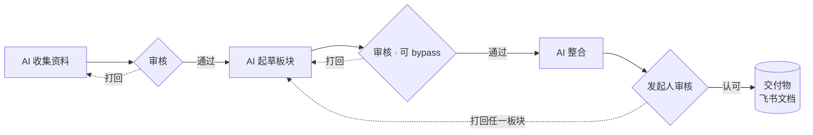

# larkflow · 飞流

> 飞书原生的**交付物流转**工作流引擎（LangGraph 驱动）。
> 在一张*项目进行中可编辑*的图上，AI、人、工具接力产出并审核一份交付物，任意打回、只重算受影响的部分，直到发起人认可后交付。全程落在飞书里。

**状态**：立项 · 第一段本地引擎已跑通（8 节点缺陷流，15 测试绿）· 第二轮设计定。详细真相源见 [`AIREADME/`](AIREADME/INDEX.md)。

---

## 它解决什么

一份需要多方接力的交付物（合同、PRD、任何文档），传统做法是手动分工、催定稿、追版本、打回后全流程重来。larkflow 把这套协调劳动变成一张可视、可流转、可追溯的工作流：**AI 节点扛收集 / 起草 / 整合的重活，人只在关键处把关（想省事可一键 bypass），交付物反复打回重写不丢版本，流程图中途还能改。**

## 两个场景

**合同起草（多部门 · 各自产出再合并）**
AI 并行收集数据（旧合同 / 报价）→ 各部门审数据（拦假消息 / 黑名单供应商）→ AI 并行起草各板块 → 各板块审核（可 bypass）→ AI 整合 → 发起人审核（可打回任一板块）→ 交付合同。

**PRD 细化（会议驱动 · 同文档协同）**
会议纪要 + 草稿下发 → 组员在同一飞书文档协同、定稿后发消息通知 → 发起人（或起个 AI 节点）审核 → 打回重写 / 再开会 → 整体评审 → 交付 PRD。

## 核心理念



- **受控活图**：图在项目进行中可编辑。冻结线随执行前沿走，已完成 / 在跑的节点冻结，只改未来节点；打回把前沿往回拉、解冻那段重跑。永远只改未来、不改历史。
- **选择性重算**：打回一组节点，只重算它们 + 其传递下游，旁支复用旧产出，不做无谓重跑。
- **节点 = 执行体 × 角色**：`executor(tool / llm / human) × role(produce 产出 / gate 把关)`，业务差异全在配置，引擎不为业务新增节点类型。审核策略一个轴：`auto`（bypass）/ `single` / `any` / `all`（会签）。
- **交付物 = 飞书文档 handle**：统一成飞书文档 / 云盘链接。人可看 / 协同 / 评论审，机器可读正文；版本靠飞书原生，引擎不自建。
- **单一事实源**：LangGraph checkpointer 是权威，飞书任务 / 文档 / 多维表格是投影，绝不反向写真相。

## 架构（两层）

- **领域图（数据）** = 工作流「是什么」：一张会变的节点依赖图，持久在 checkpointer、投影到飞书。
- **LangGraph 引擎（运行时）** = 工作流「怎么推进」：一张*固定*的编排器图**解释** state 里的领域图数据，派发就绪节点、跑 tool / llm、human 节点 `interrupt` 持久挂起、打回环回。

图是数据，引擎是解释器；「有环」正是打回 / 选择性重算 / 重启所需。飞书 I/O（收事件 / 建任务 / 发卡 / 读写交付物）全走官方 [lark-cli](https://github.com/larksuite/cli)；LLM 走 OpenAI 兼容接口、按任务角色路由。

## 仓库结构

```
AIREADME/            AI 真相源（先读 INDEX.md）
larkflow/
  engine/            固定编排器图 + 门禁 / 选择性重算（纯函数）
  model/             模板 / 节点契约 + 校验
  io/                lark-cli 封装（事件 / 任务 / 卡 / 关联表）
  llm/               LLM 客户端（Stub + OpenAI 兼容）
  templates/         策展模板（seg-1 = 缺陷流）
  service.py         驱动层：interrupt/resume 与飞书投影
tests/               15 e2e / 单元测试（零外部依赖）
```

## 本地跑

seg-1 引擎用内存 SQLite + Mock 飞书 IO + Stub LLM，零外部依赖：

```bash
python -m venv .venv && . .venv/bin/activate
pip install -e ".[dev]"
pytest -q          # 15 passed
```

## 文档

真相源在 [`AIREADME/`](AIREADME/INDEX.md)（跨会话 / 跨项目的 AI 可读文档体系）：

- 定位 / 红线 → [CORE](AIREADME/CORE.md)
- 架构 / 禁改 → [ARCHITECTURE](AIREADME/ARCHITECTURE.md)，决策理由 → [DECISIONS](AIREADME/DECISIONS.md)
- 产品 → [PRD](AIREADME/PRD.md)，路线 → [ROADMAP](AIREADME/ROADMAP.md)，对外契约 → [SPEC](AIREADME/SPEC.md)

## 设计红线

单一事实源不破（checkpointer 权威，飞书是投影）· 只改未来不改历史 · 完成靠显式信号（引擎不猜定稿）· key / 凭证不入库 · LLM 走 OpenAI 兼容多角色路由 · 入口只走 lark-cli 事件。

---

*立项 pre-code，第一段引擎已跑通；下一步见 [ROADMAP](AIREADME/ROADMAP.md)。欢迎 issue 讨论设计。*
