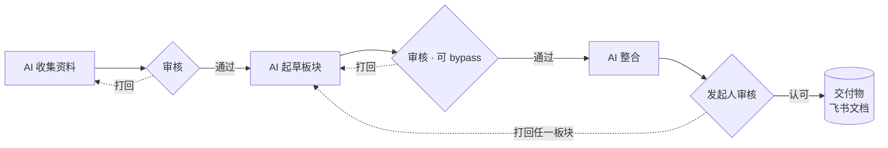

# larkflow · 飞流

> 飞书原生的**交付物流转**工作流引擎（LangGraph 驱动）。
> 在一张*项目进行中可编辑*的图上，AI、人、工具接力产出并审核一份交付物，任意打回、只重算受影响的部分，直到发起人认可后交付。全程落在飞书里。

**状态**：引擎核心 + 服务层已落码（316 测绿，全程 Mock / Stub / 内存库）· **真飞书环境一次没跑过**（差 dev 应用与事件回调）。详细真相源见 [`AIREADME/`](AIREADME/INDEX.md)。

---

## 它解决什么

一份需要多方接力的交付物（合同、PRD、任何文档），传统做法是手动分工、催定稿、追版本、打回后全流程重来。larkflow 把这套协调劳动变成一张可视、可流转、可追溯的工作流：**AI 节点扛收集 / 起草 / 整合的重活，人只在关键处把关（想省事可一键 bypass），交付物反复打回重写不丢版本，流程图中途还能改。**

## 两个场景

**合同起草（多部门 · 各自产出再合并）**
AI 并行收集数据（旧合同 / 报价）→ 各部门审数据（拦假消息 / 黑名单供应商）→ AI 并行起草各板块 → 各板块审核（可 bypass）→ AI 整合 → 发起人审核（可打回任一板块）→ 交付合同。

**PRD 细化（会议驱动 · 同文档协同）**
会议纪要 + 草稿下发 → 组员在同一飞书文档协同、定稿后发消息通知 → 发起人（或起个 AI 节点）审核 → 打回重写 / 再开会 → 整体评审 → 交付 PRD。

## 核心理念



- **受控活图**：图在项目进行中可编辑。冻结线随执行前沿走，已完成 / 在跑的节点冻结，只改未来节点；打回把前沿往回拉、解冻那段重跑。永远只改未来、不改历史。
- **选择性重算**：打回一组节点，只重算它们 + 其传递下游，旁支复用旧产出，不做无谓重跑。
- **节点 = 执行体 × 角色**：`executor(tool / llm / human) × role(produce 产出 / gate 把关)`，业务差异全在配置，引擎不为业务新增节点类型。审核策略一个轴：`auto`（bypass）/ `single` / `any` / `all`（会签）。
- **交付物 = 飞书文档 handle**：统一成飞书文档 / 云盘链接。人可看 / 协同 / 评论审，机器可读正文；版本靠飞书原生，引擎不自建。
- **单一事实源**：LangGraph checkpointer 是权威，飞书任务 / 文档 / 多维表格是投影，绝不反向写真相。

## 架构（两层）

- **领域图（数据）** = 工作流「是什么」：一张会变的节点依赖图，持久在 checkpointer、投影到飞书。
- **LangGraph 引擎（运行时）** = 工作流「怎么推进」：一张*固定*的编排器图**解释** state 里的领域图数据，派发就绪节点、跑 tool / llm、human 节点 `interrupt` 持久挂起、打回环回。

图是数据，引擎是解释器；「有环」正是打回 / 选择性重算 / 重启所需。飞书 I/O（收事件 / 建任务 / 发卡 / 读写交付物）全走官方 [lark-cli](https://github.com/larksuite/cli)；LLM 走 OpenAI 兼容接口、按任务角色路由。

## 仓库结构

```
AIREADME/            AI 真相源（先读 INDEX.md）
larkflow/
  engine/            固定编排器图 + 门禁 / 选择性重算 + 受控活图 + tool 能力库（纯函数为主）
  model/             模板 / 节点契约 + 校验
  io/                lark-cli 封装（事件 / 任务 / 卡 / 交付物 / 关联表）
  llm/               LLM 客户端（Stub + OpenAI 兼容多角色路由）
  templates/         策展模板，**只有 yaml、没有 Python**（合同 / 缺陷 / 招聘）
  service.py         驱动层：interrupt/resume、飞书投影、改图、对账、打回权限、解除
  serve.py           常驻服务：启动对账 + 事件泵 + 信号 / 优雅退出
  store.py           多进程共用一个 SQLite（WAL + busy_timeout + 跨进程实例锁）
  __main__.py        CLI（serve / start / status / pending / unblock / reconcile）
  demo.py            本地演示入口（不联网）
tests/               316 e2e / 单元测试（零外部依赖）
```

## 本地跑

引擎用内存 SQLite + Mock 飞书 IO + Stub LLM，**不联网、不碰飞书、不调真 LLM**：

```bash
python -m venv .venv && . .venv/bin/activate
pip install -e ".[dev]"

pytest -q                              # 316 passed

python -m larkflow.demo --auto         # 自动跑一遍合同图，打印「打回省算」的证据
python -m larkflow.demo                # 交互式：你扮演所有的人，h 看命令
python -m larkflow.demo --template hiring   # 换一张完全不同的业务图（招聘接力）
```

交互式演示里可以：`p` 看卡在谁手上（含交付物链接、可打回候选、上一轮打回意见）、
`ok 1` 放行、`no 1 biz_draft 账期不对` 当场手选目标打回、`w 1 <正文>` 模拟人在飞书文档里写、
`doc` 打印交付物正文、`add <id> <标签> after <上游>` 在运行中往图里加节点（受控活图）。

**换一个业务场景 = 新增一个 `templates/<名字>.yaml`，零 Python**：tool 节点的确定性动作由
`tool: {kind, args}` 从内置能力库选取（`record` / `summarize_links` / `notify` / `noop` /
`format_check` / `expect_fields`）。`tests/test_generality.py` 把这条钉成硬约束。

## 怎么真跑起来（接真飞书）

上面那一节全程在替身里跑。要让它真的在飞书里流转，需要四步：

**1. 建 dev 飞书自建应用**（独立租户，ADR-008）
在飞书开放平台建企业自建应用，开这几项：

- 权限：`task:task`（建 / 完成任务）、`im:message`（发消息 / 卡片）、`docx:document` + `drive:drive`（交付物文档）
- 事件与回调 → **回调配置**里开 `card.action.trigger`（卡片按钮回调）。**不开就一个按钮点击也收不到**，而消费端不会报错、只是永远静默。
- 事件订阅方式选**长连接**（引擎靠 `lark-cli event consume` 出站订阅，宿主**不需要**开任何入站端口 / 域名 / 证书）。
- 用 `lark-cli auth login` 把这个应用的凭证配进 lark-cli 的 profile（key / token 走 lark-cli 自己的存储，不进本仓库）。

**2. 配 env**（照 `.env.example` 抄一份 `.env`，只填值不入库）

```bash
LARK_PROFILE=<lark-cli profile>     # 认哪一个飞书应用
LARKFLOW_DB=/var/lib/larkflow/larkflow.sqlite   # 本地盘，不要放网络盘
LARKFLOW_ROLES={"财务":"ou_xxx","法务":"ou_xxx","负责人":"ou_xxx"}   # 模板里每个 assignee_role 都要有
LLM_BASE_URL= / LLM_API_KEY= / LLM_MODEL=       # OpenAI 兼容；按角色再配 LLM_<ROLE>_*
```

角色没配全会在装配期直接抛（真栈 strict，绝不伪造 `ou_<角色>` 发给飞书）。

**3. 起常驻进程**

```bash
pip install -e .
larkflow serve                      # = 启动对账 + 起事件泵 + block（唯一的守护进程）
```

`serve` 做三件事：① 把 checkpointer 里每个没跑完的实例对一遍账（补上崩溃时丢掉的卡 / 任务，把被 super-step 屏障挡住的分支推到位）；② 每个 EventKey 起一条 `lark-cli event consume` 子进程收 NDJSON；③ 收到 SIGINT / SIGTERM 后停订阅、等在飞的那条事件处理完、关 SQLite。挂 systemd 直接 `ExecStart=/usr/local/bin/larkflow serve`、`Restart=always` 即可。

**4. 起项目、看状态、救场**（另一个进程，与 daemon 写同一个 DB）

```bash
larkflow start --template contract --reporter ou_xxx \
        --input 甲方=某某科技 --input 乙方=某某咨询 --input 价款=30万
larkflow status <实例>                     # 整张图 + 谁在等 + 有没有卡死
larkflow pending <实例> --actor ou_xxx      # 以某个人的视角看他点得动什么
larkflow unblock <实例> <节点> --by ou_xxx --reason "改了要素"   # 解除 ⛔
larkflow reconcile [实例]                   # 手动对账（省略 = 全部）
larkflow --json status <实例>               # 给脚本读
```

一次性命令与常驻 `serve` 是两个进程、写同一个 SQLite。这条是**正面处理过的**：DB 开 WAL + `busy_timeout`，同一实例的每一次状态变更再过一把跨进程 flock（`<DB>.locks/`），同一个 DB 只允许一个 `serve`（`<DB>.serve.lock`）。保证与不保证详见 `larkflow/store.py` 顶部。

## 文档

真相源在 [`AIREADME/`](AIREADME/INDEX.md)（跨会话 / 跨项目的 AI 可读文档体系）：

- 定位 / 红线 → [CORE](AIREADME/CORE.md)
- 架构 / 禁改 → [ARCHITECTURE](AIREADME/ARCHITECTURE.md)，决策理由 → [DECISIONS](AIREADME/DECISIONS.md)
- 产品 → [PRD](AIREADME/PRD.md)，路线 → [ROADMAP](AIREADME/ROADMAP.md)，对外契约 → [SPEC](AIREADME/SPEC.md)

## 设计红线

单一事实源不破（checkpointer 权威，飞书是投影）· 只改未来不改历史 · 完成靠显式信号（引擎不猜定稿）· key / 凭证不入库 · LLM 走 OpenAI 兼容多角色路由 · 入口只走 lark-cli 事件。

---

*引擎与服务层已落码、headless 全绿；下一步是接真飞书跑第一次端到端，见 [ROADMAP](AIREADME/ROADMAP.md)。欢迎 issue 讨论设计。*
