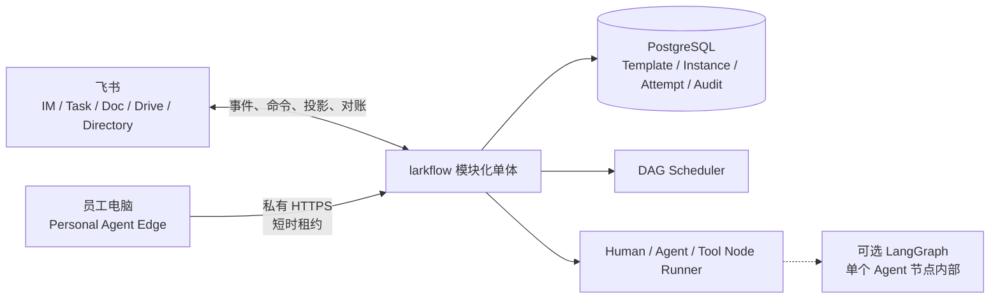

# larkflow · 飞流

> 飞书原生的企业协作 DAG 系统。它把多人流程拆成有依赖、有唯一责任人、可验收和可追溯的节点。

## 当前状态

larkflow 已开始按收敛后的产品设计重建中央工作流，目前完成模板生命周期、草稿预览、领域内核、PostgreSQL 事务持久化、Runtime Worker、首个 LLM Agent executor、Task Projection Worker，以及飞书 Task 完成状态的耐久入站链路。开发环境中的真实 Human-Agent-Human 三节点闭环已经完成。仓库另有一个未部署的 Personal Agent Edge Proof v0，用于验证员工电脑上的 Codex 能否通过中央私有 API 安全领取一个本人所有的只读节点。

- **目标产品**：单企业、单层 DAG 的最小闭环，支持模板可选、草稿确认、Human / Agent / Tool 节点、受控编辑、重启、审计和飞书投影。
- **新内核**：`larkflow/workflow/` 已实现模板生命周期和不可变版本、角色绑定和冻结 Instance Snapshot、草稿预览与确认、DAG 校验、节点状态迁移、依赖解锁、Human / Agent / Tool Node Runner、Attempt、claim、过期认领恢复、Runtime / Projection / Inbound Worker、乐观并发、PostgreSQL 仓储、追加型审计、事务 outbox 与耐久 Inbox。凭据侧 Task 验证默认最多尝试 24 次，超限进入不可再认领的 `exhausted` 终态并保留终止时间、失败阶段、结果和最后错误。
- **Edge Proof v0**：已实现一次性配对、设备哈希凭据、撤销、Owner 与 `personal.readonly` 双重过滤、租约续期、迟到结果拒绝、loopback Gateway、手工 `run-once` 和 Codex 只读适配器。离线测试、一次性 PostgreSQL 14 与合成数据本机 Codex 端到端已经通过，尚未做真实 HTTPS 或部署验证。
- **legacy 原型**：LangGraph + SQLite + lark-cli 路径继续保留，用于回归已验证的飞书投影、打回、幂等和恢复机制。
- **尚未实现**：通用飞书命令入站、IM / Doc 投影、业务 Tool executor adapter、受控编辑、重启、企业目录校验和生产装配。Edge 还缺真实链路、安全评审、系统凭据存储与任何产品化体验。真实 Agent 与模板入口只在开发环境和测试组织验证，不能据此描述为生产上线。
- **证据边界**：本轮完成的是既有设计简化与一致性核验，不是访谈、市场或商业验证。
- **重要边界**：`alicloud-sh` 已运行 Target Runtime、Projection、凭据侧入站校验和领域侧入站四个独立服务。Projection 周期读取当前 Human Task，观察到完成后只写耐久 Inbox；事件可降低延迟，但不是可靠性前提。凭据侧仍会重新读取 Task 并写入已验证 Inbox，领域侧不能读取 lark-cli profile，只在校验绑定、Owner、当前 Attempt 和完成人后提交 Human 节点。云端 Target 已在明确授权下启用开发用真实 Agent，但尚未接入业务 Tool、IM 或 Doc 投影。legacy 服务继续使用 SQLite，不能把 checkpointer 或全局 LangGraph state 扩展为新产品领域模型。

产品与架构真相源从 [AIREADME/INDEX.md](AIREADME/INDEX.md) 开始。判断“目标是什么”和“现在做到了什么”时，必须区分 Target 与 As-built。

## 简化后的产品闭环

1. 用户从启用模板或结构化无模板定义创建实例草稿。
2. 系统展示节点、依赖、唯一人类 Owner、执行器和验收条件。
3. 用户明确确认启动或丢弃，草稿不会自动执行。
4. 中央 Scheduler 按依赖调度 Human、Agent 和 Tool 节点，并把责任入口投影到飞书。
5. 项目 Owner 可以预览并确认只影响未来节点的编辑。
6. 节点重启会重置该节点及全部可达下游，历史通过 Attempt 保留。
7. PostgreSQL 保存业务状态、revision、投影记录和审计，飞书对象可以对账和重建。

既有设计的取舍记录见 [research/design-simplification.md](research/design-simplification.md)。

## 产品不变量

1. 每个节点必须有唯一人类 Owner，Agent 和 Tool 只是执行器。
2. 实例先是草稿，经人确认后才能运行。
3. 模板可选，模板版本不可变，实例保存完整快照。
4. 运行中编辑只影响未开始区域，并经过预览、确认和 revision 校验。
5. DAG 保持无环，重做与重启创建新的 Attempt。
6. 中央数据库是业务真相源，飞书是交互入口和可恢复投影。
7. 权限、责任、状态和图修改合法性由服务端计算。
8. LangGraph 只可用于单个复杂 Agent 节点内部。

## MVP 明确不包含

- 独立 Project、IM、搜索、知识库和应用市场全套平台。
- 模板子 DAG、临时子 DAG和三级下钻。
- 个人 Agent Edge 的产品化、后台常驻、写能力和通用 Capability Lease。仓库中的只读 Proof 不属于默认 MVP 交付。
- Knowledge、Skill、MCP 注册表和 RAG 模板匹配。
- 字段级锁、复杂 ACL、五维评分、Kafka、微服务和完整图形化编辑器。

这些能力只有在真实使用证据证明必要时才重新评估。

## 目标架构



详细模型和迁移差距见 [AIREADME/ARCHITECTURE.md](AIREADME/ARCHITECTURE.md)。目标契约见 [AIREADME/DAG_TEMPLATE_SPEC.md](AIREADME/DAG_TEMPLATE_SPEC.md)。

## 仓库结构

```text
AIREADME/                         产品、架构、契约、路线和决策真相源
research/design-simplification.md 既有设计简化与取舍记录
research/phase-0/                Deferred 的访谈、对照实验协议与迁移清单
larkflow/
  workflow/                      Target 模板服务、领域内核、CLI、Runtime / Projection / Inbound / Edge、PostgreSQL migration、事务仓储、outbox 与 Inbox
  engine/                        legacy LangGraph 编排、门禁、返工和活图机制
  model/                         legacy YAML 节点和模板校验
  io/                            lark-cli、飞书投影、事件和关联表适配
  llm/                           Stub 与 OpenAI 兼容多角色路由
  templates/                     legacy YAML 模板、中央与 Personal Edge 的 Target Human-Agent-Human 示例
  service.py                     legacy interrupt/resume、投影、权限与对账驱动层
  serve.py                       legacy 常驻服务和启动对账
  store.py                       legacy SQLite、WAL 和跨进程锁
tests/                           离线 pytest 套件
deploy/                          legacy 单机服务、Target Runtime / Projection / Inbound、PostgreSQL 备份资产
```

迁移资产的逐模块处理方式见 [research/phase-0/migration-inventory.md](research/phase-0/migration-inventory.md)。

## 当前阶段

Phase 0 的设计一致性核验已经完成，当前进入 Phase 1 中央工作流基础实现。现有代码建立可离线验证的领域边界，并在开发环境打通 PostgreSQL 与测试飞书组织中的 Task 投影：

- Instance Snapshot 无论来自模板还是无模板定义，都进入同一套运行时。
- Template Service 已实现 `draft / enabled / disabled / deleted`、不可变版本、布尔锁、追加型模板审计和 aggregate version 乐观并发。启用模板固定使用最新版本，已启用模板必须先停用才能追加版本。
- 启用模板可按参数和逻辑 Owner 角色绑定生成冻结草稿；`preview` 只读校验完整图，确认仍是独立的人类动作。
- 草稿只能由项目 Owner 确认或丢弃，确认后才创建节点与初始 Attempt。
- Human 节点只接受唯一 Owner 提交，Agent 和 Tool 结果必须匹配当前 claim、Worker 身份、Attempt 和节点版本。
- Scheduler 只在全部依赖完成后解锁节点，任何迟到或陈旧结果都不得改写当前状态。
- Runtime Worker 每次只认领一个已被 adapter 明确接受的自动节点，先提交 claim 再调用 executor；进程中断后，其他 Worker 可在租约到期时用新 token 接管同一 Attempt。
- `LLMAgentExecutor` 只接受 `work.agent.kind=llm.generate`，使用已提交的实例输入和直接依赖结果生成正文；启动装配会强制最长 LLM 路由预算加安全余量小于节点 claim 租期。
- PostgreSQL 14 schema、migration runner、事务仓储、追加型 Audit 和带租约的 outbox 已落码；领域状态、审计和 outbox 在同一事务提交。
- migration SQL 已进入 wheel；仓库当前包含七份 migration，最新一份增加 Edge 配对、设备和追加型事件表。一次性 PostgreSQL 14 已验证七份 migration 重入、Edge 配对竞争、续租、完成、撤销、原始 secret 不落库和审计不可改写，测试库与上传件随后删除。
- `larkflow-target` CLI 已提供模板创建、追加版本、启用、停用、逻辑删除、查询，从模板创建草稿和预览，以及实例确认、状态、Human 提交和四类 Worker 命令；环境配置由项目 dotenv 解析器读取，不使用 shell `source`。
- `alicloud-sh` 上的长期 Target 开发库只接受本机 peer authentication，已应用六份 migration；Runtime、Projection、入站校验与领域入站四个 systemd 服务常驻，与 legacy 单消费者同时 active。凭据侧验证默认最多尝试 24 次，一条历史失败事件已在升级后进入不可再认领的 `exhausted` 终态。
- Projection Worker 只认领明确的投影事件，在数据库 claim 提交后调用 lark-cli，以稳定幂等键创建任务，并把 Task GUID、URL、同步版本和完成状态写回 Projection 记录。启动全量对账以 PostgreSQL 为权威分页扫描当前 Human 责任入口，补建缺失记录，并在飞书明确返回 Task 不存在时使用新一代稳定幂等键重建；权限或网络错误不会被误判为删除。该版本已部署到常驻开发服务。专用开发实例已完成真实删除重建及后续完成验收：旧 Task 读回 `1470404` 后只重建 1 条，Projection 换绑到新 GUID、`repair_generation=1`，第二次对账 3 条绑定全部不变；人工完成新 Task 后，凭据侧验证 1 条、领域侧提交 1 条且均无失败，Instance、Node、Attempt 与 Projection 一致进入完成态。
- Human Task 会展示节点明确声明的 Instance 输入；下游任务还会展示直接依赖中已提交的 Agent 正文。超长内容只在任务描述中截断，完整输入与结果仍保存在 PostgreSQL。
- 每日 custom-format 备份保留约 7 天，并完成过一次新库恢复演练。
- 自动执行采用 at-least-once 语义，executor 必须使用请求中的稳定幂等键消除重复副作用。
- 当前只接入了 Task 完成状态轮询和可选事件唤醒；真实 Human-Agent-Human 已在开发云服务器和测试组织完成三节点闭环，正式模板创建的实例也已完成两个 Human Task 与一个真实 Agent 节点。两个 Human 结果均为最小业务确认值，Agent 正文已投影到最终任务。业务 Tool、通用飞书命令入站、IM / Doc 投影和生产迁移仍缺，因此不能描述为目标产品已经上线。开发服务中的 `development.echo` 只用于持久化与恢复演练。
- Personal Edge 不通过飞书 `lark-cli` 与中央节点交互。中央 Gateway 复用 PostgreSQL Node claim，员工电脑仅保存可撤销设备凭据，并在每次 `run-once` 时显式指定一个 Codex 只读工作区。Human 节点和 gate 不会被 Edge 领取。

原有访谈和飞书基线协议保留在 [research/phase-0/README.md](research/phase-0/README.md)，当前状态为 Deferred，不阻塞本轮简化设计，也不能被描述为已完成。

## 运行 legacy 原型

下面的命令用于回归当前机制原型，不代表目标产品已经实现。测试使用 Mock Lark I/O、Stub LLM 和临时或内存 SQLite，不访问真实飞书。

```bash
python -m venv .venv
. .venv/bin/activate
pip install -e ".[dev]"

pytest -q
pytest -q tests/test_workflow_kernel.py
pytest -q tests/test_workflow_persistence.py
pytest -q tests/test_workflow_runtime.py
python -m larkflow.demo --auto
python -m larkflow.demo --template hiring
```

`tests/test_workflow_postgres.py` 是显式启用的集成测试，只能指向可销毁数据库，并通过 `LARKFLOW_TEST_POSTGRES_DSN` 提供连接。

Target 运维入口是独立命令 `larkflow-target`。下面只展示不会调用飞书的控制面命令，真实 DSN 和 tenant 应通过权限收紧的 env 文件提供：

```bash
larkflow-target --env-file /etc/larkflow-target.env migrate
larkflow-target --env-file /etc/larkflow-target.env template-create template.yaml --actor <owner>
larkflow-target --env-file /etc/larkflow-target.env template-enable <template> --actor <owner>
larkflow-target --env-file /etc/larkflow-target.env create-from-template <template> --instance-id <instance> --owner <owner> --bindings bindings.yaml --inputs inputs.yaml
larkflow-target --env-file /etc/larkflow-target.env preview <instance> --actor <owner>
larkflow-target --env-file /etc/larkflow-target.env create draft.yaml
larkflow-target --env-file /etc/larkflow-target.env confirm <instance> --actor <owner>
larkflow-target --env-file /etc/larkflow-target.env show <instance>
larkflow-target --env-file /etc/larkflow-target.env serve
```

`reconcile-projections` 会只读查询并可能重建飞书 Task，因此只能使用持有开发 profile 的 Projection env 显式执行：`larkflow-target --env-file /etc/larkflow-target-projection.env reconcile-projections`。`reconcile-completions` 使用同一身份立即扫描当前 Human Task，只把已完成状态写入耐久 Inbox，不直接提交节点。

Edge Proof v0 有两个独立入口。Gateway 只允许监听 loopback，远程使用前必须配置独立 HTTPS 反向代理；本机 Edge 默认只接受 HTTPS，只有 loopback 可以使用明文 HTTP。下面是接口形状示例，不代表仓库已部署该服务：

```bash
# 中央节点，数据库已执行 larkflow-target migrate
larkflow-edge-gateway --env-file /etc/larkflow-target.env pairing-create \
  --tenant <tenant> --person <person> --actor <admin>
larkflow-edge-gateway --env-file /etc/larkflow-target.env serve \
  --host 127.0.0.1 --port 8765

# 员工电脑，pair 默认无回显读取一次性 code
larkflow-edge pair --server https://edge.example.com --name "My Mac"
larkflow-edge run-once --workspace /absolute/path/to/approved/workspace \
  --wait-seconds 20
```

Proof 凭据保存在当前用户 `0600` 文件中，尚未接入 Keychain。Codex 使用 `read-only + ephemeral + ignore-user-config`，子进程环境采用最小 allowlist，不继承任意 API key、代理、SSH agent、Edge、Target 或飞书变量。本机必须依赖 Clash 等环境代理时，可显式增加 `--inherit-loopback-proxy`；它只传递无用户名和密码的 loopback HTTP / HTTPS / SOCKS URL，远程或带凭据代理仍被丢弃。只读当前只证明写入受限，没有证据证明目录级读取被限制在所选工作区；恶意任务输入仍可能诱导读取其他可读文件，也不等于无数据外发。该 Proof 只能用于明确批准的测试工作区。

真实飞书部署会创建任务、卡片和文档，只能在明确配置的开发环境中运行。现有单机部署是 legacy 原型实录，操作前先读 [AIREADME/DEPLOYMENT.md](AIREADME/DEPLOYMENT.md)。

## 文档路由

- 产品定位与红线：[CORE](AIREADME/CORE.md)
- 简化依据与目标：[PRODUCT_STRATEGY](AIREADME/PRODUCT_STRATEGY.md)
- MVP 功能契约：[PRD](AIREADME/PRD.md)
- 目标架构与实现差距：[ARCHITECTURE](AIREADME/ARCHITECTURE.md)
- DAG 目标契约：[DAG_TEMPLATE_SPEC](AIREADME/DAG_TEMPLATE_SPEC.md)
- 当前 legacy 接口：[SPEC](AIREADME/SPEC.md)
- 推进顺序：[ROADMAP](AIREADME/ROADMAP.md)
- 决策历史：[DECISIONS](AIREADME/DECISIONS.md)

## 安全

- 不提交凭证、token、真实人员 ID 或生产数据库。
- 飞书对象和执行器回传都必须经过服务端授权、版本与幂等校验。
- 测试不得构造 `build_real_service`，不得访问网络或真实飞书资源。
