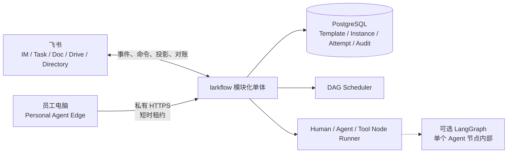

# larkflow · 飞流

> 飞书原生的企业协作 DAG 系统。它把多人流程拆成有依赖、有唯一责任人、可验收和可追溯的节点。

## 当前状态

larkflow 已开始按收敛后的产品设计重建中央工作流，目前完成模板生命周期、草稿预览、领域内核、PostgreSQL 事务持久化、Runtime Worker、首个 LLM Agent executor、首个确定性 Tool executor、Task Projection Worker、飞书 Task 完成状态的耐久入站链路，以及带预览确认的节点重启、完整实例重启和运行中未来区域编辑。开发环境中的真实 Human-Agent-Tool-Human 四节点闭环、Human-Agent-Human 节点重启闭环、完整实例重启闭环和运行中未来区域编辑闭环已经完成。未来区域编辑的真实飞书验收覆盖未开始节点改名、幂等重复确认、冻结线拒绝、成环图拒绝和状态漂移后的陈旧预览拒绝；正向实例最终完成于 `graph_revision 2`，三类负向命令均未污染图或审计。开发应用发布所需通讯录数据范围后，跨人员非 Owner 真组织验收也已通过：中央应用可解析测试成员，当前登录用户对该成员持有实例发送的真实编辑命令被拒绝，图修订、预览和审计均未被污染。Personal Agent Edge Proof v0 已在开发服务器以 loopback Gateway 常驻，并通过临时 SSH 隧道验证员工电脑上的 Codex 可以安全领取一个本人所有的只读节点；专用开发子域名、Caddy 和受信任证书已经完成源站验证，但公网设备链路受阿里云中国内地 ICP 接入备案阻断，Caddy 已停止并禁用开机启动。

- **目标产品**：单企业、单层 DAG 的最小闭环，支持模板可选、草稿确认、Human / Agent / Tool 节点、受控编辑、重启、审计和飞书投影。
- **新内核**：`larkflow/workflow/` 已实现模板生命周期和不可变版本、角色绑定和冻结 Instance Snapshot、草稿预览与确认、DAG 校验、节点状态迁移、依赖解锁、Human / Agent / Tool Node Runner、Attempt、claim、过期认领恢复、节点与完整实例重启预览及原子确认、未来区域编辑预览及原子确认、Runtime / Projection / Inbound Worker、乐观并发、PostgreSQL 仓储、追加型审计、事务 outbox 与耐久 Inbox。凭据侧 Task 验证默认最多尝试 24 次，超限进入不可再认领的 `exhausted` 终态并保留终止时间、失败阶段、结果和最后错误。
- **Edge Proof v0**：已实现一次性配对、设备哈希凭据、撤销、Owner 与 `personal.readonly` 双重过滤、租约续期、迟到结果拒绝、loopback Gateway、手工 `run-once` 和 Codex 只读适配器。离线测试、一次性 PostgreSQL 14、合成数据本机 Codex 端到端、长期开发库部署和 SSH 隧道跨机链路已经通过。专用 DNS 记录、Caddy、Let’s Encrypt 证书、源站反向代理和未认证 401 已验证；公网 TLS 随后被 ICP 接入备案阻断，因此公网配对、领取、续租和回传仍未完成。
- **legacy 原型**：LangGraph + SQLite + lark-cli 路径继续保留，用于回归已验证的飞书投影、打回、幂等和恢复机制。
- **飞书入口 as-built**：已实现 `/larkflow help`、`/larkflow start`、`/larkflow confirm`、`/larkflow status`、`/larkflow list`、`/larkflow restart`、`/larkflow restart-all`、`/larkflow restart-confirm`、`/larkflow edit`、`/larkflow edit-confirm` 十个窄命令，以及命令回执、Agent / Tool 结果消息、完成文档和最终通知。命令先耐久落库，再校验发送者属于当前企业且状态活跃；`start` 只创建草稿，`confirm` 才启动实例，`status` 只向 Instance Owner 返回单实例有界状态摘要，`list` 只返回本人拥有的最近十个实例摘要，restart 和 edit 命令只创建短期影响预览，对应 confirm 命令才执行原子变更。开发测试组织已完成真实 IM 到 Human-Agent-Tool-Human、完成文档、最终通知、状态查询、实例列表、节点重启、完整实例重启和未来区域编辑闭环；编辑拒绝矩阵已覆盖冻结线、非法 DAG、陈旧预览与跨人员非 Owner。跨人员回归使用测试成员持有的合成实例和当前登录用户发送的真实 `/larkflow edit` 命令，命令被耐久处理为拒绝并成功回复。
- **尚未实现**：上述十类命令之外的通用飞书控制面、更多业务 Tool adapter、图形化编辑体验和生产装配。企业目录草稿 Owner 全量校验已落码并部署但默认关闭，IM 命令发送者的活跃成员校验已完成真栈验证。Edge 还缺可持续使用的公网 HTTPS 入口、安全评审、系统凭据存储与任何产品化体验；当前入口必须先完成 ICP 接入备案，或迁移到合规的非中国内地环境。真实 Agent、确定性内容检查、模板入口和飞书 IM / Doc 投影只在开发环境和测试组织验证，不能据此描述为生产上线。
- **证据边界**：本轮完成的是既有设计简化与一致性核验，不是访谈、市场或商业验证。
- **重要边界**：`alicloud-sh` 已运行 Target Runtime、Projection、凭据侧入站校验、领域侧入站和 loopback Edge Gateway 五个独立服务，并保留一个 legacy 事件消费者。Caddy 配置是唯一规划的 Edge 公网入口，只反向代理到 `127.0.0.1:8765`；当前因备案阻断处于 disabled / inactive，服务器已恢复为只有 SSH 对公网监听。Projection 周期读取当前 Human Task，观察到完成后只写耐久 Inbox；Task 事件可降低延迟，但不是可靠性前提。凭据侧仍会重新读取飞书资源并写入已验证 Inbox，领域侧不能读取 lark-cli profile，只在校验绑定、Owner、当前 Attempt 和操作人后提交领域命令。云端 Target 已在明确授权下启用开发用真实 Agent、`content.check` Tool、窄 IM 命令和完成文档 / 通知投影。legacy 服务继续使用 SQLite，并仅作为事件桥接时写入 Target Inbox，不能把 checkpointer 或全局 LangGraph state 扩展为新产品领域模型。

产品与架构真相源从 [AIREADME/INDEX.md](AIREADME/INDEX.md) 开始。判断“目标是什么”和“现在做到了什么”时，必须区分 Target 与 As-built。

## 简化后的产品闭环

1. 用户从启用模板或结构化无模板定义创建实例草稿。
2. 系统展示节点、依赖、唯一人类 Owner、执行器和验收条件。
3. 用户明确确认启动或丢弃，草稿不会自动执行。
4. 中央 Scheduler 按依赖调度 Human、Agent 和 Tool 节点，并把责任入口投影到飞书。
5. 项目 Owner 可以预览并确认只影响未来节点的编辑。
6. 节点重启会重置该节点及全部可达下游，历史通过 Attempt 保留。
7. 完整实例重启会为全图创建新 Attempt，从所有根节点重新调度，历史 Attempt 和交付物保留。
8. PostgreSQL 保存业务状态、revision、投影记录和审计，飞书对象可以对账和重建。

既有设计的取舍记录见 [research/design-simplification.md](research/design-simplification.md)。

## 产品不变量

1. 每个节点必须有唯一人类 Owner，Agent 和 Tool 只是执行器。
2. 实例先是草稿，经人确认后才能运行。
3. 模板可选，模板版本不可变，实例保存完整快照。
4. 运行中编辑只影响未开始区域，并经过预览、确认和 revision 校验。
5. DAG 保持无环，重做与重启创建新的 Attempt。
6. 中央数据库是业务真相源，飞书是交互入口和可恢复投影。
7. 权限、责任、状态和图修改合法性由服务端计算。
8. LangGraph 只可用于单个复杂 Agent 节点内部。

## MVP 明确不包含

- 独立 Project、IM、搜索、知识库和应用市场全套平台。
- 模板子 DAG、临时子 DAG和三级下钻。
- 个人 Agent Edge 的产品化、后台常驻、写能力和通用 Capability Lease。仓库中的只读 Proof 不属于默认 MVP 交付。
- Knowledge、Skill、MCP 注册表和 RAG 模板匹配。
- 字段级锁、复杂 ACL、五维评分、Kafka、微服务和完整图形化编辑器。

这些能力只有在真实使用证据证明必要时才重新评估。

## 目标架构



详细模型和迁移差距见 [AIREADME/ARCHITECTURE.md](AIREADME/ARCHITECTURE.md)。目标契约见 [AIREADME/DAG_TEMPLATE_SPEC.md](AIREADME/DAG_TEMPLATE_SPEC.md)。

## 仓库结构

```text
AIREADME/                         产品、架构、契约、路线和决策真相源
research/design-simplification.md 既有设计简化与取舍记录
research/phase-0/                Deferred 的访谈、对照实验协议与迁移清单
larkflow/
  workflow/                      Target 模板服务、领域内核、CLI、Runtime / Projection / Inbound / Edge、PostgreSQL migration、事务仓储、outbox 与 Inbox
  engine/                        legacy LangGraph 编排、门禁、返工和活图机制
  model/                         legacy YAML 节点和模板校验
  io/                            lark-cli、飞书投影、事件和关联表适配
  llm/                           Stub 与 OpenAI 兼容多角色路由
  templates/                     legacy YAML 模板、Target Human-Agent-Human、Human-Agent-Tool-Human 与 Personal Edge 示例
  service.py                     legacy interrupt/resume、投影、权限与对账驱动层
  serve.py                       legacy 常驻服务和启动对账
  store.py                       legacy SQLite、WAL 和跨进程锁
tests/                           离线 pytest 套件
deploy/                          legacy 单机服务、Target Runtime / Projection / Inbound、PostgreSQL 备份资产
```

迁移资产的逐模块处理方式见 [research/phase-0/migration-inventory.md](research/phase-0/migration-inventory.md)。

## 当前阶段

Phase 0 的设计一致性核验已经完成，当前进入 Phase 1 中央工作流基础实现。现有代码建立可离线验证的领域边界，并在开发环境打通 PostgreSQL 与测试飞书组织中的 Task 投影：

- Instance Snapshot 无论来自模板还是无模板定义，都进入同一套运行时。
- Template Service 已实现 `draft / enabled / disabled / deleted`、不可变版本、布尔锁、追加型模板审计和 aggregate version 乐观并发。启用模板固定使用最新版本，已启用模板必须先停用才能追加版本。
- 启用模板可按参数和逻辑 Owner 角色绑定生成冻结草稿；`preview` 只读校验完整图，确认仍是独立的人类动作。
- 草稿只能由项目 Owner 确认或丢弃，确认后才创建节点与初始 Attempt。
- Human 节点只接受唯一 Owner 提交，Agent 和 Tool 结果必须匹配当前 claim、Worker 身份、Attempt 和节点版本。
- Scheduler 只在全部依赖完成后解锁节点，任何迟到或陈旧结果都不得改写当前状态。
- Runtime Worker 每次只认领一个已被 adapter 明确接受的自动节点，先提交 claim 再调用 executor；进程中断后，其他 Worker 可在租约到期时用新 token 接管同一 Attempt。
- `LLMAgentExecutor` 只接受 `work.agent.kind=llm.generate`，使用已提交的实例输入和直接依赖结果生成正文；启动装配会强制最长 LLM 路由预算加安全余量小于节点 claim 租期。
- `ToolExecutorRouter` 按 `work.tool.kind` 选择内部 adapter；首个 `content.check` 对直接依赖正文执行长度和必需词检查，返回稳定证据与 `pass / fail` verdict。未知 kind 在 claim 前被过滤，不会被错误 Worker 认领。
- 可选企业目录边界会在草稿入库前校验 Instance Owner 与全部节点 Owner。无法证明 open_id 属于当前租户活跃成员时 fail closed；开发环境默认关闭，启用需额外的通讯录只读 scope。
- PostgreSQL 14 schema、migration runner、事务仓储、追加型 Audit 和带租约的 outbox 已落码；领域状态、审计和 outbox 在同一事务提交。
- migration SQL 已进入 wheel；仓库当前包含十二份 migration，最新一份新增耐久 GraphEditPreview。一次性 PostgreSQL 14 已分别验证节点重启、完整实例重启和未来区域编辑预览的双连接竞争，均恰好一路执行、一路幂等回放，聚合版本只增加一次、旧 Attempt 结果保留、审计只写一条，并继续覆盖 Owner 与 tenant 隔离、Edge 配对竞争和审计不可改写；测试库与上传件随后删除。
- 当前完整离线套件为 `726 passed, 12 skipped`；跳过项是需要显式外部环境的集成验证，不会在默认测试中访问网络、凭据或真实飞书。
- `larkflow-target` CLI 已提供模板创建、追加版本、启用、停用、逻辑删除、查询，从模板创建草稿和预览，以及实例确认、状态、Human 提交和四类 Worker 命令；环境配置由项目 dotenv 解析器读取，不使用 shell `source`。
- `alicloud-sh` 上的长期 Target 开发库只接受本机 peer authentication，已应用十二份 migration；Runtime、Projection、入站校验、领域入站与 Edge Gateway 五个 Target systemd 服务常驻，与 legacy 单消费者组成六个 Python 服务并保持 active。Edge Gateway 只监听 `127.0.0.1:8765`。凭据侧验证默认最多尝试 24 次，一条历史失败事件已在升级后进入不可再认领的 `exhausted` 终态。
- Projection Worker 只认领明确的投影事件，在数据库 claim 提交后调用 lark-cli，以稳定幂等键创建任务，并把 Task GUID、URL、同步版本和完成状态写回 Projection 记录。启动全量对账以 PostgreSQL 为权威分页扫描当前 Human 责任入口，补建缺失记录，并在飞书明确返回 Task 不存在时使用新一代稳定幂等键重建；权限或网络错误不会被误判为删除。该版本已部署到常驻开发服务。专用开发实例已完成真实删除重建及后续完成验收：旧 Task 读回 `1470404` 后只重建 1 条，Projection 换绑到新 GUID、`repair_generation=1`，第二次对账 3 条绑定全部不变；人工完成新 Task 后，凭据侧验证 1 条、领域侧提交 1 条且均无失败，Instance、Node、Attempt 与 Projection 一致进入完成态。
- Human Task 会展示节点明确声明的 Instance 输入；下游任务还会展示直接依赖中已提交的 Agent 正文。超长内容只在任务描述中截断，完整输入与结果仍保存在 PostgreSQL。
- 每日 custom-format 备份保留约 7 天，并完成过一次新库恢复演练。
- 自动执行采用 at-least-once 语义，executor 必须使用请求中的稳定幂等键消除重复副作用。
- 飞书 IM 命令链路已接入：真实消息创建草稿、确认启动、Human Task、Agent、`content.check` Tool、最终 Human Task、完成文档和最终通知均在开发云服务器与测试组织闭环。完成文档已回读四个节点结果，最终通知也已按消息 ID 回读；对同一已完成实例再次执行修复命令为 no-op，没有重复创建文档或消息。Owner 的 `/larkflow status` 与 `/larkflow list` 都已完成命令记录、耐久回复和飞书服务端消息回读。节点重启已完成真实预览、确认、旧 Task 关闭、新 Task 创建、重复确认 no-op 和新 Attempt 完成。完整实例重启也已在同一三节点实例上完成全图预览与确认，三个节点分别进入 Attempt 2、2、3，从根节点重新调度并再次完成；重复确认没有新增 Attempt、Task 或审计。两轮完成文档和最终通知使用不同外部 ID，新完成文档已从飞书服务端回读三节点结果。旧 Attempt、结果、Task 和完成投影均保留，Instance 最终为 `done`。运行中未来区域编辑的正向实例已在真实飞书中把最终 Human Task 标题改为新值，Agent、完成文档和最终通知随后全部投影并从服务端回读；实例最终为 `done / version 8 / graph_revision 2`，编辑审计恰好一条。另一实例真实拒绝冻结线修改、成环依赖和 aggregate version 漂移后的陈旧预览，最终保持 `graph_revision 1` 且没有编辑审计。跨人员回归中，中央应用发布后可读取测试成员，测试成员持有的合成实例已创建 Human Task 投影；当前登录用户发送的真实 `/larkflow edit` 被处理为拒绝并成功回复，实例保持 `graph_revision 1`，没有创建编辑预览或图编辑审计，原节点标题不变。测试成员无需完成该 Task。Task 完成事件在本轮仍未被 bot 长连接收到，周期状态轮询是可靠入口。六个 Python 服务保持 active 且 `NRestarts=0`，验收窗口没有 warning 级日志。更多业务 Tool、图形化控制面和生产迁移仍缺，因此不能描述为目标产品已经上线。开发服务中的 `development.echo` 只用于持久化与恢复演练。
- Personal Edge 不通过飞书 `lark-cli` 与中央节点交互。中央 Gateway 复用 PostgreSQL Node claim，员工电脑仅保存可撤销设备凭据，并在每次 `run-once` 时显式指定一个 Codex 只读工作区。两个合成单节点实例已通过 SSH 隧道完成真实跨机领取和回传，其中第二条在同一 Attempt 上写入 10 次续租审计；测试设备随后撤销，旧凭据再次领取被拒绝。专用开发子域名的权威 DNS、源站证书和反向代理也已验证，但员工电脑的公网 TLS 握手随后被阿里云备案系统重置，尚未产生公网配对设备。Human 节点和 gate 不会被 Edge 领取。

原有访谈和飞书基线协议保留在 [research/phase-0/README.md](research/phase-0/README.md)，当前状态为 Deferred，不阻塞本轮简化设计，也不能被描述为已完成。

## 运行 legacy 原型

下面的命令用于回归当前机制原型，不代表目标产品已经实现。测试使用 Mock Lark I/O、Stub LLM 和临时或内存 SQLite，不访问真实飞书。

```bash
python -m venv .venv
. .venv/bin/activate
pip install -e ".[dev]"

pytest -q
pytest -q tests/test_workflow_kernel.py
pytest -q tests/test_workflow_persistence.py
pytest -q tests/test_workflow_runtime.py
python -m larkflow.demo --auto
python -m larkflow.demo --template hiring
```

`tests/test_workflow_postgres.py` 是显式启用的集成测试，只能指向可销毁数据库，并通过 `LARKFLOW_TEST_POSTGRES_DSN` 提供连接。

Target 运维入口是独立命令 `larkflow-target`。下面只展示不会调用飞书的控制面命令，真实 DSN 和 tenant 应通过权限收紧的 env 文件提供：

```bash
larkflow-target --env-file /etc/larkflow-target.env migrate
larkflow-target --env-file /etc/larkflow-target.env template-create template.yaml --actor <owner>
larkflow-target --env-file /etc/larkflow-target.env template-enable <template> --actor <owner>
larkflow-target --env-file /etc/larkflow-target.env create-from-template <template> --instance-id <instance> --owner <owner> --bindings bindings.yaml --inputs inputs.yaml
larkflow-target --env-file /etc/larkflow-target.env preview <instance> --actor <owner>
larkflow-target --env-file /etc/larkflow-target.env create draft.yaml
larkflow-target --env-file /etc/larkflow-target.env confirm <instance> --actor <owner>
larkflow-target --env-file /etc/larkflow-target.env show <instance>
larkflow-target --env-file /etc/larkflow-target.env serve
```

`reconcile-projections` 会只读查询并可能重建飞书 Task，因此只能使用持有开发 profile 的 Projection env 显式执行：`larkflow-target --env-file /etc/larkflow-target-projection.env reconcile-projections`。`reconcile-completions` 使用同一身份立即扫描当前 Human Task，只把已完成状态写入耐久 Inbox，不直接提交节点。`reconcile-instance-completion <instance_id>` 只修复一个已完成实例缺失的完成文档或最终通知，依赖稳定幂等键，重复执行不会复制外部资源。

Edge Proof v0 有两个独立入口。开发服务器已把 Gateway 作为仅监听 loopback 的 systemd 服务部署，并完成独立 Caddy HTTPS 反向代理的源站验证。本机 Edge 默认只接受 HTTPS，只有 loopback 可以使用明文 HTTP。当前 ECS 位于阿里云中国内地，专用域名尚未完成 ICP 接入备案，因此公网 TLS 会被接入侧阻断；Caddy 已停止并禁用开机启动。完成备案或迁移到合规的非中国内地环境前，下面的 HTTPS 入口只是配置形状，不能作为已通过的公网验收：

```bash
# 中央节点，数据库已执行 larkflow-target migrate
larkflow-edge-gateway --env-file /etc/larkflow-target-edge.env pairing-create \
  --tenant <tenant> --person <person> --actor <admin>
larkflow-edge-gateway --env-file /etc/larkflow-target-edge.env serve \
  --host 127.0.0.1 --port 8765

# 开发验收隧道，不是公网入口
ssh -N -L 127.0.0.1:18765:127.0.0.1:8765 alicloud-sh
larkflow-edge pair --server http://127.0.0.1:18765 --name "My Mac"

# 配置 HTTPS 后的员工电脑入口，pair 默认无回显读取一次性 code
larkflow-edge pair --server https://edge.example.com --name "My Mac"
larkflow-edge run-once --workspace /absolute/path/to/approved/workspace \
  --wait-seconds 20
```

Proof 凭据保存在当前用户 `0600` 文件中，尚未接入 Keychain。Codex 使用 `read-only + ephemeral + ignore-user-config`，子进程环境采用最小 allowlist，不继承任意 API key、代理、SSH agent、Edge、Target 或飞书变量。本机必须依赖 Clash 等环境代理时，可显式增加 `--inherit-loopback-proxy`；它只传递无用户名和密码的 loopback HTTP / HTTPS / SOCKS URL，远程或带凭据代理仍被丢弃。只读当前只证明写入受限，没有证据证明目录级读取被限制在所选工作区；恶意任务输入仍可能诱导读取其他可读文件，也不等于无数据外发。该 Proof 只能用于明确批准的测试工作区。

真实飞书部署会创建任务、卡片和文档，只能在明确配置的开发环境中运行。现有单机部署是 legacy 原型实录，操作前先读 [AIREADME/DEPLOYMENT.md](AIREADME/DEPLOYMENT.md)。

## 文档路由

- 产品定位与红线：[CORE](AIREADME/CORE.md)
- 简化依据与目标：[PRODUCT_STRATEGY](AIREADME/PRODUCT_STRATEGY.md)
- MVP 功能契约：[PRD](AIREADME/PRD.md)
- 目标架构与实现差距：[ARCHITECTURE](AIREADME/ARCHITECTURE.md)
- DAG 目标契约：[DAG_TEMPLATE_SPEC](AIREADME/DAG_TEMPLATE_SPEC.md)
- 当前 legacy 接口：[SPEC](AIREADME/SPEC.md)
- 推进顺序：[ROADMAP](AIREADME/ROADMAP.md)
- 决策历史：[DECISIONS](AIREADME/DECISIONS.md)

## 安全

- 不提交凭证、token、真实人员 ID 或生产数据库。
- 飞书对象和执行器回传都必须经过服务端授权、版本与幂等校验。
- 测试不得构造 `build_real_service`，不得访问网络或真实飞书资源。
