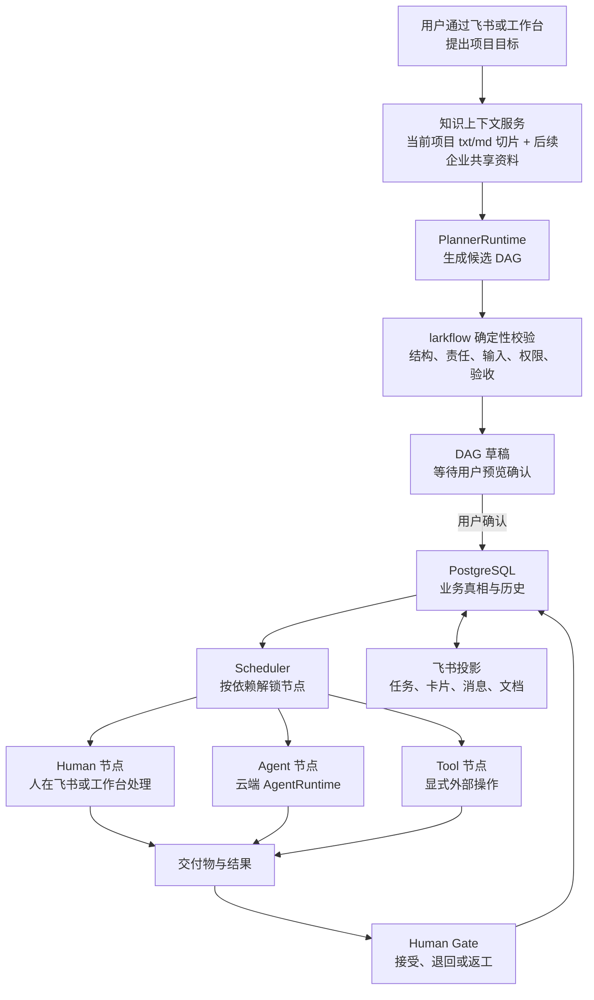

# larkflow 总体方案说明

> 本文面向希望理解产品总体方案、但不需要先阅读领域契约和实现细节的读者。它是 [AIREADME](../AIREADME/INDEX.md) 的通俗解释，不建立第二套产品或架构真相；若本文与 AIREADME 冲突，以 AIREADME 中对应文件为准，并应同步修正文档。

## 一句话定义

larkflow 不是“一个会自己做完所有事情的超级 Agent”，而是“企业项目的云端控制平面”。它负责理解项目目标、组织知识、生成 DAG、分配责任、调度人和 Agent、控制权限、记录历史，并确保最终决定仍掌握在人手里。

把 larkflow 理解成“部署在 ECS 上的 Codex”大约对了七成。更准确地说：

- larkflow 的 Planner 部分像 Codex 的主 Agent。
- DAG 中的 Agent 节点像被限制了任务范围的工作 Agent。
- PostgreSQL、权限系统、调度器、飞书投影和 Human Gate，则是 Codex 类产品通常不负责，但 larkflow 必须负责的企业控制层。

## 一、整体架构



它可以分成五个核心部分：

1. 项目与工作流控制层。
2. 知识上下文层。
3. 项目规划层。
4. 节点执行层。
5. 飞书交互与投影层。

这五层中，只有第一层掌握业务真相。其他层都只是提供材料、建议、执行或交互。

## 二、用户创建项目时，系统发生什么

假设财务负责人提出：

> 请为明年的预算调整创建一个项目，结合公司的预算制度和我上传的部门预算表，形成调整建议，并交给我最终确认。

整个过程分为几个阶段。

### 1. 创建项目工作区

用户在飞书或 larkflow 工作台提交目标，并上传相关资料。

我们当前不急着建立一个很重的 `Project` 领域对象。首版中，一个“项目工作区”实际上由以下内容组成：

- 一个 Workflow Instance。
- 一份完整 DAG 快照。
- 项目 Owner。
- 参与人员。
- 项目上传资料。
- 所有节点和 Attempt 历史。
- 飞书任务、卡片、文档的映射关系。
- 审计记录。

也就是说，对用户叫“项目”，对系统暂时叫“一个工作流实例”。

这样做是为了减少复杂度。只有当真实项目经常需要多个独立 DAG 共享同一批资料时，我们才增加真正的 Project 聚合。

例如以后一个“年度预算项目”同时包含预算编制 DAG、法务审核 DAG、董事会材料 DAG 和预算执行跟踪 DAG，这时独立 Project 才真正有价值。现在先不提前设计。

### 2. 组装授权知识

larkflow 不会把整个企业飞书云盘都交给模型。

目标方案使用两类资料：

- 企业共享资料：由管理员明确发布为企业全员可以使用的资料。
- 项目资料：由项目发起人直接上传，只属于当前项目。

已提交的 Phase 2A 只覆盖第二类资料的第一个切片：Console 仅在存储和模型外发都已启用时展示 UTF-8 txt/md 入口，资料先绑定未生成的草稿请求，确认清单后才进入 Planner。能力未启用时，服务端在落库前拒绝附件模式，原有无附件流程继续可用。该切片尚未完成真实 PostgreSQL 与 Caddy 验证、部署或 migration 应用。企业共享资料仍是目标设计；Agent 节点也还不会在运行时读取附件。

这里最重要的不是检索能力，而是授权顺序：

1. 先判断当前用户和项目有权使用哪些资料。
2. 再从这些资料中检索。
3. 再把检索结果交给 Planner 或 Agent。

不能先从整个企业知识库检索，然后让模型自己“不要泄露无权限内容”。模型提示词不是权限系统，向量数据库也不是权限系统。

系统最终会给 Planner 或 Agent 一份有界的 `ContextBundle`。当前 Phase 2A 只给 Planner，里面包含：

- 允许使用的资料片段。
- 来源 ID。
- 内容摘要或指纹。
- 数据分类。
- 所属 tenant 和项目。
- 允许发送给哪类模型。
- 本次使用范围。
- 过期时间。

它不是把“知识库权限”交给 Agent，而是 larkflow 先完成权限裁剪，再给 Agent 最小材料。

### 3. Planner 生成候选 DAG

Planner 可以理解成“项目规划 Agent”。

它阅读：

- 用户目标。
- 企业共享资料。
- 项目上传资料。
- 可用人员和角色。
- 可用 Agent 能力。
- 可用 Tool。
- larkflow 的 DAG 规则。
- 模板库和已有案例。

然后生成一张候选 DAG。

但 Planner 不能直接创建正式项目，更不能启动项目。它只能返回：

- 候选 DAG。
- 校验报告。
- 为什么这样拆分。
- 使用了哪些资料。
- 仍有哪些不确定问题。
- 模型与工具用量。

例如它可能生成：

```text
确认预算范围 Human
        ↓
读取预算制度 Tool
        ↓
分析历史预算 Agent
        ↓
分析部门预算 Agent
        ↓
汇总调整方案 Agent
        ↓
财务负责人最终确认 Human
```

两个分析 Agent 也可以并行执行：

```text
                 ┌─ 分析历史预算 Agent ─┐
确认预算范围 ────┤                      ├─ 汇总调整方案 ─ 财务确认
                 └─ 分析部门预算 Agent ─┘
```

DSH 的 PTC、类型化工具和 Subagent 很适合帮助 Planner 完成这个规划过程。但即使 Planner 使用 DSH，它也只能产生候选图。

### 4. larkflow 做确定性校验

Planner 说“这是一张好图”没有意义，必须由 larkflow 自己检查。

主要检查包括：

- DAG 是否有环。
- 每个节点是否有唯一人类 Owner。
- 每个节点是否有明确目标。
- 每个节点是否有交付物。
- 每条依赖是否真的被下游消费。
- Agent 是否拿到了必要输入。
- 是否有尚未确认的重要事实。
- 是否使用了未经授权的知识范围。
- 是否调用了不允许的工具。
- 是否存在没有 Human Gate 的高影响结果。
- 是否把 Agent 错当成 Owner。
- 是否把模型判断错当成事实。
- 是否出现重复、无价值或过度拆分的节点。
- 预计耗时和关键路径是否合理。

这一层决定了规划质量的下限。

DSH 或 Pi 可以提高模型的规划能力，但不能替代这一层。模型越聪明，确定性护栏仍然越重要，因为聪明模型也可能稳定地产生结构合理但业务错误的结果。

### 5. 只创建草稿

校验通过后，系统创建的是 `draft`，不是运行中的项目。

用户看到：

- 项目目标。
- 节点顺序。
- 并行和串行关系。
- 每个节点的 Owner。
- 每个节点是 Human、Agent 还是 Tool。
- 输入和交付物。
- 使用哪些资料。
- 哪些节点会访问模型。
- 哪些节点有外部副作用。
- 哪些地方需要人工确认。

用户可以修改节点、修改依赖、更换 Owner、调整验收条件、补充资料、丢弃草稿或确认启动。

这条边界非常重要：自然语言永远只能生成草稿，不能直接启动项目。

## 三、项目启动以后怎样运行

用户确认后，larkflow 冻结当前 DAG 快照，然后在 PostgreSQL 中创建节点与初始 Attempt。Scheduler 开始检查哪些节点满足依赖条件。

### Human 节点

Human 节点会投影成飞书任务、飞书决定卡、工作台待办和必要时的文档入口。

但飞书任务只是责任入口。例如用户在飞书里点击“完成”，不一定意味着中央节点完成。如果节点要求提交预算表、决定意见或结构化字段，仍必须把这些交付物提交给 larkflow，由服务端验证。

### Agent 节点

Agent 节点交给云端 `AgentRuntime`。

每次执行只处理：

- 一个项目。
- 一个节点。
- 一个 Attempt。
- 一份最小上下文。
- 一组明确允许的只读工具。
- 一个预算和超时时间。

Agent 不能看到整个企业资料，也不会天然拥有整个项目的修改权。

它可以读取本节点输入、检索已授权资料、查询直接依赖节点的交付物、调用结构检查工具、形成报告或建议、对自己的输出做自检，并返回结构化交付物和执行证据。

它不能修改业务 DAG、给自己增加节点、改派 Owner、代替 Human Gate、直接修改 PostgreSQL、直接持有飞书应用凭据、随意读取其他项目，或绕过 larkflow 调用外部写工具。

### Tool 节点

Tool 节点表示一个明确、可审计的能力，例如搜索公开信息、校验文档结构、创建飞书文档、发送通知、调用企业系统 API 或写入某个外部业务系统。

首版必须严格区分两种 Tool：

1. Agent Attempt 内部的只读工具。
2. DAG 上显式存在的业务 Tool 节点。

内部只读工具是辅助思考的，例如知识检索、模板搜索、DAG 校验。真正会产生业务副作用的操作，要画在 DAG 上，成为可见节点，并绑定人类 Owner。

原因很简单：外部副作用通常不能回滚。如果 Agent 已经发送了消息、修改了财务系统或创建了合同，仅仅回滚 Agent session，不能让这些事情自动消失。Cordis 的 effect 生命周期也只能撤销明确建模且具备逆操作的上下文变化，不能撤销已经发生的任意外部业务行为。

所以我们不让 Agent 在内部工具循环中偷偷完成业务写操作。

## 四、每个 DAG 节点为什么都必须有人类 Owner

larkflow 的一个关键原则是：执行者可以是机器，责任主体必须是人。

例如“生成预算调整建议”由 Agent 执行，但仍应有财务负责人或指定成员作为节点 Owner。

这个 Owner 负责确认输入是否充分、判断结果是否可用、接收失败通知、决定是否重试、必要时人工接管，以及对业务后果负责。

所以 `executor=agent` 和 `owner=财务负责人` 可以同时成立。

这避免出现一个危险情况：Agent 自己创建任务、自己执行、自己验收、自己宣布完成，最后没有任何人对结果负责。

## 五、PostgreSQL、飞书和 Agent Runtime 各自是什么角色

### PostgreSQL 是业务真相

它保存项目实例、DAG 快照、节点状态、当前责任人、Attempt 历史、输入和交付物引用、图版本、草稿与确认状态、返工和重启记录、投影关系和审计事件。

如果飞书任务被误删、Agent 进程崩溃或服务重启，项目仍然存在。

### 飞书是企业交互入口和投影

飞书负责登录和组织身份、消息、任务、卡片、文档、云盘和人员入口。

但飞书任务显示“完成”，不一定代表中央项目已经完成。larkflow 会根据 PostgreSQL 的权威状态对账、修复和重建飞书对象。

### Agent Runtime 是一次执行的临时计算环境

Pi、DSH、LangGraph 或普通模型调用都属于这一层。

它们可以保存一次 Attempt 的内部 trace、工具调用和中间步骤，但不能成为项目状态源。

LangGraph 在当前代码里还有一个过渡身份：旧 `larkflow` 入口、legacy 引擎和旧测试仍依赖它，所以现在不能直接从默认安装删除。但新的 PlannerRuntime、AgentRuntime 和 Target 工作流不会继续建立在它上面。等 Target 成为默认入口，并完成一个完全不安装 LangGraph 的基础 wheel 冒烟后，旧依赖才会移到 `larkflow[legacy]`。如果以后没有真实的复杂 Agent Attempt 需要内部图分支、checkpoint 或恢复，就不会再建设新的 LangGraph Adapter。

如果 Runtime 说“我完成了”，larkflow 仍要检查：

- 回传的是不是当前 Attempt。
- claim 是否仍有效。
- 节点版本是否匹配。
- 交付物是否满足合同。
- 结果是否通过确定性校验。
- 是否仍有 Human Gate。

## 六、返工、退回和重启怎样处理

项目运行后不会假设所有节点一次成功。

如果最终负责人退回 Agent 的结果：

1. 原 Attempt 保留。
2. 退回意见写入审计和结果。
3. 用户发起节点重启预览。
4. larkflow 计算受影响的目标节点和所有下游。
5. 用户确认影响范围。
6. 系统为这些节点创建新的 Attempt。
7. 原 Attempt 不覆盖、不删除。
8. 退回意见只进入正确的返工节点，不污染无关节点。

例如：

```text
需求确认 Attempt 1，保留
预算分析 Attempt 1，被退回
预算分析 Attempt 2，收到具体退回意见
最终确认 Attempt 1，被退回
最终确认 Attempt 2，重新等待负责人决定
```

这使项目历史可以回答第一次为什么失败、谁退回的、给了什么意见、第二次改了什么、哪些上游没有重做，以及哪些外部对象属于哪次 Attempt。

## 七、权限隔离不是一个开关，而是三道门

### 第一层：知识权限

回答“这个 Agent 能读什么”。

例如可以读企业公开制度和当前项目上传件，但不可以读其他项目附件、个人知识库或法务部门未公开资料。

### 第二层：工具权限

回答“这个 Agent 能调用什么”。

例如可以搜索资料、读取上传件和调用 DAG validator，但不可以发送飞书消息、修改财务系统、创建新项目或调用任意 shell。

### 第三层：业务权限

回答“这个动作在当前业务状态下是否合法”。

例如只有项目 Owner 能启动草稿，只有当前节点 Owner 能提交 Human 结果，只有合法负责人能接受或退回，只有未来未开始区域可以编辑，只有匹配当前版本的确认请求才能生效。Agent 不能修改 DAG，Tool 不能代替 Human Gate。

三层都通过，动作才成立。即使某个 Agent 有调用工具的能力，也不代表它有权改变当前项目状态。

## 八、Pi 和 DSH 最终放在哪里

我们不会把 Pi 或 DSH 变成 larkflow 的核心。larkflow 只定义两个稳定接口。

### PlannerRuntime

负责项目创建阶段的规划，可以有 Python 基线 Planner、DSH Planner Adapter 和将来的其他 Planner。

DSH 在这里比较有价值，因为它擅长类型化工具组合、多轮 DAG 校验与修复、并行查询模板和知识、用 PTC 做循环与聚合，以及用 Subagent 分别做需求分析、风险评审和 DAG 批评。但输出仍然只是候选图。

### AgentRuntime

负责运行阶段的单节点 Attempt，可以有当前简单的 `llm.generate`、Pi 风格的轻量 Agent loop、DSH Agent Adapter 和 LangGraph 复杂节点 Adapter。

Pi 对这里的主要启发是简洁的 Agent loop、Provider 抽象、Session 事件、工具调用过程和可观察的执行轨迹。DSH 的主要启发是插件 seam、类型化工具、PTC、受限 Subagent，以及 Attempt 内能力按需挂载和撤回。

但两者都要遵守 larkflow 的输入输出合同。采用哪个 Runtime，不应该改变业务 DAG 的含义。

## 九、为什么不把整个 larkflow 直接做成一个 DSH 或 Pi Agent

一个 Agent Runtime 擅长的是“完成一次任务”，而 larkflow 还必须解决跨天和跨人的项目状态、人员责任、企业权限、草稿确认、图版本、暂停和取消、返工和重启、历史 Attempt、外部副作用、飞书任务对账、服务崩溃恢复和企业审计。

DSH workflow 或 Pi session 可以记录 Agent 内部过程，但不能天然承担一个持续数周、涉及多个员工和业务系统的企业项目。

所以准确的关系是：larkflow 管项目，Runtime 完成一次受限工作。Runtime 不是项目本身。

## 十、Edge 现在退出主线

Edge 已经做过一个只读 Proof，代码和安全证据都保留。

但当前不再继续投入正式分发、后台常驻、Keychain 体验、本地写能力、公网设备接入，以及员工本机 Codex 或 Claude 的近期产品化。

只有将来出现一种真实、高频，而且云端无法完成的任务，例如必须读取员工本机专有工作区，才重新评估 Edge。

因此当前架构可以简单理解为：所有 Planner、Agent 和 Tool 默认都在云端运行。

## 十一、当前已经实现什么，哪些还是目标方案

当前已经有：

- PostgreSQL 工作流领域内核。
- 模板和实例。
- DAG 校验。
- 草稿生成、预览和确认。
- Scheduler 和 Node Runner。
- Human、Agent、Tool 三类节点。
- 固定的 `llm.generate` Agent。
- 部分确定性 Tool 和公开搜索 Tool。
- Attempt 历史。
- 节点返工和完整重启。
- 运行中未来区域编辑。
- 飞书任务、卡片、消息和文档投影。
- 飞书 OAuth 员工工作台。
- Owner 和参与者权限隔离。
- 审计、Outbox、Inbox 和投影对账。
- 本地 PlannerRuntime 合同、bounded 基线适配器、统一最终候选 validator 和兼容草稿服务。
- 本地 AgentRuntime 合同、completion 基线适配器和 Worker bridge。
- 已提交的 Console txt/md 项目附件切片、collecting 状态、逻辑撤销、保留配额与显式开始生成。
- 规划专用 `ContextBundle`、安全来源引用、内容指纹和默认 deny 的模型外发策略。
- Planner 使用附件后，Instance 只冻结安全 refs 与 fingerprint，不保存正文。

上述 PlannerRuntime、AgentRuntime 与 Phase 2A 代码均已提交，但尚未部署；Phase 2A 也尚未完成真实 PostgreSQL、Caddy 和 migration 应用验证，不能视为正式完成或生产就绪。

目前仍是目标设计、尚未实现的有：

- 企业共享知识清单。
- 企业共享资料与通用 Knowledge Context Service。
- Agent Attempt 读取项目附件。
- PDF、DOCX、图片 OCR、飞书消息附件和生产对象存储。
- Authorized Tool Gateway。
- Attempt 级能力信封。
- 持久化的 Attempt 级模型数据外发政策。
- Pi Adapter。
- DSH Adapter。
- Planner A/B 评估系统。
- 生产级运行时隔离。

当前两个 Runtime 端口只关闭了 Refactor Phase 1 的替换边界，不代表知识授权、工具循环、持久运行策略或候选 Runtime 已完成。所以现在不是推倒重做，而是在已经比较扎实的工作流内核和基线端口上，继续补“知识与受控工具”两块。

## 十二、总结

用户把项目目标和材料交给 larkflow，云端 Planner 在授权知识范围内生成 DAG 草稿。人确认后，larkflow 按依赖调度 Human、Agent 和 Tool。每一步都有唯一人类责任人，所有状态与历史保存在 PostgreSQL，飞书负责交互和投影。Pi、DSH 等 Runtime 只完成一次受限 Attempt，不能控制项目、权限或最终决定。

更本质地说：larkflow 不是让 Agent 接管企业项目，而是让企业能够安全、可控、可追溯地把 Agent 放进项目里。
