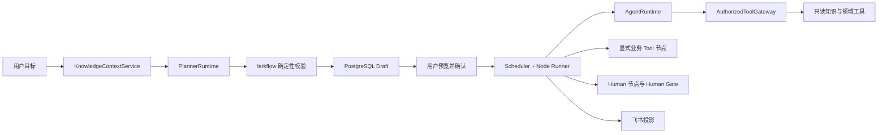

# larkflow 云端 Agent 控制平面重构蓝图

> 状态：Target 迁移附录。Refactor Phase 0、Phase 1 与 Phase 2A 代码均已提交，并随 Phase 2A wheel 部署到开发环境；真实 PostgreSQL、Caddy 与 migration 应用验证已通过，真实 Owner 浏览器上传与生成仍待手工验收。
>
> 本文只把既有目标架构翻译成文件级边界、迁移批次和验收门槛，不构成代码、数据库 migration、依赖安装、部署、提交或发布授权。
>
> 设计真相仍以 [`AIREADME/CORE.md`](../AIREADME/CORE.md)、[`AIREADME/PRD.md`](../AIREADME/PRD.md)、[`AIREADME/ARCHITECTURE.md`](../AIREADME/ARCHITECTURE.md)、[`ADR-114`](../AIREADME/DECISIONS.md#adr-114--2026-08-14--云端-agent-控制平面采用可替换-runtime-与受控知识边界) 和 [`AIREADME/ROADMAP.md`](../AIREADME/ROADMAP.md) 为准。本文若与它们冲突，应先修正设计真相，再执行迁移。

## 1. 结论

larkflow 不需要推倒重写。需要做的是一次边界重构：保留已经成立的工作流控制平面，把目前直接耦合在业务流程中的模型调用拆成四个可替换、可授权、可观测的合同。

1. `KnowledgeContextService`：把已授权的企业共享资料和当前项目上传件整理成不可变的 `ContextBundle`。
2. `PlannerRuntime`：根据目标、上下文和只读工具生成候选 DAG，不写数据库，不启动流程。
3. `AgentRuntime`：一次只执行一个节点的一个 Attempt，不承载跨节点业务状态。
4. `AuthorizedToolGateway`：只向当前 Attempt 开放经过授权的窄工具，首版内部工具全部只读。

Scheduler、Node Runner、claim、Attempt、DAG 校验、Human Gate、PostgreSQL 权威状态和飞书投影继续保留。Pi、DeepSeek Harness（DSH）和 LangGraph 只能作为稳定端口后的适配器。



## 2. 为什么是边界重构，而不是整体重写

当前实现已经具备最难替代的业务基础设施：

- `larkflow/workflow/model.py`、`service.py`、`scheduler.py` 和 `runner.py` 已经定义 Instance、Node、Attempt、状态迁移、依赖解锁和执行认领。
- `larkflow/workflow/runtime.py` 已经先提交 claim，再在数据库事务外调用执行器，并拒绝陈旧结果。
- `ExecutionRequest` 已经携带 tenant、Instance、Node、Attempt、Owner、executor、版本和租约信息，并以 `tenant_id + attempt_id` 形成稳定幂等键。
- PostgreSQL 仓储、追加型审计、outbox、飞书 Projection、Human Task、决定和重启都围绕同一业务真相工作。
- 当前 `DraftDefinitionGenerator` 已经是一个有界基线：一次生成，失败后最多修复一次，再由本地规则校验。
- 当前 `LLMAgentExecutor` 已经是可用的对照组：只处理声明式 `llm.generate`，每次执行一次 completion。

这些能力决定了业务正确性，应该保留。当前欠缺的是运行时中立接口、受控知识上下文和 Attempt 内部工具边界。重写工作流核心会同时扩大状态迁移、幂等、权限、投影和历史兼容风险，却不会直接提高规划或 Agent 质量。

## 3. 重构目标

### 3.1 产品目标

- 用户提交项目目标后，系统可以在明确授权范围内读取企业共享资料和当前项目上传件。
- Planner 生成候选 DAG，并能使用查询、校验、模拟和批评工具进行有限修复。
- 用户看到的仍是可编辑、不可执行的草稿，确认后才启动。
- Agent 节点可以从单次 completion 演进为受限工具循环，但每次仍只完成一个业务节点的一个 Attempt。
- 不同 Runtime 可以在相同输入、上下文、工具和校验器下进行 A/B 比较。

### 3.2 工程目标

- 领域内核只依赖本项目定义的 Python 协议和数据合同。
- 外部 Runtime 不获得 PostgreSQL 写权限、飞书应用凭据、租户级对象存储密钥或生产密钥。
- 权限在检索和工具调用之前判定，不依赖提示词过滤越权结果。
- 每个 Attempt 固化实际 runtime、provider、model、工具范围、知识范围、数据分类、外发策略、预算和版本。
- 当前简单生成器与单 completion 执行器继续作为默认基线和可回滚路径。

## 4. 明确不做什么

本轮重构不包含以下事项：

- 不重写工作流领域内核、Scheduler、Node Runner、仓储、Projection 或 Human Gate。
- 不立即增加独立 Project 聚合。首版项目工作区仍由一个 Workflow Instance 加项目上传件承载。
- 不建设个人知识库、部门知识库、通用企业搜索或复杂源 ACL 同步。
- 不恢复 Personal Agent Edge，不清理或删除既有 Edge Proof。
- 不为了采用而直接引入 Pi、DSH 或 LangGraph 依赖。
- 不允许模型运行任意服务器代码，也不把 worker thread 当作多租户安全边界。
- 不向 Attempt 内部开放飞书写入、数据库写入或其他业务副作用工具。
- 不把 runtime、provider、model、工具和外发策略写入业务 DAG Contract。
- 不承诺微服务拆分。首版仍可部署为模块化单体，DSH 实验才使用独立 sidecar 或受限容器。

## 5. 重构期间不得破坏的不变量

| 不变量 | 迁移要求 |
| --- | --- |
| PostgreSQL 是业务真相 | Runtime 日志、Pi session、DSH workflow、向量索引和模型上下文都不得替代 Instance、Node、Attempt 或 Audit |
| 飞书是投影 | Runtime 不直接创建飞书任务、卡片、文档或消息 |
| 每节点唯一 Human Owner | Agent、Subagent、工具和模型都不能成为 Owner |
| 自然语言只生成 draft | Planner 只能返回候选结果，由 larkflow 复验并持久化草稿 |
| Human Gate 留在人类侧 | Runtime 不得替用户接受结果、跳过 Gate 或自行启动流程 |
| 历史通过 Attempt 保留 | 重试、切换 runtime 或 provider 都创建新 Attempt，不覆盖旧结果 |
| 服务端重新授权 | tenant、actor、Instance、Node、Attempt、版本和资源范围不能信任客户端或 Runtime 回传 |
| 图合法性由 larkflow 判断 | Planner 自带的 validation report 只是证据，不能替代确定性校验器 |
| 业务副作用显式建模 | 飞书或外部系统写入继续使用 DAG 上的 Tool 节点及其 Owner、幂等和审计 |
| 运行时策略与业务语义分离 | `NodeExecutionPolicy` 属于执行配置和 Attempt 快照，不属于 DAG Contract |

## 6. 当前状态与目标差距

### 6.1 规划链路

基线实现仍位于 `larkflow/workflow/draft_generation.py`：

- `DraftCompletionClient` 只提供 `complete(prompt, model_role)`。
- `DraftDefinitionGenerator` 把 brief 和 context 拼入提示词，请求一个 JSON DAG。
- 首次结果不合法时最多修复一次。
- 最终仍调用本地 `instantiate_inline_definition` 等规则校验。

Refactor Phase 1 已在 `larkflow/planning/` 增加纯本地 `PlannerRequest / PlannerResult / PlannerRuntime`、bounded adapter 和 `PlanningService`。Target 草稿装配显式选择 `bounded`，仍调用同一 `DraftDefinitionGenerator`，所以提示词、一次修复上限和拒绝分类保持不变。原生成专用规则已提取为 larkflow 自有的 `GeneratedDraftValidator`：bounded 内部先校验以决定是否执行唯一一次修复，`PlanningService` 再对每个 Runtime 的最终候选覆盖 schema 与请求输入并强制复验。真实网页和飞书 Worker 会传入服务端 tenant、requester 或 initiator，以及耐久 console request ID 或 action ID。当前 metadata 只在本地结果合同中存在，授权知识、工具调用、完整规划证据、用量与持久 trace 仍未实现。

### 6.2 Agent 执行链路

completion 基线实现仍位于 `larkflow/workflow/executors.py`：

- `AgentCompletionClient` 同样只有一次 completion。
- `LLMAgentExecutor` 只接受 `agent.kind = llm.generate`。
- 输入快照和输出合同被序列化为一个提示词。
- 返回结果由 larkflow 做长度、格式和来源合同处理。

Refactor Phase 1 已在 `larkflow/agent_runtime/` 增加纯本地 `AgentRunRequest / AgentRunResult / AgentRuntime`、completion adapter 和 `AutomatedExecutor` bridge。Target 装配显式选择 `completion`，仍调用同一 `LLMAgentExecutor`。桥接请求不包含 claim token、claim expiry 或 expected node version，结果仍由 Worker 使用本地 claim 与版本提交。能力信封、Tool Gateway、持久 policy、统一 trace 和候选适配器仍未实现。

### 6.3 知识与工具链路

Phase 2A 已提交 Console txt/md 项目上传参与 DAG 规划的代码路径：附件先绑定 collecting 草稿请求，Owner 显式确认后冻结 manifest，规划 Worker 通过 `PlanningContextService` 构建类型化 `ContextBundle`，安全 refs 与 fingerprint 随 draft Instance 冻结。只有存储已配置且模型外发为 `allow` 时，Console 才公布能力并接受 defer；撤销对象继续占用保留配额，临时 Blob I/O 故障走 failed/backoff。默认 `deny` 不会留下新的 collecting 请求。该路径已完成真实 PostgreSQL、Caddy、migration 和开发部署验证；真实 Owner 浏览器上传与生成仍待手工验收。

Phase 2B 已形成并部署开发实现：生成结果落库前由 larkflow 为附件支持的 Agent 节点追加显式项目附件输入；`AgentContextService` 从提升到当前 Instance 的冻结 refs 重新完成 tenant、Instance、状态、指纹、大小、UTF-8、外发和字符预算校验。`AgentRuntimeExecutor` 只把 Node 与 Attempt 绑定的 `ContextBundle` 和 `CapabilityEnvelope` 下发给 Runtime，并把不含正文和 object key 的证据写入 Attempt 结果。未声明该输入的节点不会触发 Blob 读取，Worker 未配置 resolver 时显式请求会 fail closed。一次性真实 PostgreSQL 合同与安装态 synthetic Agent Attempt 回归已经通过。企业共享资料清单、Attempt 内只读 Tool Gateway 和生产对象存储仍未实现。现有 `web.search` 与确定性检查器属于显式业务 Tool 节点，不等于 Attempt 内部的只读 Tool Gateway。

显式 `web.search` 已增加独立的本地 `SearchProvider` 合同与薄 Python 豆包搜索适配器，并部署到开发环境。真实 synthetic/public 检索回读了 10 条带 URL 的规范化来源、usage 和 provider request ID；适配器只接收查询并返回规范化来源证据，不获得 PostgreSQL 写权、飞书凭据或 DAG 修改权；Planner 只接收 capability 布尔结果，不接收搜索 Runtime。该切片不等于 Attempt 内部 Tool Gateway，也不引入 DSH、PTC 或 LangGraph。

这两类工具必须保持不同语义：

- 业务 Tool 节点是 DAG 上可见的工作包，有唯一 Human Owner、独立 Attempt、交付物、幂等和审计。
- Attempt 内部工具只是当前 Planner 或 Agent 的短时能力，用来读取授权上下文或调用确定性分析，不产生外部业务副作用。

## 7. 目标模块边界

以下同时列出当前最小落点与后续目标。Phase 2A 没有为了目录整齐提前建立完整 `knowledge/` 子系统。

```text
larkflow/
├── workflow/                       # 保留领域内核、Worker、仓储与投影
│   ├── draft_generation.py         # 第一阶段保留，作为现有基线实现
│   ├── console_attachments.py      # Phase 2A 附件 Port、仓储、授权与规划上下文服务
│   ├── agent_context.py            # Phase 2B Agent Attempt 附件授权与完整性复验
│   ├── executors.py                # 第一阶段保留，作为兼容门面
│   ├── runtime.py                  # 继续拥有 claim 与执行结果提交
│   └── ...
├── planning/
│   ├── __init__.py
│   ├── contracts.py                # PlannerRequest、PlannerResult 等纯数据合同
│   ├── context.py                  # Planning 与 Agent Attempt ContextBundle、fingerprint
│   ├── bounded.py                  # 现有 DraftDefinitionGenerator 的适配器
│   └── service.py                  # 调用、复验、指标和草稿写入编排
├── agent_runtime/
│   ├── __init__.py
│   ├── contracts.py                # AgentRunRequest、AgentRunResult
│   ├── completion.py               # 当前单 completion 基线
│   └── executor.py                 # AutomatedExecutor 到 AgentRuntime 的桥接
├── knowledge/                      # 企业共享资料的运行时中立合同边界
│   ├── __init__.py
│   └── contracts.py                # Publication、版本安全引用和规范化 Selection
├── knowledge_authorization.py      # 后续检索前的资源与外发授权，尚未创建
├── enterprise_knowledge_store.py   # 后续清单、版本、读取与失效，尚未创建
├── agent_tools/
│   ├── __init__.py
│   ├── contracts.py                # ToolSpec、ToolCall、ToolResult
│   ├── gateway.py                  # 能力信封、参数校验、审计、预算和超时
│   └── readonly/                   # 首版允许的只读窄工具
└── runtime_adapters/
    ├── __init__.py
    ├── dsh_planner.py              # 后续实验，不进入首批迁移
    ├── dsh_agent.py
    └── pi_agent.py
```

### 7.1 迁移原则

- 第一批只加端口和适配器，不移动现有大文件，不改变调用结果。
- `workflow/draft_generation.py` 和 `workflow/executors.py` 暂时作为兼容入口，等所有调用方切换并稳定后再决定是否移动实现。
- 领域层只能 import `contracts.py` 中的本地类型，不 import DSH、Pi 或具体供应商 SDK。
- `runtime_adapters/` 可以依赖端口，端口不能反向依赖适配器。
- 任何 sidecar 都通过窄协议接收一次请求，不能连接 larkflow 数据库或持有飞书凭据。

## 8. 核心合同草案

以下字段用于固定边界。它们是内部 Python 合同候选，不是当前公共 HTTP API，也不应直接复制进业务 DAG schema。

### 8.1 PlannerRequest

| 字段 | 含义 |
| --- | --- |
| `tenant_id` | 当前租户，服务端产生 |
| `actor_person_id` | 发起人，服务端认证结果 |
| `request_id` | 本次规划请求的稳定 ID |
| `brief` | 用户目标 |
| `constraints` | 已确认的范围、期限、角色和限制 |
| `context_bundle` | 已授权且有指纹的上下文清单 |
| `capability_envelope` | 当前规划 Attempt 可使用的只读工具和预算 |
| `policy` | runtime、model、egress、timeout 等执行策略快照 |

Planner 不接收数据库连接、飞书凭据、对象存储主密钥或任意租户搜索权限。

### 8.2 PlannerResult

| 字段 | 含义 |
| --- | --- |
| `candidate` | `DAGCandidate`，仍是不可信候选 |
| `validation_report` | Planner 自己观察到的结构与领域问题 |
| `planning_evidence` | 使用过的来源、模板、工具、批评与修复摘要 |
| `usage` | token、调用次数、耗时与估算成本 |
| `runtime_metadata` | runtime、adapter、provider、model 和版本 |
| `trace_ref` | 经过脱敏和保留期控制的诊断引用，可为空 |

`PlannerResult` 返回后必须经过 larkflow 当前确定性 DAG 校验。Phase 1 的 `PlanningService` 已强制执行这一复验，并把 `schema_version`、brief 与 context 重新绑定为服务端 `PlannerRequest` 中的值，不能相信 Adapter 回传的同名字段。只有 larkflow 可以把通过复验的候选写成 `draft`。

### 8.3 AgentRunRequest

| 字段 | 含义 |
| --- | --- |
| `tenant_id` | 当前租户 |
| `instance_id` | 当前项目工作区 |
| `node_key` | 当前业务节点 |
| `attempt_id` | 当前不可变 Attempt |
| `owner_person_id` | 该节点唯一 Human Owner |
| `work_contract` | 目标、输入、输出与验收合同 |
| `input_snapshot` | Attempt 启动时冻结的直接输入 |
| `context_bundle` | 为当前节点重新授权并裁剪的知识上下文 |
| `capability_envelope` | 当前 Attempt 的工具、预算、超时和外发边界 |
| `policy` | 本次实际 runtime 与模型策略 |

`WorkflowWorker` 现有 claim token 和 expected node version 继续留在 larkflow 进程，用于结果提交。它们不应传给外部 sidecar，因为 sidecar 不负责修改业务状态。

### 8.4 AgentRunResult

| 字段 | 含义 |
| --- | --- |
| `deliverables` | 与节点输出合同匹配的候选交付物 |
| `quality_observations` | Runtime 观察，不替代 larkflow 的确定性检查与 Human Gate |
| `tool_invocations` | 已调用内部只读工具的摘要和状态 |
| `source_refs` | 输出所依据的来源 ID |
| `usage` | token、工具次数、耗时和成本 |
| `runtime_metadata` | 实际 runtime、provider、model 和版本 |
| `trace_ref` | 可选脱敏诊断引用 |

### 8.5 ContextBundle

`ContextBundle` 是授权后的不可变清单，不是一个自动拥有所有知识的字符串。建议包含：

- `bundle_id`、`tenant_id`、scope kind/id、purpose、`actor_person_id`，运行时 bundle 再增加 Node 与 Attempt 绑定。
- 每个 `SourceRef` 的稳定来源 ID、标题、来源类型、版本或 ETag、摘要指纹、数据分类和授权理由。
- 服务端附件元数据保存对象引用、上传人、状态和保留策略；交给 Runtime 的 `AttachmentRef` 只含稳定来源 ID、显示名、MIME、大小、内容指纹、数据分类与外发决策。
- 可发送给当前模型的正文片段或安全读取引用。
- `egress_policy`、生成时间、失效时间和整个清单的确定性 fingerprint。

任何 Runtime 需要更多材料时，必须再次通过 Gateway 请求，不能自行扩张检索范围。

### 8.6 CapabilityEnvelope

短时能力信封建议包含：

- tenant、actor、Instance、Node、Attempt 的精确绑定。
- 允许的工具名和工具 schema 版本。
- 允许的知识 scope、数据分类和模型外发等级。
- 总调用次数、单工具次数、token、成本、运行时长和单调用超时。
- 签发时间、失效时间和唯一 envelope ID。

信封由 larkflow 服务端计算。Runtime 只能缩小能力，不能扩大能力。

### 8.7 NodeExecutionPolicy

建议字段包括：

- `runtime`、`adapter_version`、`provider`、`model`。
- `allowed_tools`、`knowledge_scopes`、`data_classification`、`egress`。
- `budget`、`timeout`、`retry`、`sandbox`、`fallback`。

该策略属于 NodeRun 配置，并在 Attempt 创建时冻结快照。业务 DAG 只描述工作目标、依赖、Owner、executor、输入、输出与验收。用户换 provider 或 Runtime 时，应生成新 Attempt，而不是在同一 Attempt 内静默切换。

## 9. KnowledgeContextService 首版边界

### 9.1 允许的来源

1. 企业共享资料：由管理员明确发布为当前 tenant 全员可用于 larkflow 的资料。
2. 项目上传件：由用户上传并绑定当前 Workflow Instance。

如果企业无法提供明确的全员发布清单，首版只启用项目上传。不能把“机器人可以读取”解释为“所有员工的 Agent 都可以读取”。

### 9.2 授权顺序

服务端必须先判定以下条件，再读取或检索正文：

1. actor 是否属于 tenant。
2. actor 是否有权访问当前 Instance 或当前责任任务。
3. source 是否属于管理员发布的共享清单，或属于当前 Instance 的上传件。
4. 当前 Node 和 Attempt 是否允许使用该知识 scope。
5. 数据分类是否允许发送给所选 provider 和 model。
6. 内容大小、类型、恶意文件、提示注入和保留策略是否满足要求。

检索后的提示词过滤不能替代上述授权。向量索引只负责召回，不负责决定谁能看什么。

### 9.3 上传件最小能力

- 上传、列出、读取、逻辑失效和审计。
- 大小、MIME、扩展名和内容指纹校验。
- 绑定 tenant 与 Instance，禁止通过对象 key 越权读取。
- 内容提取失败时保留原文件元数据和失败状态，不把空内容伪装成已读取。
- 删除首版使用逻辑失效或保留期策略，不物理抹除审计历史。
- Runtime 只拿短时读取引用或已裁剪内容，不拿对象存储主凭据。

## 10. AuthorizedToolGateway 首版工具集

首版优先实现会直接提高规划质量、同时没有业务副作用的窄工具：

| 工具 | 用途 | 主要输出 |
| --- | --- | --- |
| `requirements_extract` | 从目标和材料提取约束、缺失输入和开放问题 | 结构化 requirements |
| `template_search` | 查询当前 tenant 已启用模板 | 模板摘要与版本引用 |
| `org_resolve` | 解析可分配的人员或角色 | 受限人员候选，不返回越权目录 |
| `capability_catalog` | 查询当前部署可用 Runtime 与工具能力 | 只读能力摘要 |
| `context_search` | 在已授权 `ContextBundle` 范围内检索 | SourceRef 与片段 |
| `dag_validate` | 调用 larkflow 的确定性 DAG 校验 | 错误、警告和定位 |
| `dependency_validate` | 检查无效、冗余或未消费依赖 | 依赖报告 |
| `deliverable_validate` | 检查输入、输出与验收是否闭合 | 交付物报告 |
| `placement_validate` | 检查当前只允许云端的执行策略 | 策略报告 |
| `side_effect_validate` | 检查副作用是否被误放进 Agent 内部 | 违规报告 |
| `schedule_simulate` | 模拟并行层级、关键路径和阻塞点 | 调度摘要 |
| `dag_critique` | 从责任、遗漏、冗余和可执行性角度评审候选 | 结构化批评 |

这些工具必须使用版本化 schema、严格参数校验、有界输出和统一审计。工具名只是当前建议，正式实现时可以合并，但不能放宽权限语义。

首版明确禁止：

- 任意 SQL、任意 HTTP、任意 shell、任意文件系统读取。
- 创建或修改飞书对象。
- 修改 Instance、Node、Attempt、Owner、DAG 或 Human Gate。
- 代表用户批准、接受、转交、重启或编辑流程。
- 根据模型输出自行扩大知识 scope 或外发等级。

## 11. 数据持久化候选

所有 schema 变化必须使用追加 migration，并经过独立授权后实施。本节只定义未来可能需要保存的事实。

### 11.1 `project_attachment`

保存 tenant、Instance、上传人、对象引用、文件名、MIME、大小、内容指纹、数据分类、状态、创建时间和逻辑失效时间。对象正文不直接放进业务聚合 JSON。

### 11.2 `context_manifest`

保存某次规划或 Agent Attempt 实际使用的来源清单、版本、摘要指纹、授权决策、外发策略和 bundle fingerprint。它用于复现与审计，不成为第二个业务状态机。

### 11.3 `runtime_trace`

保存 runtime、adapter、provider、model、版本、开始结束时间、usage、结果状态和脱敏 trace 引用。默认不保存完整提示词、模型思考过程或原始敏感正文。

### 11.4 `tool_invocation`

保存 Attempt、工具、schema 版本、参数摘要指纹、授权结果、耗时、状态、结果摘要指纹和错误类别。敏感参数与正文不能直接进入通用日志。

### 11.5 Attempt 执行策略快照

可以给现有 Attempt 增加不可变 `execution_policy_snapshot` 与 `context_manifest_id`，也可以使用一对一附表。正式选择前应先比较对聚合读取、migration、审计和兼容查询的影响。无论采用哪种方式，都不能通过更新旧 Attempt 来表达运行时切换。

## 12. 三条目标执行流程

### 12.1 创建项目与生成草稿

1. 用户提交目标并选择企业共享资料，按需上传项目材料。
2. larkflow 验证 tenant、actor、资料范围和外发政策。
3. `KnowledgeContextService` 生成 `ContextBundle`。
4. larkflow 选择 Planner policy，并签发短时 `CapabilityEnvelope`。
5. `PlannerRuntime` 调用只读工具，返回 `PlannerResult`。
6. larkflow 忽略 Runtime 对合法性的自我声明，重新执行全部确定性校验。
7. 校验通过后，larkflow 写入 PostgreSQL draft 和规划证据摘要。
8. 用户预览节点、依赖、Owner、资料范围和验收条件。
9. 用户确认后，larkflow 才冻结 Instance Snapshot 并启动调度。

Planner 超时、失败或候选不合法时，只记录失败的规划请求，不留下半启动 Instance，也不执行任何外部业务写。

### 12.2 执行一个 Agent 节点

1. Scheduler 把满足依赖的节点推进到可执行状态。
2. Node Runner 创建或恢复当前 Attempt，并提交 claim。
3. Worker 读取不可变输入快照和 NodeRun policy。
4. 服务端为这个 Node 与 Attempt 重新生成 `ContextBundle` 和 `CapabilityEnvelope`。
5. `AgentRuntimeExecutor` 去除业务状态修改能力，调用选定 `AgentRuntime`。
6. Runtime 只能在 Gateway 中调用获准的只读工具。
7. Runtime 返回候选交付物、来源和用量。
8. larkflow 校验 claim、版本、输出 schema、确定性质量合同和副作用边界。
9. 合法结果写入当前 Attempt；陈旧或越权结果被拒绝。
10. 下游 Human Gate 仍由真实负责人接受或退回。

### 12.3 执行一个显式业务 Tool 节点

1. Tool 节点继续由现有 Workflow Worker 按 DAG 依赖认领。
2. Tool executor 使用节点合同和稳定幂等键执行已声明的外部动作。
3. 结果、错误、外部对象绑定和审计写回当前 Attempt。
4. AgentRuntime 不能绕过这条路径直接完成同样副作用。

这条路径与 Attempt 内部 `AuthorizedToolGateway` 并存，但权限、审计和产品语义不同。

## 13. 分阶段迁移计划

每个阶段都应是可以独立合并、独立回滚的小批次。任何阶段失败时，不应迫使下一阶段继续。

### Refactor Phase 0：锁定现状行为

状态：已纳入内容提交 `476b43491adeaf1bcde32185d9b9f036c3a9874a`，并随 Phase 2A wheel 部署到开发环境。

目标：在抽象接口前先证明当前基线行为是什么。

计划工作：

- 为当前自然语言草稿生成建立固定输入与候选结果 fixture。
- 固定首次生成、一次修复、最终拒绝、节点上限、非法依赖和 Human Gate 规则。
- 固定 `LLMAgentExecutor` 的输入快照、结果格式、来源提示、长度限制和异常行为。
- 固定 Worker 的 claim 提交、过期恢复、陈旧结果拒绝和稳定幂等键。

Exit gate：现有离线测试全绿；新增 characterization tests 能在破坏关键行为时失败；不改生产配置和公共合同。

完成证据：迁移前聚焦基线为 `49 passed`。新增与既有测试共同锁定首次生成、最多一次修复、最终拒绝、Agent 输入快照、结果格式、来源提示、长度与异常、Worker claim 先提交、过期恢复、陈旧结果拒绝，以及稳定 `tenant:attempt` 幂等键。

### Refactor Phase 1：增加端口与基线适配器，不改变行为

状态：已纳入内容提交 `476b43491adeaf1bcde32185d9b9f036c3a9874a`，并随 Phase 2A wheel 部署到开发环境。

目标：建立 `PlannerRuntime` 和 `AgentRuntime`，但默认结果与当前实现一致。

计划工作：

- 新增 `planning/contracts.py`、`planning/bounded.py` 和 `planning/service.py`。
- 用适配器包住当前 `DraftDefinitionGenerator`，保持相同提示词、修复次数和校验结果。
- 新增 `agent_runtime/contracts.py`、`completion.py` 和 `executor.py`。
- 用桥接执行器包住当前 `LLMAgentExecutor`，继续只支持 `llm.generate`。
- 在现有装配层增加显式 runtime 选择，默认仍为 `bounded` 和 `completion`。
- 记录最小 runtime metadata，但不增加外部依赖。

Exit gate：同一 fixture 在迁移前后得到相同业务结果和错误分类；当前 DAG schema、数据库 schema、CLI、HTTP 与飞书行为不变；全部现有测试通过。

完成证据：Target 装配已显式使用 `bounded` 与 `completion`。第一轮端口聚焦套件为 `107 passed`；P2 收口的草稿、网页入口、飞书入口与端口聚焦套件为 `75 passed`。完整离线套件在清空本机代理并允许既有停机测试读取进程树后为 `1085 passed, 24 skipped`。负向测试证明空图、仅 Agent、缺少最终 Human Gate 和非法领域形状不能从替换 Runtime 越过服务边界；两条真实 Worker 路径的非空 tenant、actor 与耐久 request ID 也已锁定。源码扫描、阻断 LangGraph 导入的 Target 冒烟、阻断 workflow 导入的合同独立性冒烟、`pip check` 和 wheel 文件清单检查均通过。Runtime metadata 已进入本地结果合同，但尚未持久化。DAG schema、数据库 schema、HTTP、飞书、依赖和部署均未改变。

### Refactor Phase 2：项目上传与 ContextBundle

目标：先关闭最简单、最有价值的知识边界，不等待企业知识库。

Phase 2A 状态：主体代码已纳入内容提交 `b2a13ff1eff796723774d42ca5d04556814a38c2`，PostgreSQL 合同收口提交为 `07de190db49839d8195cfa26967241fad7d975f6`。离线、真实 PostgreSQL、Caddy、migration 和开发部署验证均已通过；真实 Owner 浏览器上传与生成仍待手工验收。范围只到“Console 上传 txt/md、显式开始生成、Planner 使用授权内容、创建 draft Instance、冻结安全 refs”。

计划工作：

- 增加项目附件的元数据、对象存储适配器和逻辑失效。
- 增加上传、列出和读取的服务端授权。
- 实现 `SourceRef`、`AttachmentRef`、`ContextBundle` 和 fingerprint。
- Phase 2A 让草稿规划显式引用当前请求上传件；Phase 2B 才让 Agent 节点使用提升到 Instance 的冻结 refs。
- 增加文件类型、大小、恶意内容、提示注入和模型外发负向测试。

Exit gate：跨 tenant、跨 Instance、非参与者、失效附件、禁止外发和陈旧读取全部 fail closed；Runtime 不获得对象存储主凭据；旧流程在没有附件时保持原行为。

Phase 2A 已提交实现证据：新增 `0024_console_project_attachments`、独立 BlobStore Port、内存与 PostgreSQL 元数据仓储、collecting 状态机、Owner-only HTTP、两阶段控制台、类型化 ContextBundle、规范化 fingerprint、Prompt Injection 隔离、Instance 安全 refs 与幂等 promotion。复审收口又增加持久化前能力门、浏览器能力协商、request 与 tenant retained 配额、Blob 终态与可重试错误分类，以及精确附件路径的 Caddy body limit。负向测试覆盖跨 tenant、真实 collaborator、状态冲突、逻辑撤销、重复上传撤销、真实 128 KB 上限、缺失或损坏 blob、临时 I/O、文件与上下文预算、默认外发拒绝、路径与 object key 伪造、崩溃窗口恢复和无附件兼容。附件模块为 `35 passed`，完整离线套件为 `1120 passed, 26 skipped`。阿里云一次性 PostgreSQL 从空库应用 24 份 migration 并重入，`tests/test_workflow_postgres.py` 为 `26 passed`；补充合同验证并发 tenant 配额、逻辑撤销保留、Owner 隔离、manifest、promotion 幂等、删除保护和事务回滚。Caddy 2.11.4 的 validate/adapt 与公网请求体实测均通过。真实 Owner 浏览器上传与生成仍是唯一 Phase 2A 产品验收缺口。

Phase 2A 残余边界：只接受 UTF-8 txt/md；filesystem adapter 只适合显式共享绝对根目录的单机开发环境；不支持企业共享资料、飞书消息附件、PDF/DOCX/OCR、向量检索或生产对象存储。

Phase 2B 开发部署证据：附件支持的 Agent 输入由服务端追加，不依赖模型声明能力；Runtime 只拿有界正文、安全 refs 和不可变能力信封。跨 tenant、跨 Instance、撤销、manifest 篡改、默认 deny、字符预算、无 resolver 及未声明输入均 fail closed；成功 Attempt 只保存安全 manifest、信封和 runtime metadata。该切片复用 0024，不增加数据库 schema。一次性真实 PostgreSQL 从空库应用 24 份 migration 并重入，仓储合同为 `27 passed`；安装态 synthetic Attempt 证明正文只在 Runtime 内可见，持久结果不含正文、object key 或 claim。开发环境十个服务已统一更新并完成状态回读。

### Refactor Phase 3：企业共享资料清单

目标：只接入管理员明确发布为当前 tenant 全员可用的资料。

合同基线已落码，但持久化、管理 API、内容读取和 Runtime 接入尚未实现：

- `EnterpriseKnowledgePublication` 只表示服务端目录中的发布或撤销状态，发布者身份不会进入 Runtime-safe ref。
- `EnterpriseKnowledgeRef` 固定 tenant、`enterprise:` 来源 ID、不可变版本、显示标签、UTF-8 txt/md 类型、大小、SHA-256、发布时间、`internal` 分级和显式 allow/deny 外发决定，不携带正文、对象 key、源系统 token 或发布者。
- `EnterpriseKnowledgeSelection` 在读取正文前拒绝跨 tenant、同一来源多版本和空选择，按来源与版本规范化排序，并把 tenant、来源、版本、内容指纹、分级和外发决定绑定到 canonical fingerprint。
- 撤销只阻断后续 `authorized_ref` 和新 ContextBundle。旧 Attempt 继续保留当时的安全来源清单与 fingerprint，不物理改写历史。
- 首版只接受管理员确认具有当前 tenant 全员使用权的静态内容快照；不做部门、个人 ACL，同步继承，也不把“bot 能读取”当成全员授权。

计划工作：

- 基于上述本地合同增加 tenant-first 共享来源清单、不可变版本、同步状态和逻辑失效。
- 检索前完成 tenant、发布状态、数据分类和外发授权。
- 在 ContextBundle 中同时表示企业来源与项目附件，并保留来源 ID。
- 当源系统权限不明确时拒绝进入企业共享清单。

首批实现测试必须覆盖：跨 tenant、非管理员发布、重复来源版本、撤销后新读取、缺失或变化的内容哈希、默认外发 deny、非法分级、源系统权限不明确、正文与对象 key 不进入快照或 Runtime 请求，以及没有企业共享资料时项目附件路径保持不变。PostgreSQL 合同还要验证 tenant-first 主键、不可变版本、追加型发布审计、并发发布幂等和禁止物理删除。任何检索测试都必须在授权后读取正文，不能以 mock 掉授权仓储的方式证明隔离。

Exit gate：不存在“先跨权限召回正文，再靠模型过滤”的路径；撤销发布后新 Attempt 无法读取，旧 Attempt 仍保留当时的来源清单和指纹；无法维护明确清单时可以完全关闭企业共享资料，只保留项目上传。

### Refactor Phase 4：只读 Tool Gateway 与有界 Agent loop

目标：让 Planner 和 Agent 能使用少量确定性工具，同时保持能力最小化。

计划工作：

- 实现工具 schema 注册、能力信封、调用预算、超时、参数校验和统一审计。
- 先接 `dag_validate`、`dependency_validate`、`deliverable_validate`、`schedule_simulate` 和 `context_search`。
- Planner 可以在固定最大轮次内调用工具、修复候选并返回证据。
- Agent 可以在固定最大轮次内读取上下文和调用获准只读工具。
- 网关拒绝未知工具、未知版本、越权 scope、超预算和过期信封。

Exit gate：关闭 Gateway 后可回到 Refactor Phase 1 基线；工具循环有固定调用数、总耗时和输出上限；任何业务写调用都被拒绝；Planner 与 Runtime 仍不能写 draft 或完成 Attempt。

### Refactor Phase 5：Pi 与 DSH 适配器实验

目标：用数据决定是否采用适配器，不把框架选择变成架构前提。

计划工作：

- DSH Planner 运行于独立 sidecar 或受限容器，只接收一次 `PlannerRequest`。
- PTC 只组合类型化只读工具，禁止数据库、飞书凭据、任意网络和宿主文件系统。没有 OS 级进程或容器隔离时，只测试标准模式或服务端固定编排，不运行模型生成代码。
- Pi Agent Adapter 只执行一个 `AgentRunRequest`，session 不承载跨 Attempt 业务状态。
- DSH Subagent 只用于当前规划 Attempt 的需求分析、风险评审或 DAG 批评。
- 与 Python 基线使用同一输入、ContextBundle、工具、预算和确定性校验器进行 A/B。

Exit gate：适配器在至少一项核心质量指标上产生材料改善，且没有越权、schema 污染、不可解释副作用或不可接受成本。否则停止适配器，保留端口和基线。

### Refactor Phase 6：后续能力，当前不排期

只有真实需求和安全条件同时成立时再评估：

- 面向多租户生产的不可信模型代码隔离、资源配额、逃逸检测和事件响应。
- 受控写工具、补偿语义与人工批准。
- 独立 Project 聚合和多 DAG 共享资料。
- 个人或部门知识库及复杂源 ACL 同步。
- Personal Agent Edge 恢复。

## 14. 每个实现批次的验收门槛

### 14.1 正确性

- 全部现有离线测试通过。
- 新增合同有序列化、版本兼容、非法字段和边界值测试。
- DAG 仍由同一个确定性校验路径裁决。
- stale claim、过期 claim、重复结果和并发完成行为不变。
- 重试、切换 runtime 和 provider 都产生新 Attempt。

### 14.2 权限

- tenant、actor、Instance、Node、Attempt 和资源 scope 全部由服务端绑定。
- 覆盖跨 tenant、跨 Instance、非 Owner、非参与者、失效来源和禁止外发负向用例。
- Runtime 进程环境不包含 PostgreSQL DSN、飞书 secret、Edge credential 或对象存储主密钥。
- 未授权工具、未知工具版本和过期能力信封默认拒绝。

### 14.3 副作用

- Planner 失败不能留下已启动流程。
- AgentRuntime 失败不能直接改变业务状态或创建飞书对象。
- 所有外部业务写仍能定位到显式 Tool 节点、Attempt、Owner、幂等键和审计。
- 超时只表示当前结果未知，不自动重复可能产生副作用的调用。

### 14.4 可观测性

- 每次运行记录 adapter、provider、model、版本、耗时、usage 和错误类别。
- 每个 Tool invocation 记录授权结果、schema 版本、耗时和摘要指纹。
- 日志不默认包含完整提示词、模型思考过程、原始附件正文、token 或凭据。
- trace 与业务审计分开保存，分别设置访问权和保留期。

### 14.5 产品兼容

- 用户仍先看到草稿，再确认启动。
- 旧模板和旧 Instance 不需要补写 Runtime 字段才能读取或继续运行。
- 没有知识资料、没有 Gateway 或新 Runtime 被关闭时，基线路径仍可工作。
- 飞书卡片、任务、文档与工作台的现有责任语义不改变。

## 15. 兼容、灰度与回滚

### 15.1 默认路径

- `PlannerRuntime = bounded`，复用当前 `DraftDefinitionGenerator`。
- `AgentRuntime = completion`，复用当前 `LLMAgentExecutor`。
- `KnowledgeContextService = disabled` 或只启用当前项目上传。
- `AuthorizedToolGateway = disabled`，直到工具和权限测试关闭。

### 15.2 独立开关

建议至少可以分别关闭：

- 企业共享资料。
- 项目附件进入模型上下文。
- Planner 工具循环。
- Agent 工具循环。
- 每个 Pi 或 DSH 适配器。
- 所有外部模型数据外发。

开关只决定新请求的执行策略，不修改已经启动的 Attempt。正在运行的 Attempt 应按其冻结策略完成或明确失败。

### 15.3 回滚规则

- 新适配器异常时，停止为新 Attempt 选择它，不在同一 Attempt 内静默换到备用 Runtime。
- 已经产生的 Attempt、trace 摘要和工具审计继续保留。
- additive migration 不通过删除列回滚，应用层先停止读取新字段并保留历史。
- 不允许 baseline 与新 Runtime 各自写一份业务结果形成双真相。

### 15.4 LangGraph 默认依赖退出门槛

当前 `pyproject.toml` 仍把 `langgraph` 与 `langgraph-checkpoint-sqlite` 列为默认依赖。原因不是 Target 需要 LangGraph，而是 legacy `larkflow` CLI、`engine/orchestrator.py`、`app.py`、`service.py` 和对应测试仍直接使用 StateGraph、interrupt、Command 与 SQLite checkpointer。Target `larkflow/workflow/` 已与这套状态模型隔离，因此本轮采用兼容迁移，不立即删除依赖。

分三步处理：

1. Refactor Phase 0 与 Phase 1 保留现有依赖、legacy 文件和脚本行为。新增 `planning/`、`agent_runtime/`、Target 装配和对应测试不得导入 LangGraph，也不得使用它表达跨节点状态。
2. Target 成为正式默认入口后，增加一个只安装基础 wheel 的独立测试环境。该环境不安装 LangGraph，必须通过 Target CLI 导入、帮助命令、最小启动和离线工作流冒烟。legacy 测试改为显式安装 `larkflow[legacy]`，继续证明旧入口没有被无声破坏。
3. 上述门槛全部关闭后，才把现有 LangGraph 依赖从默认依赖移到 `legacy` optional dependency。迁移提交必须同时更新安装说明、CI 矩阵和 legacy 入口在缺少 extra 时的明确错误，不能让用户遇到隐蔽的 `ModuleNotFoundError`。

是否新增 `larkflow[langgraph]` 是另一项独立决策。只有真实单节点 Attempt 需要内部图分支、checkpoint 或恢复，并且 completion、有界工具 loop、Pi 与 DSH 方案都无法以更小复杂度满足时，才实现 `LangGraphAgentRuntimeAdapter`。该适配器仍只处理一个 Node 的一个 Attempt，checkpoint 不能成为业务 DAG、跨节点状态、Owner、Human Gate 或授权边界。没有这类证据时，不创建 extra，也不为保留依赖寻找用途。

Dependency Exit Gate：

- `planning/`、`agent_runtime/` 与 Target `workflow/` 的 import graph 中没有 LangGraph。
- 默认入口已经指向 Target，或 legacy 入口在缺少 `legacy` extra 时给出可执行的安装提示。
- 无 LangGraph 的基础 wheel 通过导入、CLI、最小启动和离线冒烟。
- legacy 测试任务显式安装并验证 `larkflow[legacy]`。
- 包文档清楚区分 base、legacy 和证据驱动的可选 Adapter。
- 本次退出不删除 legacy 源码、历史 ADR、Attempt 或测试证据。

## 16. A/B 评估设计

比较对象必须使用相同用户目标、ContextBundle、允许工具、调用预算和最终确定性校验器。

### 16.1 规划质量指标

- 首次硬校验通过率。
- 用户确认前改图次数。
- 遗漏必要输入数量。
- 无效依赖和未消费依赖数量。
- 冗余节点数量。
- 一次接受率。
- 从请求到可预览草稿的耗时。
- 每次可接受草稿的 token 与成本。

### 16.2 Agent 执行指标

- 输出 schema 首次通过率。
- 确定性质量检查通过率。
- Human Gate 接受、退回和人工接管比例。
- 工具调用成功率、越权拒绝率和无效调用数。
- 每个成功 Attempt 的耗时、token 和成本。
- 重复副作用数量，目标必须始终为零。

### 16.3 采用判断

一次演示效果好不能作为采用证据。只有当适配器在真实项目小样本中稳定改善质量或减少人工修改，同时满足权限、成本、延迟和可回滚边界，才进入默认候选。没有材料改善时停止投入，不为已经建立的适配器寻找用途。

## 17. 主要风险与停止开关

| 风险 | 最小控制 | 停止条件 |
| --- | --- | --- |
| 企业资料 ACL 被错误放宽 | 只允许管理员明确发布的全员清单，检索前授权 | 无法证明来源是 tenant 全员可用 |
| 模型数据外发违规 | 数据分类与 provider egress 分开判定 | provider 或模型政策无法满足当前数据等级 |
| Prompt injection 扩权 | 内容只作为数据，工具权限由能力信封判定 | Runtime 可以根据正文改变工具或知识 scope |
| DSH 代码模式逃逸 | OS 级隔离、只读 SDK、无凭据、无任意网络 | 只能依赖 worker thread containment |
| 重试产生重复副作用 | Attempt 内部工具只读，业务写走显式 Tool 节点 | Runtime 需要直接调用写工具 |
| trace 泄漏敏感信息 | 默认只存摘要、指纹和受控引用 | 框架无法关闭完整 prompt 或敏感日志 |
| Runtime 成为第二真相 | 单请求、无业务写、结果由 larkflow 提交 | 适配器要求自己维护项目 DAG 或恢复状态 |
| 静默 fallback 破坏复现 | 每个 Attempt 冻结实际策略 | provider 或 Runtime 在 Attempt 内自动切换且不留痕 |
| 成本或延迟失控 | 固定轮次、工具数、token、时间和成本预算 | 无法在网关层硬停止 |

每个实验适配器必须有独立 kill switch。还需要一个全局 Runtime kill switch，使新 Agent Attempt 回到 `completion` 基线、新规划回到 `bounded` 基线。关闭新能力不能阻止 Human 节点、显式 Tool 节点和既有 Workflow Instance 继续运行。

## 18. 建议的 PR 切分

以下只是将来实施时的批次建议，不代表本轮已经授权创建 PR。

1. Characterization tests：固定规划、Agent 和 Worker 的当前行为。
2. Planner contracts：新增端口与 bounded adapter，不改默认行为。
3. Agent contracts：新增端口、completion adapter 和 Worker bridge。
4. Runtime metadata：固化 Attempt 级运行时摘要，旧记录兼容为空。
5. Project attachments：元数据、对象存储 Port、授权和负向测试。
6. ContextBundle：组装、指纹、manifest 与草稿上下文接入。
7. Enterprise corpus：管理员发布清单、版本和撤销。
8. Tool Gateway core：schema、能力信封、预算、审计和拒绝路径。
9. Planner tools：校验、依赖、交付物、调度模拟和批评。
10. Agent read-only loop：只读工具、有界循环和结果复验。
11. DSH Planner experiment：独立 sidecar、隔离和 A/B harness。
12. Pi 或 DSH Agent experiment：单 Attempt adapter 与评估。

每个 PR 只能引入一个主要边界变化，并明确列出受影响不变量、migration、配置、负向测试、回滚开关和未覆盖范围。

## 19. 文件级检查清单

未来每个实现批次至少检查以下位置：

- `larkflow/workflow/draft_generation.py`：是否仍是基线，兼容入口是否清晰。
- `larkflow/workflow/executors.py`：业务 Tool 与 AgentRuntime bridge 是否仍有清楚边界。
- `larkflow/workflow/runtime.py`：claim 是否在外部调用前提交，结果是否仍由版本和 token 验证。
- `larkflow/workflow/runner.py`：新 Runtime 是否没有绕过 claim、租约和陈旧结果拒绝。
- `larkflow/workflow/service.py`：Planner 或 Runtime 是否没有直接获得领域写入口。
- `larkflow/workflow/postgres.py` 与 `migrations/`：是否只有追加 migration，旧数据能否读取。
- `larkflow/workflow/config.py` 与 `cli.py`：默认路径、显式开关和敏感配置是否正确。
- `tests/test_workflow_draft_generation.py`：规划基线和非法候选。
- `tests/test_workflow_agent.py`、`tests/test_workflow_runtime.py`：单 Attempt、claim 和陈旧结果。
- `tests/test_workflow_tools.py`：业务 Tool 与内部只读工具不能混淆。
- `tests/test_workflow_console_attachments.py` 与 PostgreSQL opt-in 合同：跨 tenant、真实 collaborator、外发拒绝、预算、完整性、promotion 与恢复。
- 后续 knowledge、gateway 和 adapter 测试：跨 Instance、Attempt 授权、超时和 kill switch。
- `AIREADME/`：Target、As-built、ADR、Roadmap 和 Changelog 是否同步。

## 20. 重构完成的定义

只有满足以下条件，才可以把这次重构描述为完成：

- 现有工作流核心没有被替换，全部回归继续通过。
- 规划和 Agent 执行都只依赖本地稳定端口，默认基线可独立运行。
- 项目上传和企业共享资料在检索前完成服务端授权，并形成可审计 `ContextBundle`。
- Attempt 内部工具全部经过 Gateway、能力信封、预算和审计，首版无业务写能力。
- 每个 Attempt 可以说明实际 runtime、provider、model、工具、知识范围、外发策略和用量。
- 新 Runtime 被关闭或失败时，不影响 Human、显式 Tool 和既有 Instance 的正确运行。
- 至少完成基线与候选适配器的同条件 A/B，采用或停止都有数据依据。
- 真实项目没有出现跨租户资料泄漏、静默 fallback、重复副作用或 Runtime 越权修改业务状态。

在这些条件完成之前，准确表述应是“正在把中央工作流收敛为云端 Agent 控制平面”，不能表述为“已经完成新架构”或“已经接入企业知识库”。

## 21. 开始实施前的授权边界

Refactor Phase 0 与 Phase 1 的代码和离线验证已纳入内容提交 `476b43491adeaf1bcde32185d9b9f036c3a9874a`。Phase 2A 主体已纳入 `b2a13ff1eff796723774d42ca5d04556814a38c2`，PostgreSQL 合同收口为 `07de190db49839d8195cfa26967241fad7d975f6`；开发环境已应用 24 份 migration、安装精确 wheel、启用附件目录和 Caddy 路由，并完成服务端回读。该状态不是生产发布。

Phase 2B 已完成开发部署与技术探针；企业共享资料的本地合同和测试边界也已冻结。下一步先实现 tenant-first 发布清单与撤销仓储，不接管理 UI、检索或 Runtime 正文读取。真实 Owner 浏览器 collecting、txt/md 上传、列表与显式生成仍是独立产品验收门槛。Tool Gateway、sidecar 和依赖安装继续分别评审，Personal Edge 保持暂停。
